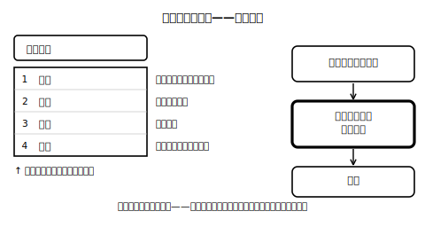

<!--
status: published_draft
unit: jhs-jpn-all-kanji-goi-unyou
lesson: 03
系統タグ: 同音弁別・語彙選択／形式: 選択＋部分書字
例文: 全て自作／字体・読みはverify_required（教科書照合前提）
license: CC-BY-4.0
-->

# Lesson 03 同音異義語——変換候補を選ぶ目

## ねらい

音が同じで意味の異なる語（同音異義語。この授業では音読みの熟語を中心に扱います）を、変換候補から選ぶ場面を入り口に、「文脈＋語義＋辞書確認」で選べるようになる。文脈の推測だけに頼らない習慣をつくる。

## 主概念1: 変換候補の選択は、毎日の語彙テスト（約220字）

「かんしん」と打つと、「感心」「関心」などの候補が並びます。どれを選ぶかを機械は決めてくれません。決めるのはあなたです。ここで使うのは、前の時間と同じ手順——①文の意味を捉える ②音を共有する候補を見る ③それぞれの**語の意味**で見分ける ④迷ったら辞書で確かめる。同音異義語は音が同じでも意味が違う別の語なので、「音」ではなく、語の意味・前後の文脈・文の形を手がかりに選ぶことになります。逆に言えば、意味さえ知っていれば手がかりは残っている、ということです。

## 主概念2: 文脈の推測だけに頼らない（約180字）

文脈はとても強い手がかりですが、頼りすぎると失敗します。「なんとなく文に合いそう」で選ぶと、形の似た候補や、よく見る候補につられることがあるからです。そこで手順の最後に「辞書・用例で確かめる」を必ず置きます。文脈で仮に決める→語義で検算する、の二段構えです。特に、意味の説明が自分でできない候補を選んだときは、それは「推測しただけ」のサイン。確かめてから確定しましょう。

## 導入（5分）

スクリーンに「彼のいけんにいぎを唱えた」を仮名のまま提示。「いぎ」の変換候補（異議・意義・威儀）を見せ、「どうやって選ぶ？」と問う。→意味で選ぶ、が本時の軸。

## 活動1: 変換候補から選ぶ（選択式・理由言語化）

（ ）の語にふさわしい表記を候補から選び、**選ばなかった候補の意味**も一言で言う。

**問1** 弟の努力に、家族みんなが（ かんしん ）した。 〔感心・関心〕
**問2** 姉は最近、宇宙の話題に強い（ かんしん ）を持っている。 〔感心・関心〕
**問3** 結果は予想と違って、（ いがい ）な展開になった。 〔以外・意外〕
**問4** 部員（ いがい ）は、この部屋に入れません。 〔以外・意外〕
**問5** この調査の（ たいしょう ）は、市内の中学生です。 〔対象・対照・対称〕
**問6** 兄と弟は、性格が（ たいしょう ）的だ。 〔対象・対照・対称〕
**問7** 留学は、視野を広げるよい（ きかい ）だ。 〔機会・機械〕

## 活動2: 文脈を足して決める（部分書字・産出）

次の文は、これだけでは候補が決めきれません。**どちらかに決まるように前後に言葉を足して**、文を書き直しなさい（2通り作れたらなお良い）。

**問8** 「たいしょうをよく見て描く。」 〔対象・対照〕
**問9** 「そのじてんで確認した。」 〔辞典・時点〕

> 指導上の注意: ここでも「正解の字」を先に与えない。「あなたの足した文脈なら、こちらに決まるね」という返し方で、文脈が字を決める体験を完成させる。

## 雑談枠: ポケットの中の小テスト

1人1台の端末で文字を打つ時代、私たちは実は毎日、同音異義語のテストを受けています。変換キーを押して候補を選ぶ瞬間、その一回一回が「意味で語を選ぶ」練習になっているのです！ 候補の中に知らない熟語を見つけたら、それは新しい語彙との出会いのチャンス。今日の手順（意味で選ぶ→辞書で確かめる）は、教室の外でこそ毎日使えます。

## まとめ（振り返り）

- 同音異義語は「音が同じ別の語」。意味で選ぶ。
- 文脈で仮決め→語義・辞書で検算、の二段構え。

---

## stretch（発展・希望者のみ）

**S1** 「こうえん」には〔公園・講演・公演・後援〕などの候補があります。4つの候補が**それぞれ一つに決まる**短文を、1文ずつ自作しなさい（作ったら辞書で語義を確認）。
**S2** 自分の端末（または家族の端末）で最近打った文章から、同音の変換候補で迷った例を1つ持ち寄り、どう決めたかを説明できるようにしておく。

<!-- gen_nav:nav:start（自動生成・手編集しない） -->

---

[← 前のレッスン](lesson_02.md)｜[単元の目次](README.md)｜[解答](answer_key_supplement.md)｜[次のレッスン →](lesson_04.md)

<!-- gen_nav:nav:end -->
