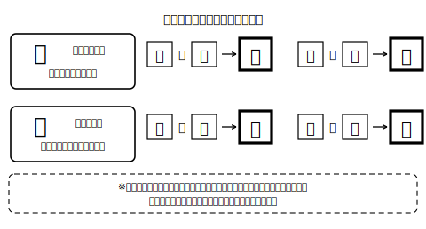

<!--
status: published_draft
unit: jhs-jpn-all-kanji-goi-unyou
lesson: 04
系統タグ: 同訓弁別／形式: 部分〜完全書字
例文: 全て自作／字体・読みはverify_required（教科書照合前提）
license: CC-BY-4.0
-->

# Lesson 04 同訓異字・書いて使う——頭の中に変換候補を持つ

## ねらい

同訓異字を「候補から選ぶ」段階から「自分で候補を出して書く」段階へ進める。手順は選ぶときと同じ①〜④のまま、候補の想起だけを自力で行う。

## 主概念1: 「選べる」と「書ける」の間には段差がある（約210字）

選択肢が目の前に並んでいれば選べる字でも、白紙に自分で書くとなると、急に手が止まることがあります。なぜでしょうか？　書くときは、候補を自分の頭から取り出さなければならないからです。でも安心してください。手順そのものは選ぶときと同じです。①文脈の意味を捉える→②同じ訓を持つ候補を思い浮かべる→③語義で見分ける→④辞書・用例で確かめる。変わるのは②だけ——画面が出してくれていた候補一覧を、今日からは自分の頭で出します。

## 主概念2: 字の部品は「思い出すヒント」になる（約190字）

漢字の部品は、意味のヒントをくれることが多いものです。たとえば、さんずいの字には水に関わる意味の字が多く、てへんの字には手の動作に関わる字が多く見られます。ただし例外もあるので、部品だけで答えを決めつけるのは危険です。部品は答えを決める道具ではなく、②で候補を思い出すとき、③で意味を確かめるときの手がかり。「この文は手の動作の話だから、てへんの字かもしれない」という使い方をしましょう。

## 導入（5分）

「シャツをきる」「紙をきる」を口頭で提示し、「頭の中にどんな漢字の候補が浮かんだ？」と問う。→ふだん端末がやっている変換候補の表示を、自分の頭でやったことに気づかせる。

## 活動1: 一字を書く（部分書字）

次の（　）のひらがなを漢字一字（＋送りがな）に直しなさい。書く前に、①〜④の手順で「なぜその字か」を言えるようにすること。

**問1** まどを（あ）けて空気を入れかえる。
**問2** 来週の日曜は予定を（あ）けておく。
**問3** 長い夜が（あ）けて、朝日がさした。
**問4** 借りていた本を図書室に（かえ）す。
**問5** 練習を終えて家に（かえ）る。
**問6** 黒板の図をノートに（うつ）す。

## 活動2: 書き分ける（完全書字）

次の各組の（　）に、文脈に合う漢字（送りがなをふくむ）を書きなさい。

**問7** 「あつい」
1. 今年の夏はとても（　　）。
2. （　　）お茶を少し冷ましてから飲む。
3. （　　）辞書をかばんから取り出す。

**問8** 「なおす」
1. 作文の書き誤りを（　　）。
2. 薬を飲んで、かぜを（　　）。

**問9** 「うつす」
1. 机を窓ぎわに（　　）。
2. スクリーンに映像を（　　）。

**問10** 問7〜9のうち一組を選び、手順②（候補の想起）と③（語義での見分け）で自分が何を考えたかを、一文ずつ書きなさい。

## 雑談枠: 変換候補が「出てこない」場面

ふだんは端末が変換候補を並べてくれますが、手書きのテスト、黒板、手紙——候補が出てこない場面は、いまでも生活のあちこちにあります。そういうとき、変換エンジンの代わりをするのは自分の頭です。ふだん画面をながめて「選ぶだけ」になっている瞬間に、「もし白紙だったら自分で出せるかな？」と一度考えてみる。それだけで、同じ変換の一瞬が練習の時間に変わります。

## まとめ（振り返り）

- 書くときも手順①〜④は同じ。変わるのは「候補を自分の頭から出す」ことだけ。
- 字の部品は答えを決める道具ではなく、候補を思い出し、意味を確かめるためのヒント。

---

## stretch（発展・希望者のみ）

**S1** さんずい・てへんのほかに、意味のヒントになる部品を漢字辞典で二つ探し、その部品を持つ字を三つずつ挙げなさい。
**S2** 「とる」（取・採・撮）のそれぞれを使った短文を一文ずつ自作しなさい。書いたら辞書の用例と見比べて、自分の文の使い方が近いかを確かめること（言い切れない場合は、そのことをメモに残してよい）。

<!-- gen_nav:nav:start（自動生成・手編集しない） -->

---

[← 前のレッスン](lesson_03.md)｜[単元の目次](README.md)｜[解答](answer_key_L04以降.md)｜[次のレッスン →](lesson_05.md)

<!-- gen_nav:nav:end -->
