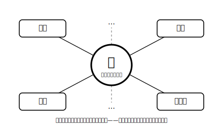
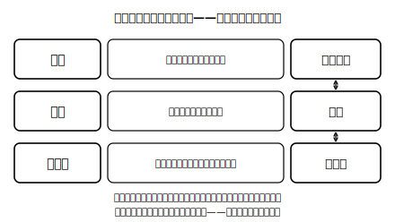

<!--
status: published_draft
unit: jhs-jpn-all-kanji-goi-unyou
lesson: 05
系統タグ: 熟語ネットワーク／形式: 完全書字
例文: 全て自作／字体・読みはverify_required（教科書照合前提）
license: CC-BY-4.0
-->

# Lesson 05 熟語ネットワークで語彙を増やす——一字を核に、網ごと覚える

## ねらい

一つの漢字を核として熟語のつながり（ネットワーク）を自分で書き広げ、和語⇔漢語の言い換えで語彙の使い分けの入り口に立つ。

## 主概念1: 熟語は「核の字」から枝分かれする（約210字）

「決」という字の核の意味（きめる・きまる）を一つ知っていると、決定・決心・解決・多数決……と、たくさんの熟語に同じ意味の芯が通っていることが見えてきます。熟語は一語ずつバラバラに覚えるものではなく、核の字から枝分かれした網の目です。新しい熟語に出会ったら、①核の字の意味を思い出す→②Lesson 02でやった構成の型で組み立てを見る→③意味を推理する→④辞書で確かめる。語彙は一語ずつでなく、網ごと増やしましょう。

## 主概念2: 和語と漢語——近い内容の二つの言い方（約200字）

大づかみに言うと、「きめる」のような昔から日本にある言い方が和語、「決定する」のように漢字の音で読む言い方が漢語です。指す内容は近くても、文の調子は変わります。一般に、漢語は掲示やお知らせなどの書き言葉で使われることが多く、和語は話し言葉になじみやすいと感じられることが多い——ただし、これも場面次第で、どちらか一方だけが正しいわけではありません。大事なのは、両方の言い方を持っていて、場面に合わせて選べることです。

## 導入（5分）

「明日の会議は中止します」と「あしたの集まりはやめます」を並べて板書し、「内容は同じ？　感じはどう違う？」と問う。→和語と漢語という二つの層があることに気づかせる。

## 活動1: 核の字から枝を書く（完全書字）

**問1** 「決」を使った二字熟語を三つ以上書き、それぞれの熟語の中で「決」がどんな意味で働いているかを一言ずつ添えなさい。
**問2** 「転」で同じことをしなさい。
**問3** 「集」で同じことをしなさい。書けた熟語のうち一つを選び、Lesson 02の構成の型（①〜⑤）のどれに当たるかも言いなさい。

## 活動2: 和語⇔漢語を行き来する（完全書字）

**問4** 次の文の下線部（和語）を、同じ内容の漢語（二字熟語＋「する」）に書き換えなさい。
1. 旅行の行き先を<u>きめる</u>。
2. 朝八時に校庭に<u>あつまる</u>。
3. 学級新聞を全員に<u>くばる</u>。

**問5** 次の漢語を、和語を使った言い方に書き換えなさい。
1. 開始する　2. 帰宅する　3. 増加する

**問6** 「校内放送の原稿」と「友だちへのメッセージ」。それぞれの場面で「集合してください」と「あつまって」のどちらを選ぶか、理由とともに書きなさい。（答えは一つに決まりません。理由の筋が通っているかを大事にします）

## 雑談枠: 2,136字は「掛け算の種」

常用漢字表（平成22年告示）の2,136字は、社会生活で漢字を使うときの「目安」でしたね。この字たちのおもしろいところは、単独で終わらないことです。字と字が組み合わさって熟語になるので、覚えた核の字が一つ増えるたびに、読める語・推理できる語は足し算でなく掛け算のように広がっていきます。今日書いた「決」や「転」の枝の数を思い出すと、実感できるのではないでしょうか？

## まとめ（振り返り）

- 熟語は核の字からの枝分かれ。新しい語は「核の意味＋構成の型」で推理し、辞書で確かめる。
- 和語と漢語は近い内容の二つの言い方（調子や使われる場面は変わる）。両方持って、場面で選べることが力になる。

---

## stretch（発展・希望者のみ）

**S1** 「昼ごはん・昼食・ランチ」のように、和語・漢語・外来語の三つがそろう組を二つ探して書きなさい（辞書やまわりの掲示を使ってよい）。
**S2** 「不」「未」「無」を頭につけた熟語をそれぞれ二つ以上書き、打ち消しのつき方に違いが感じられるかを自分の言葉でメモしなさい（言い切れなくてよい。仕上げに辞書で確かめること）。

<!-- gen_nav:nav:start（自動生成・手編集しない） -->

---

[← 前のレッスン](lesson_04.md)｜[単元の目次](README.md)｜[解答](answer_key_L04以降.md)｜[次のレッスン →](lesson_06.md)

<!-- gen_nav:nav:end -->
