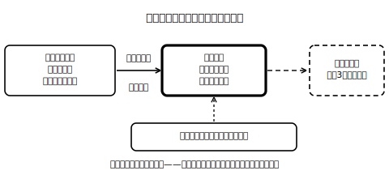

<!--
status: published_draft
unit: jhs-jpn-all-kanji-goi-unyou
lesson: 06
系統タグ: 語彙選択（同音弁別を含む）／形式: 完全書字（＋産出）
例文: 全て自作／字体・読みはverify_required（教科書照合前提）
license: CC-BY-4.0
-->

# Lesson 06 文脈に合う語を選んで書く——「知っている」から「使える」へ

## ねらい

同音異義語を文脈から判断して自分で書けるようになり、さらに自分の文で使うことで「使い慣れる」への一歩をふみ出す。

## 主概念1: 同音の語は、意味が手がかり（約220字）

Lesson 03では、画面の変換候補から選びました。今日は白紙に書きます。同音異義語は音がまったく同じなので、耳で聞き分けることはできません。だから、手がかりは語の意味——文の意味・前後の文脈・文の形です。手順はこれまでと同じ——①文脈の意味を捉える→②同じ音の候補を思い浮かべる→③語義で見分ける→④辞書・用例で確かめる。書く前にひと呼吸おいて、「この文でこの語は、どういう意味で使われている？」と自分に問いかけてから書く。この一呼吸が、取り違えをぐっと減らします。

## 主概念2: 使ってみて、はじめて自分の語になる（約180字）

読める語、意味の分かる語でも、自分の文で一度も使ったことがなければ、いざ書く場面でなかなか出てきません。今日の仕上げは、覚えた語で自分の文を作ることです。自分の生活の文脈に一度のせた語は、次に必要になったとき思い出しやすくなります。これが、中学三年の目標に出てくる「使い慣れる」という段階への入り口です。知っている語を、使える語に変えましょう！

## 導入（5分）

「こうえん」とだけ板書し、「漢字で書くと？」と問う。→複数の候補が出ることを確認し、「この音だけでは決められない。何があれば決められる？」→文脈、という流れを引き出す。

## 活動1: 文脈に合う語を書く（完全書字）

次の（　）に、文脈に合う漢字の語を書きなさい。書く前に③（語義での見分け）を声に出して言うこと。

**問1** こうえん
1. 駅前の（　　）のベンチで休む。
2. 演劇部の（　　）が体育館で行われる。
3. 専門家を招いて、防災についての（　　）を聞く。

**問2** しじ
1. 先生の（　　）に従って避難訓練をする。
2. 多くの生徒がその案を（　　）した。

**問3** かてい
1. 実験の（　　）をノートに記録する。
2. 高校の普通科の（　　）で学ぶ内容を調べる。

**問4** えいせい
1. 気象（　　）が雲の動きを観測する。
2. 手をよく洗って（　　）に気をつける。

**問5** じしん
1. 毎日の練習を重ねて（　　）がついた。
2. まず自分（　　）の考えを書いてから話し合う。

**問6** きかん
1. テスト（　　）は部活動が休みになる。
2. 報道（　　）が学校祭の取材に来た。

## 活動2: 自分の文で使う（産出）

**問7** 問1〜6から一組を選び、組の中の語を一つずつ使った文を自作しなさい。書けたら辞書を引き、載っている用例と自分の文を見比べること。
**問8** 自分が最近、入力の変換で迷った（または迷いそうな）同音の語を一つ挙げ、候補それぞれの意味の違いを辞書で調べて、短くメモしなさい。

## 雑談枠: 辞書の「用例」はお手本の宝庫

多くの国語辞典には、意味の説明だけでなく、その語を使った短い用例が載っています。実はこれ、「この語はこういう文の中で生きる」という使われ方の見本です。意味を確かめるだけなら説明文で足りますが、「使い慣れる」ためには用例のほうが近道になることもあります。今日、問7で自分の文と用例を見比べたとき、何か発見はありましたか？　辞書は答え合わせの道具であると同時に、文のお手本集でもあるのです。

## まとめ（振り返り）

- 同音異義語の手がかりは意味・文脈・文の形。書く前に「この文での意味」を言葉にしてから書く。
- 知っている語は、自分の文で一度使うと「使える語」に近づく。仕上げは辞書の用例との見比べ。

---

## stretch（発展・希望者のみ）

**S1** 「保証」と「保障」は意味の重なりが大きい組です。辞書で両方を引き比べ、違いを自分の言葉で説明しなさい（きっぱり言い切れなくてよい。「〜という傾向がありそうだ」で構いません）。
**S2** 同音異義語のクイズを一問自作し、となりの人と交換して解き合いなさい。作るときの条件: 例文は自作すること・文脈がどちらか一方に決まる文にすること。解く側は「文脈が一つに決まっているか」も点検すること。

<!-- gen_nav:nav:start（自動生成・手編集しない） -->

---

[← 前のレッスン](lesson_05.md)｜[単元の目次](README.md)｜[解答](answer_key_L04以降.md)｜[次のレッスン →](lesson_07.md)

<!-- gen_nav:nav:end -->
