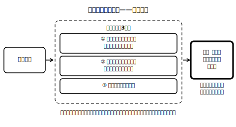

<!--
status: published_draft
unit: jhs-jpn-all-kanji-goi-unyou
lesson: 07
系統タグ: 統合運用／形式: 産出（校正＋条件作文）
例文: 全て自作（校正課題の誤り例も全て自作）／字体・読みはverify_required（教科書照合前提）
license: CC-BY-4.0
-->

# Lesson 07 統合——短文を書く・直す（単元のまとめ）

## ねらい

単元で学んだ手順①〜④を「書く」「読み直して直す」という実際の場面で総合的に使い、中3の運用段階への橋渡しとする。

## 主概念1: 書いたら読み直す——「直せる目」も書く力（約210字）

どれだけ気をつけていても、同訓・同音の取り違えは起こるものです。だからこそ、書き手には「書いたあとに読み直して直す」という仕上げの工程があります。点検の目のつけどころは三つ。①同じ訓・同じ音の語がひそんでいないか探す　②その字の意味が文脈と合っているか確かめる　③迷ったら辞書を引く。誤りを自分で見つけて直せる目は、はじめから正しく書ける手と同じくらい価値があります。今日はその目を鍛えます。

## 主概念2: 単元のまとめ——文脈が決める・辞書で確かめる（約190字）

この単元で一貫してやってきたのは、暗記ではなく手続きです。①文脈の意味を捉える→②候補を思い浮かべる→③語義で見分ける→④辞書・用例で確かめる。そして、漢字の使い分けには「どちらとも言い切れない」場合があることも学びました。だからこそ、自分の選んだ字の根拠を説明できること、そして確かめる習慣を持っていることが、これから先ずっと使える武器になります。文脈が決める・辞書で確かめる——これがこの単元の合言葉です。

## 導入（5分）

教師が自作した「漢字の使い方が一か所おかしいお知らせ文」を提示し、「どこか変なところはない？」と問う。→違和感→理由の言語化、の順で点検の型を見せる。

## 活動1: 見つけて直す（校正）

次の各文には、漢字の使い方が文脈に合わない箇所が一つある——とは限りません！　誤りがあれば直して理由を一言添え、誤りがなければ「誤りなし」と書きなさい。

**問1** 暑いスープが冷めないうちに飲んだ。
**問2** 先生の支持で、机を廊下に運んだ。
**問3** 夜が空けるころ、ようやく駅に着いた。
**問4** 学級会で決まったことを、そのままノートに移した。
**問5** 転んで痛めた足首を、時間をかけて直した。
**問6** 体育館に集合して、校長先生の話を聞いた。

## 活動2: 書く・点検する・確かめる（条件作文）

**問7** 次の三つの条件を満たす短い文章（二〜三文）を書きなさい。
1. 同訓異字の組（例: 「あける」「かえる」「うつす」「あつい」など、この単元で扱った組から一つ）を選び、二通りの漢字で使うこと。
2. 書き終えたら、手順①〜④で自己点検すること。
3. 迷った箇所に印をつけ、辞書で確かめた結果を欄外にメモすること。

**問8** となりの人と作品を交換し、「同訓・同音の観点」で点検し合いなさい。直すかどうかを決めるのは書いた本人です。指摘する側は理由を添え、書いた側は理由を聞いてから判断すること。

## 雑談枠: 送信前のひと呼吸

メールやメッセージの変換ミスは、大人にも毎日のように起こります。だからこそ、文章を仕事にする世界には、書いた本人とは別の目で原稿を読み直す「校正」という仕事があるほどです。プロでも読み直す——それなら私たちが読み直すのは当然かもしれません。送信ボタンを押す前のひと呼吸、提出する前のひと呼吸。この単元で身につけた点検の目は、テストの外でこそ毎日活躍します。

## まとめ（振り返り・単元全体）

- 選べる→書ける→直せる。手順①〜④は、この三段階すべてで同じ道具として働く。
- 文脈が決める・辞書で確かめる。言い切れない場合があるからこそ、根拠の説明と確認の習慣が力になる。

---

## stretch（発展・希望者のみ）

**S1** 自分の過去のノートや作文から、同訓または同音の別の字がありうる語を三つ拾い出し、「もし別の字で書いたら意味がどう変わるか」を説明しなさい。
**S2** 「こたえる」（答える・応える）のそれぞれを使った文を一文ずつ自作し、辞書の用例と見比べなさい。二つの字の感じの違いを自分の言葉でメモすること（言い切れなくてよい）。

<!-- gen_nav:nav:start（自動生成・手編集しない） -->

---

[← 前のレッスン](lesson_06.md)｜[単元の目次](README.md)｜[解答](answer_key_L04以降.md)

<!-- gen_nav:nav:end -->
