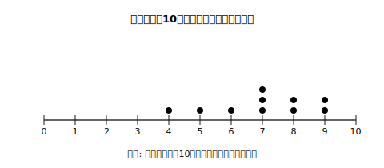

# L01 3つの代表値、おかえり——値と度数を区別する

## ねらい

- 小学校で学んだ3つの代表値（平均値・中央値・最頻値）の求め方を、定義から確かめ直す。
- データを読むとき、「**値**（何点・何回）」と「**度数**（その値の人数・個数）」を区別して言えるようになる。
- データが偶数個のときの中央値の求め方（真ん中2つの平均）を確実にする。

## 準備運動：小6の記憶を呼び出す

代表値（だいひょうち）とは、データ全体の特徴を**1つの数**で代表させる値のこと。小学校で3つ学んだのを覚えているだろうか。名前だけでも思い出してから、下の定義と突き合わせてみよう。

> 【ことば】**平均値（へいきんち）**……データの個々の値を合計し、データの個数で割った値。
> 【ことば】**中央値（ちゅうおうち）**……データを大きさの順に並べたときの中央の値。メジアンともいう。
> 【ことば】**最頻値（さいひんち）**……データの中で最も多く現れている値。モードともいう。

この3つは小6で学んだ道具だ。この章では「もう知ってる」で終わらせずに、**どういうときにどれを使うべきか**まで踏み込んでいく。まずは道具の点検から。

## 主概念1：10人の小テストで3つとも求めてみる

10人が受けた10点満点の計算テストの結果（点）が次のとおりだったとしよう。

```
7, 9, 5, 8, 7, 4, 9, 6, 7, 8
```


<!-- figure-spec: 意図=生データを数直線上に1人1点で並べ「散らばりの全体」を目で見る最初の表現（表現の階段の1段目）。データ=4,5,6,7,7,7,8,8,9,9（7に3個・8と9に2個ずつ）。軸=横軸0〜10点・ドットは縦に積む。生成方法=assets_provenance/generate_figures.py のパラメトリックSVG（積み上がり内訳・平均7/中央値7/最頻値7を生データから再計算しassert検算・代表値は図に描かない） -->

数直線の上にデータを1個ずつ点（ドット）で積んだこの図を**ドットプロット**という。まず大きさの順に並べ直そう。

```
4, 5, 6, 7, 7, 7, 8, 8, 9, 9
```

- **平均値**: 合計は 4+5+6+7+7+7+8+8+9+9=70。70÷10=**7点**。
- **中央値**: 10個は偶数個なので、ど真ん中の1個がない。真ん中の2つ（5番目と6番目）は 7 と 7。この**2つの平均**をとって (7+7)÷2=**7点**。
- **最頻値**: いちばん多く現れている値は 7（3回）。よって**7点**。

3つとも7点でそろった。ドットプロットを見ると、7を頂上にして左右にだいたい対称に散らばっている——実は、こういう**左右対称に近い分布**のときは3つの代表値が近い値になりやすい。じゃあ、そろわないのはどんなとき？　それが次のL02の主役になる。

:::guide
**偶数個の中央値は「2つの平均」：ここが最初の事故ポイント**

データが奇数個ならど真ん中の1個、偶数個なら真ん中2つの平均。この場合分けを飛ばして「真ん中あたりの片方」を答えてしまう間違いがよく起きる。並べ替えたら「前後に同じ個数ずつあるか」を数えて確かめるクセをつけよう。上の例なら、7と7の前に4個・後ろに4個でOK。中央値そのものはデータの中に実在する値とは限らない（たとえば真ん中2つが7と8なら中央値は7.5点）ことも、ここで一度言葉にしておきたい。
:::

## 主概念2：「値」と「度数」——この区別が章全体の背骨

今度は、あるクラス25人に「先週、家の手伝いを何回したか」を聞いた結果を表にまとめた。

| 手伝いの回数（回） | 0 | 1 | 2 | 3 | 4 | 5 | 合計 |
|---|---|---|---|---|---|---|---|
| 人数（人） | 2 | 5 | 8 | 6 | 3 | 1 | 25 |

ここで質問。**このデータの最頻値は何だろう？**

「8！」と答えたくなった人は、ちょっと待ってほしい。8は「2回と答えた**人数**」だ。最頻値は「最も多く現れている**値**」——つまり、いちばん人数が多い回数である**2回**が最頻値になる。

> 【ことば】**度数（どすう）**……それぞれの値（またはグループ）に入るデータの個数のこと。上の表なら「人数」の行が度数だ。

この表には2種類の数が同居している。上の行は「手伝いの回数」という**値**、下の行はその値の**度数**。データの世界では、この2つを取り違えると答えがまるごとずれる。この章では表やグラフを読むたびに「いま指しているのは値？　度数？」と自分に聞く。これを合言葉にしよう。

ためしに中央値も求めてみる。25人を回数の少ない順に1列に並べたと想像すると、中央は13番目の人。0回が2人、1回まで足すと2+5=7人、2回まで足すと7+8=15人。13番目は「2回」のグループの中にいる。だから中央値は**2回**。表のままでも、「何番目の人がどの値か」を積み上げて数えれば求められるのだ。

:::zatsudan
中央値はメジアン、最頻値はモード。教科書にも、このカタカナ名が定義と並べて併記されている。カタカナ名でも覚えておくと、この先グラフソフトの画面などで英語表記に出会ったときにも慌てずにすむ。
:::

## 練習

1. 次のデータは、8人が1分間で決めたバスケットボールのフリースローの成功数（回）である。平均値・中央値・最頻値を求めよう。
   ```
   3, 6, 4, 6, 2, 6, 5, 8
   ```
2. 主概念2の「手伝いの回数」の表について、次の問いに答えよう。
   (1) 平均値を求めよう（四捨五入せず答えてよい）。
   (2) 「このクラスの最頻値は8回である」という発言のどこが誤りか、「値」「度数」という言葉を使って説明しよう。
3. 次の文が正しければ○を、正しくなければ×を付けて、理由を言おう。
   (1) データが偶数個のとき、中央値は真ん中の2つの値の平均で求める。
   (2) 中央値を求めるとき、データは並べ替えなくてもよい。
   (3) 中央値は、必ずデータの中に実在する値である。

:::stretch
**S1** 主概念1のテストの点数を1つだけ書き換えて、「平均値は変わるが、中央値も最頻値も変わらない」データを作ってみよう。どの位置の値をどう動かせばよいか、ドットプロットを思い浮かべながら考えると見通しがよくなる。（気になる人は「代表値 性質 ちがい」で調べてみよう。）
:::

---

対応解答: answer_key_L01-04.md

<!-- gen_nav:nav:start（自動生成・手編集しない） -->

---

[単元の目次](README.md)｜[解答](answer_key_L01-04.md)｜[次のレッスン →](lesson_02.md)

<!-- gen_nav:nav:end -->
