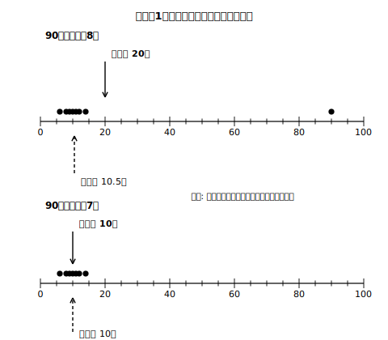

# L02 平均値は真ん中じゃない？——代表値の限界と範囲

## ねらい

- 極端にかけ離れた値（外れ値）があるとき、平均値が中央値に比べて強く影響を受けることを、実験で確かめる。
- 「平均値を超えているから上位半分」とは限らないことを、具体的なデータで体感する。
- **範囲**（データの最大値と最小値との差）を求め、その意味と弱点を知る。
- 代表値は「1つの数に縮めるかわりに、失われる情報がある」ことを言葉にできるようになる。

## 主概念1：たった1人で平均値が動く——外れ値の実験

ある部活の8人が、昨日の自主練習の時間（分）を報告した。

```
6, 8, 9, 10, 11, 12, 14, 90
```

90分の人は、大会が近くて特別に長く練習したそうだ。さて、この8人の「ふだんの練習時間」を代表する値はいくつだろう。

- **平均値**: 合計 6+8+9+10+11+12+14+90=160。160÷8=**20分**。
- **中央値**: 偶数個なので4番目と5番目の平均。(10+11)÷2=**10.5分**。

平均値は20分。でも、8人のうち7人は14分以下しか練習していない。「平均20分」という数字だけ聞くと、実際よりずっと長く感じないだろうか？

ためしに、90分の1人を除いた7人で計算し直すと、合計70÷7で平均値は**10分**、中央値は4番目の**10分**。つまり90分の1人が入ると、平均値は10分→20分へと**2倍**にはね上がるのに、中央値は10分→10.5分とほとんど動かない。

> 【ことば】**外れ値（はずれち）**……他の値から極端にかけ離れた値のこと。

ここから大事な性質が見える。**極端にかけ離れた値があると、平均値は中央値に比べて、その値に強く影響を受ける**。平均値は全員の値を合計に取り込むので、1個の巨大な値に引っぱられる。中央値は「並べたときの位置」しか見ないので、端の値がどれだけ大きくても順番はほぼ変わらないのだ。


<!-- figure-spec: 意図=90分の1個が平均値だけを大きく動かすことの可視化。データ=上段6,8,9,10,11,12,14,90（平均20・中央値10.5）／下段は90を除いた7個（平均10・中央値10）。軸=横軸0〜100分。生成方法=assets_provenance/generate_figures.py のパラメトリックSVG（平均値・中央値を生データから再計算し本文値と一致をassert検算） -->

## 主概念2：平均値を超えているのに、下位半分？

「平均値より上なら、集団の上位半分にいる」。そう思っていないだろうか。実は、これは**いつでも成り立つわけではない**。

15人の生徒の「先週1週間の家庭学習の合計時間（分）」を、少ない順に並べた。

```
30, 60, 90, 300, 330, 360, 390, 420, 420, 450, 480, 480, 510, 540, 540
```

- 平均値: 合計5400÷15=**360分**
- 中央値: 15個の真ん中、8番目=**420分**

さて、あなたの記録が**390分**だったとしよう。平均値360分を超えている。「自分は真ん中より上だな」——本当に？

少ない順に数えると、390分は**15人中7番目**。真ん中の8番目より前、つまり**少ない方の半分**にいる。平均値を超えているのに、順位では下位半分——不思議に見えるが、からくりは主概念1と同じだ。この集団には30分・60分・90分という極端に少ない3人がいて、平均値がその3人に引っぱられて**下がって**いる。だから「平均値超え」のハードルが、真ん中（中央値）より低い位置に来てしまうのだ。

**集団の中での自分の位置を知りたいなら、平均値だけで判断するのは危ない。**位置の情報をまともに持っているのは中央値の側だ。並べたときの順番を直接見ているからである。この「集団の中の位置」は、L07でもっと便利な道具（累積相対度数）を手に入れて再挑戦する。

:::guide
**「平均値=真ん中」はなぜこんなにしぶといのか**

左右対称に近い分布（L01のテストの例）では平均値・中央値・最頻値がほぼ一致するので、「平均値=真ん中」という感覚は日常経験と矛盾しにくい。崩れるのは分布が**非対称**なとき。今回のように少ない側へ裾を引くデータでは平均値が中央値より小さくなりやすく、逆に大きい側へ裾を引くデータでは平均値が中央値より大きくなりやすい（あくまで「なりやすい」であって、必ずそうなるわけではない。裾の向きと大小関係が逆になるデータも作れる）。この「分布の形と代表値の並び」はL04でヒストグラムを手に入れてから、図として正面から整理する。ここでは「平均値超え=上位半分、とは限らない」という具体例を1つ、自分の中に持てれば十分だ。
:::

## 主概念3：散らばりを1つの数で——範囲

代表値は「真ん中らへん」を1つの数で表す道具だった。もう1つ、「どれくらい散らばっているか」を1つの数で表す道具を導入する。

> 【ことば】**範囲（はんい）**……データの最大値と最小値との差。データの散らばりの程度を表す値。レンジと呼ばれることもある。

- 主概念1の8人（90分を含む）: 範囲=90−6=**84分**
- 90分を除いた7人: 範囲=14−6=**8分**

同じ部活のデータなのに、たった1人で範囲は84分から8分へ激変する。**範囲は、極端にかけ離れた値が1つでもあるとき、その影響をまともに受ける**。最大値と最小値という「両端の2つ」だけで決まる値だから、当然といえば当然だ。取り扱いや解釈には注意がいる。

もう1つ注意。平均値が等しい2つの集団でも、範囲が等しいとは限らない。「真ん中らへん」と「散らばり」は**別の情報**であり、代表値だけを見ていると散らばりの情報はごっそり失われる。1つの数に縮めることで比べやすくなる。その便利さの代金として、分布の形や外れ値の有無といった情報が消える。**縮めた数だけで判断せず、データの分布全体を確かめてから代表値を使う**。これがこの章を貫くルールだ。

:::guide
**「範囲」は本単元の〔用語・記号〕指定語**

第1学年のデータの活用で〔用語・記号〕として指定されているのは「範囲」と「累積度数」（L07）の2語。範囲は、中学2年で学ぶ**四分位範囲**の基礎になる（ここでは名前の予告まで）。
:::

:::zatsudan
平均値・中央値・最頻値の3つが、きれいに一致することがある。その典型は、分布が**左右対称**に近い形のときだ。逆に、3つの値が大きくずれていたら「この分布、対称じゃないかも」と疑う手がかりになる（あくまで手がかりで、代表値の一致・不一致だけで形が決まるわけではない）。代表値は分布の「指紋」みたいなものなんだ。L04でこの推理を実際にやってみよう。
:::

## 練習

1. 主概念2の15人のデータについて、範囲を求めよう。
2. 7人のクイズの得点が 2, 3, 3, 4, 5, 6, 5 だった。ここに8人目（得点30）が加わったとき、平均値・中央値・範囲はそれぞれどう変わるか計算して確かめよう。
3. 文化祭で配るTシャツを1種類のサイズだけたくさん用意するなら、参加者のサイズのデータから平均値・中央値・最頻値のどれを使って決めるのがよいか。理由をつけて答えよう。
4. 次の文が正しければ○を、正しくなければ×を付けて、理由を言おう。
   (1) 平均値より大きい値をとる人は、必ずその集団の上位半分にいる。
   (2) 範囲は、外れ値が1つあるだけで大きく変わることがある。
   (3) 平均値が等しい2つの集団は、散らばりの程度も等しい。

:::stretch
**S1** 「平均値が中央値より**大きく**なる」15人のデータを自作してみよう（主概念2とは逆向きの非対称）。作ったら実際に両方を計算して、意図どおりになったか検算すること。どちら側に極端な値を置けばよいか、主概念1の実験がヒントになる。（「平均値 中央値 ずれ 分布」で調べると、この話の奥行きが見えてくる。）
:::

---

対応解答: answer_key_L01-04.md

<!-- gen_nav:nav:start（自動生成・手編集しない） -->

---

[← 前のレッスン](lesson_01.md)｜[単元の目次](README.md)｜[解答](answer_key_L01-04.md)｜[次のレッスン →](lesson_03.md)

<!-- gen_nav:nav:end -->
