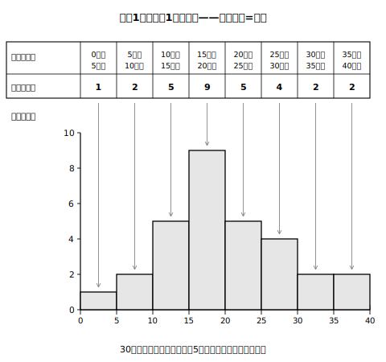

# L03 データを棚に整理する——度数分布表とヒストグラム

## ねらい

- データを**階級**に区切って**度数分布表**に整理できるようになる。
- 度数分布表から**ヒストグラム**をかき、縦軸・横軸が何を表すかを正しく読めるようになる。
- ヒストグラムから、全体の形・左右の広がり・山の頂上の位置・対称性・外れ値の有無を直観的に読み取る。

## 主概念1：30個の値は、そのままでは眺めきれない

1年A組30人の「朝、家から学校までにかかる時間（分）」を調べた。

```
16, 22, 9, 18, 14, 27, 17, 36, 12, 19, 23, 15, 4, 21, 18,
32, 13, 24, 16, 7, 26, 11, 34, 17, 22, 29, 19, 14, 37, 28
```

じっと見ても、全体の様子はつかめない。L01のドットプロットに並べれば見えてくるが、30個・100個と増えるほど、1個ずつ点を打つのも大変になる。そこで、データを**同じ幅の区間に区切って、区間ごとの個数だけを数える**という整理を導入しよう。ちょうど、バラバラの本を「0〜99ページ」「100〜199ページ」の棚に分けて、棚ごとの冊数だけメモするようなものだ。

> 【ことば】**階級（かいきゅう）**……データを整理するために区切った1つ1つの区間。区間の幅を**階級の幅**という。（「階級」は小6でも使った言葉の学び直しだ。）
> 【ことば】**度数分布表（どすうぶんぷひょう）**……階級ごとに度数（その階級に入るデータの個数）を整理した表。

階級の幅を5分にして、表を作る。「15分以上20分未満」のように、**以上・未満**で区切るのがポイントだ。こう区切れば、どの値もちょうど1つの階級に入り、重複も漏れも起きない。

| 通学時間（分） | 度数（人） |
|---|---|
| 0以上 5未満 | 1 |
| 5以上10未満 | 2 |
| 10以上15未満 | 5 |
| 15以上20未満 | 9 |
| 20以上25未満 | 5 |
| 25以上30未満 | 4 |
| 30以上35未満 | 2 |
| 35以上40未満 | 2 |
| 合計 | 30 |

作ったら必ず、度数の合計がデータの個数（30人）に一致するか確かめよう。1+2+5+9+5+4+2+2=30でOK。数え落としを見つける、いちばん簡単で強力な検算だ。

## 主概念2：ヒストグラム——度数を柱の高さで見る

度数分布表を、そのまま図にする。横軸に階級、縦軸に度数をとり、階級の幅を底辺とする長方形（柱）をすき間なく並べた図を**ヒストグラム**という。


<!-- figure-spec: 意図=度数分布表からヒストグラムへの変換の初対面。柱の高さ=度数の対応を表のマスと柱の1対1の矢印で示す。データ=度数1,2,5,9,5,4,2,2（総度数30・主概念1の表と同一）。軸=横軸0〜40分（5分刻み・柱すき間なし）・縦軸度数0〜10人。生成方法=assets_provenance/generate_figures.py のパラメトリックSVG（度数を主概念1の生データ30個から再集計し本文の表と一致をassert検算） -->

実はこの図、小6で「柱状グラフ」として出会っている。中1では名前がヒストグラムになり、読み方をさらに深めていく。最初に固定してほしいのは軸の意味だ。

- **横軸**は階級：「何分か」という**値**の世界。
- **縦軸**は度数：「何人か」という**個数**の世界。

L01の合言葉「それは値？　度数？」がここでも効く。たとえば「25分以上30分未満の階級の度数は？」と聞かれたら、答えはその柱の**高さ**を縦軸で読んで「4人」。柱が「左から何番目にあるか」を答えるのではない。横軸上の位置と縦軸の高さを混同する読み間違いは、実際によく起きる。

:::guide
**棒グラフとヒストグラムはどう違う？**

見た目は似ているが、棒グラフは「好きな教科」のような**質的データ**（種類で分ける特徴）を棒の長さで比べるときによく使われる図で、ふつう棒の間はすき間を空ける（棒グラフは、回数のようなとびとびの量的データに使われることもある）。ヒストグラムは通学時間のような**量的データ**（数量ではかる特徴）を連続した階級で区切る図なので、柱はすき間なく並べる。すき間の有無は飾りではなく、「横軸が連続した数直線かどうか」の表明なのだ。都道府県名のようなデータが質的データ、気温のようなデータが量的データ。この区別も覚えておこう。
:::

## 主概念3：ヒストグラムの「山」を読む

ヒストグラムにしたとたん、30個の数字の羅列からは見えなかったものが見えてくる。読み取れるのは、たとえばこの5つだ。

1. **全体の形**：山が1つか、複数か。
2. **左右の広がりの範囲**：データがどこからどこまで散らばっているか。
3. **山の頂上の位置**：度数が最大の階級はどこか。
4. **対称性**：山を境に左右対称か、どちらかに裾を引いているか。
5. **外れ値の有無**：本体から離れたところにポツンと柱がないか。

今回の通学時間なら、「山は1つで、頂上は15分以上20分未満（度数9）。左右を比べると、右側（時間が長い側）へなだらかに裾を引いた形」と読める。ここまで**計算は1回もしていない**——形を見ただけだ。ヒストグラムは、計算の前に「このデータはどんな顔つきか」をつかむ道具なのだ。

ただし、引き換えに失ったものもある。表とヒストグラムからは「15分以上20分未満が9人」までは分かるが、**その9人の1人1人が何分なのかは、もう分からない**。ドットプロット→度数分布表・ヒストグラムと進むごとに、個々の値の情報を手放して、そのぶん全体の形が見やすくなる——この交換は、次のL06でもう一段進むことになる。

:::zatsudan
ヒストグラムと小6の柱状グラフ、名前が変わっただけ？　と思うかもしれないけれど、中学ではこの図を「作れる」だけでなく「疑える」ところまで行くのが目標なんだ。同じデータでも区切り方しだいで山の見え方が変わることがある。そう聞くと、ちょっと気になってこないだろうか。その実験はL05のお楽しみ。
:::

## 練習

1. 主概念1のデータについて、「20分以上25分未満」の階級に入る5人の値をデータの中からすべて抜き出し、度数分布表の値と一致することを確かめよう。
2. ヒストグラム（図L03-1）について答えよう。
   (1) 度数が最大の階級はどれか。
   (2) 通学時間が30分以上の生徒は何人か。
   (3) 「9時になっても登校していない生徒の人数」はこのヒストグラムから読み取れるか。
3. ある人が「10分以上15分未満の階級の度数は、柱が左から3番目だから3人だ」と答えた。この読み方の誤りを、「横軸」「縦軸」という言葉を使って説明しよう。
4. 次の文が正しければ○を、正しくなければ×を付けて、理由を言おう。
   (1) 度数の合計は、データの個数に等しい。
   (2) このヒストグラムから、通学時間が17分ちょうどの生徒が何人いるかが分かる。
   (3) 階級は「以上・未満」で区切るので、どの値もちょうど1つの階級に入る。

:::stretch
**S1** 主概念1のデータを、階級の幅10分（0以上10未満、10以上20未満、……）で度数分布表に作り直してみよう。幅5分の表と見比べて、「見やすくなったこと」「見えなくなったこと」を1つずつ挙げよう。合計が30人になる検算も忘れずに。（この実験の本番はL05で待っている。）
:::

---

対応解答: answer_key_L01-04.md

<!-- gen_nav:nav:start（自動生成・手編集しない） -->

---

[← 前のレッスン](lesson_02.md)｜[単元の目次](README.md)｜[解答](answer_key_L01-04.md)｜[次のレッスン →](lesson_04.md)

<!-- gen_nav:nav:end -->
