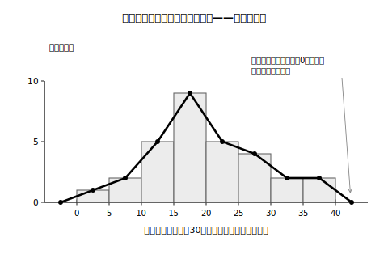
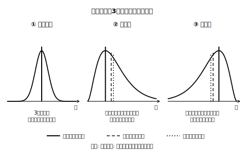

# L04 山の形が語ること——分布の形と階級値としての最頻値

## ねらい

- 連続的なデータでは小6の最頻値が有効でないことがある理由を理解し、**度数が最大の階級の真ん中の値（階級値）を最頻値として用いる**方法を身につける。
- ヒストグラムの柱の頂上を結んだ**度数折れ線**をかけるようになる。
- 分布の形（対称・右裾・左裾）と、平均値・中央値・最頻値の並び方の関係を読み取る。
- 「平均値のまわりに人が多いはず」という思い込みを、ヒストグラムで検証できるようになる。

## 主概念1：最頻値が迷子になるとき——階級値で救出する

L03の通学時間30人のデータで、最頻値を求めてみよう。「最も多く現れている値」を探すと——14分が2人、16分が2人、17分が2人、18分が2人、19分が2人、22分も2人。**最多（2人）の値が6つも同点**——最頻値が6個もあることになり、これでは「データがいちばん集中しているところ」の代表として役に立たない。

時間や長さのような連続的なデータでは、まったく同じ値がなかなか重ならない。全員が15.8分とか16.2分とか、少しずつ違う値になるからだ。こういうとき、小6で学んだ「最も多く現れている値」という求め方は**有効でないことがある**。

そこで発想を切り替える。個々の値の代わりに、**度数分布表の階級**で見るのだ。度数が最大の階級は「15分以上20分未満」（9人）。この階級の真ん中の値 (15+20)÷2=**17.5分** を最頻値として用いる。

> 【ことば】**階級値（かいきゅうち）**……階級の真ん中の値。「15分以上20分未満」の階級値は17.5分。（この呼び名は教科書でよく使われる言葉だ。）

小6の最頻値「最も多く現れている値」が、中1では「**度数が最大の階級の階級値**」まで拡張された。定義がバージョンアップしたと思えばいい。どちらも「データがいちばん集中しているところはどこか」を指す点は変わらない。

## 主概念2：柱の頂上を結ぶ——度数折れ線

ヒストグラムの各柱の上の辺の真ん中（つまり階級値の位置）を、順に線分で結ぶ。両端は、両どなりに度数0の階級があるものとして、**その階級値の位置**に横軸上の点をとり、そこまで結ぶ。こうしてできる折れ線を**度数折れ線**という。

<!-- figure-spec: 意図=柱の頂上の中点を結ぶ作図手順と、折れ線が「山の形」だけを抜き出した表現であることの可視化。データ=度数1,2,5,9,5,4,2,2（L03と同一）。軸=横軸0〜40分・縦軸度数(人)。柱は薄いグレー・折れ線は濃い実線・両端が横軸に降りる様子を含む。生成方法=assets_provenance/generate_figures.py のパラメトリックSVG（度数をL03の生データから再集計・折れ線頂点=階級値をassert検算・主概念3の代表値は図に描かない） -->

柱を消して折れ線だけ残すと、分布の「山の稜線（りょうせん）」だけが残る。線1本になったおかげで、**複数の分布を同じ図に重ねて比べる**ことができる——比べたい集団の数が増えたときに力を発揮する表現だ。

:::guide
**「度数折れ線」という名前の格**

この図の呼び名は、実は教科書の会社によって違い、「度数折れ線」と呼ぶ教科書と「度数分布多角形」と呼ぶ教科書がある。学習指導要領やその解説に登場する正式指定の用語ではなく、教科書で使われてきた慣用的な名前だ。本教材では「度数折れ線」を主に使うが、テストや他の本で「度数分布多角形」と出会っても同じものだと思ってほしい。
:::

## 主概念3：山の形と代表値の並び——「平均値=真ん中」を検証する

通学時間のデータについて、3つの代表値が出そろった。

- 最頻値（階級値）: **17.5分**
- 中央値: **18.5分**（15番目と16番目の平均。求め方はL01のとおり）
- 平均値: **20.0分**（合計600÷30）

並べると 最頻値 17.5 ＜ 中央値 18.5 ＜ 平均値 20.0。きれいに一致したL01のテストとは違って、3つがずれている。ヒストグラムの形を思い出そう。山の頂上が左寄りで、**右側へ裾を引いた形**だった。長い通学時間の人たちが平均値を右へ引っぱり（L02の外れ値実験と同じ理屈）、中央値はそれほど動かず、最頻値は山の頂上に居座る。だから右裾の分布では、この順のずれが生まれやすい。

<!-- figure-spec: 意図=対称・右裾・左裾の3つの分布で平均値/中央値/最頻値の位置関係がどう変わるかの一覧整理（L02 guideの回収）。データ=模式図3枚（数値なしの滑らかな山型。①対称=3値が中央で一致 ②右に裾=最頻値＜中央値＜平均値 ③左に裾=平均値＜中央値＜最頻値）。軸=横軸値・縦軸度数。3値は線種の異なる縦線（白黒両立のため色でなく実線/破線/点線で区別）。生成方法=assets_provenance/generate_figures.py のパラメトリックSVG（縦線位置は描いた密度曲線から平均・中央値・最頻値を数値計算して決定・並び順をassert検算） -->

ここでL02の宿題を回収する。「平均値が20分なんだから、平均値のあたりの人がいちばん多いはず」——この型の主張は正しいだろうか？　検証の手順はこうだ。

1. ヒストグラムで**度数が最大の階級**（山の頂上）を探す。
2. 平均値がその階級に**含まれているか**を確かめる。

通学時間の例なら、平均値20.0分が入るのは「20分以上25分未満」（度数5人）。20.0分ちょうどは、L03の以上・未満のルールで「20分以上」の側に入ることに注意しよう。ところが度数最大の階級は「15分以上20分未満」（9人）で、**平均値は山の頂上の階級に含まれていない**。「平均が20分だから、人がいちばん多いのも平均値のあたりのはず」は、このデータでは成り立たないのだ。

平均値のまわりに人が多いと言えるのは、分布が左右対称に近い山が1つの形のとき。そうでない分布ではあてにならない。**平均値が代表としてふさわしいかどうかは、分布の様子を見て判断する**。数字を疑うのではなく、数字の「使いどころ」を見極める。これがこの単元の言う「批判的」の中身だ（総仕上げはL08で）。

:::zatsudan
左右対称で山が1つの分布なら、平均値・中央値・最頻値の3つはほぼ重なる。逆に3つが大きくずれていたら、非対称な形を疑ってよい。つまり代表値の並び順は、ヒストグラムを見る前に山の形を推理する手がかりになる（あくまで手がかりで、最後はヒストグラムで確かめる）。自分に「平均値より中央値が大きいデータって、どんな形？」とクイズを出して、頭の中に山の絵が浮かぶようになったら、この単元はかなり分かってきている証拠だ。
:::

## 練習

1. ある40人のデータを整理したら、度数が最大の階級は「50g以上60g未満」だった。階級値としての最頻値を求めよう。
2. 通学時間のヒストグラム（L03）に度数折れ線をかき入れる手順を、「階級値」「線分」「両端」という言葉を使って3ステップで説明しよう。
3. あるデータでは、平均値8.4点・中央値10点・最頻値11点だった（値が大きいほど良い記録とする）。
   (1) 山が1つの分布だとすると、3つの並びから、どちら側に裾を引いた形と考えられるか。
   (2) 「平均値8.4点の近くの人がいちばん多い」という主張は適切といえるか。確かめるにはヒストグラムのどこを見ればよいか。
4. 次の文が正しければ○を、正しくなければ×を付けて、理由を言おう。
   (1) 連続的なデータでは、同じ値がほとんど重ならないため、小6の求め方の最頻値が有効でないことがある。
   (2) 度数折れ線は、学習指導要領で指定された正式な用語である。
   (3) 分布が左右対称に近いとき、平均値・中央値・最頻値は近い値になる。

:::stretch
**S1** 「中央値をできるだけ動かさずに、平均値だけを大きくする」には、ヒストグラムのどこにデータを足せばよいだろう。L03の通学時間データに1人だけ追加するとしたら何分の人を足すか、実際に平均値と中央値を計算して確かめてみよう（31人になるので中央値は16番目の値に変わることに注意。中央値を「まったく」変えずに平均値を大きくすることは、このデータでできるだろうか？）。（「分布 形 代表値 関係」で調べると、いろいろな分布の実例が見つかる。）
:::

---

対応解答: answer_key_L01-04.md

<!-- gen_nav:nav:start（自動生成・手編集しない） -->

---

[← 前のレッスン](lesson_03.md)｜[単元の目次](README.md)｜[解答](answer_key_L01-04.md)｜[次のレッスン →](lesson_05.md)

<!-- gen_nav:nav:end -->
