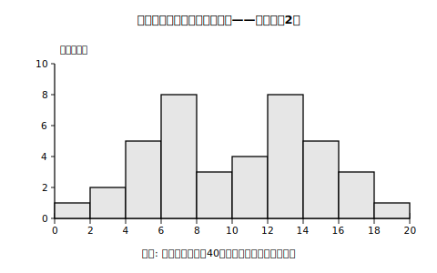
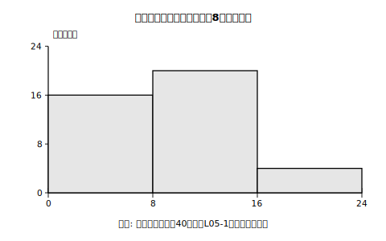

# L05 階級の幅を変えてみたら——複数のヒストグラムで検討する

## ねらい

- 同じデータでも、階級の幅が異なるとヒストグラムから読み取れる傾向が異なる**場合がある**ことを、自分の手で確かめる。
- 1つのヒストグラムだけで判断せず、**階級の幅の異なる複数のヒストグラムをつくって検討する**態度を身につける。
- 大量のデータや多様なヒストグラム作成でコンピュータを活用できることを知る。

## 主概念1：同じデータ、ちがう顔

体育祭のレクリエーションで、的当てゲームに40人が挑戦した。スコア（点）は次のとおり。

```
7, 12, 5, 16, 8, 13, 6, 10, 14, 3, 12, 7, 15, 9, 13, 4, 11, 7, 18, 12,
6, 14, 8, 13, 2, 16, 10, 5, 12, 7, 17, 11, 14, 5, 13, 6, 15, 4, 7, 1
```

まず**階級の幅2点**で度数分布表を作る（検算: 合計40人になることを確かめてある。自分でも数えてみよう）。

| スコア（点） | 度数（人） |
|---|---|
| 0以上 2未満 | 1 |
| 2以上 4未満 | 2 |
| 4以上 6未満 | 5 |
| 6以上 8未満 | 8 |
| 8以上10未満 | 3 |
| 10以上12未満 | 4 |
| 12以上14未満 | 8 |
| 14以上16未満 | 5 |
| 16以上18未満 | 3 |
| 18以上20未満 | 1 |
| 合計 | 40 |


<!-- figure-spec: 意図=山が2つある分布の姿を見せる（幅8との比較の前半）。データ=度数1,2,5,8,3,4,8,5,3,1（総度数40）。軸=横軸0〜20点（2点刻み）・縦軸度数0〜10人。[6,8)と[12,14)の2つの頂上と[8,10)の谷が見える形。生成方法=assets_provenance/generate_figures.py のパラメトリックSVG（度数を主概念1の生データ40個から再集計し本文の表と一致をassert検算・L05-2と同一データ） -->

山が**2つ**ある。6〜8点あたりに1つ、12〜14点あたりにもう1つ。あいだの8〜10点はへこんでいる。「得意な人たちと苦手な人たちの、2つのグループがありそうだ」と読みたくなる形だ。

では、同じデータを**階級の幅8点**で整理し直すと？

| スコア（点） | 度数（人） |
|---|---|
| 0以上 8未満 | 16 |
| 8以上16未満 | 20 |
| 16以上24未満 | 4 |
| 合計 | 40 |


<!-- figure-spec: 意図=幅を広げると2つの山が1つに見えることの体感（図L05-1と縦に並べて対比）。データ=度数16,20,4（総度数40・幅2の表を合算したもの）。軸=横軸0〜24点（8点刻み）・縦軸度数0〜24人。単峰の山に見える形。生成方法=assets_provenance/generate_figures.py のパラメトリックSVG（同一の生データ40個から幅8で再集計し、幅2の表の合算とも一致をassert検算） -->

こちらは山が**1つ**の、ごくふつうの分布に見える。2つのグループの気配は、跡形もない。

**データは1個も変えていない。**変えたのは階級の幅だけだ。それなのに、読み取れる「傾向」がまるで違って見える——同じデータについても、階級の幅が異なるとヒストグラムから読み取れる傾向が**異なる場合がある**のだ。幅を広げすぎると細かい構造がつぶれ、逆に幅を狭くしすぎると柱がギザギザして、かえって全体の傾向が見えにくくなることもある。

:::guide
**「必ず変わる」ではなく「場合がある」**

幅を変えても見え方がほとんど変わらないデータもたくさんある。だから正確には「変わる場合がある」。そして、変わるかどうかは**作って見るまで分からない**。ここから導かれる行動指針が本レッスンの結論、「階級の幅の異なる複数のヒストグラムをつくり、検討することが必要」だ。1枚のヒストグラムは、データの「一つの顔」にすぎない。ついでに気づいてほしいことが1つ——L04で学んだ「階級値としての最頻値」も、階級のとり方しだいで変わる。度数が最大の階級が変われば、その階級値も変わるからだ。階級値としての最頻値は「その度数分布表での」最頻値であり、元のデータに固定された1つの値ではない。なお、この章で扱うヒストグラムはどれも階級の幅が等しいもの。幅をところどころ変えた特別なヒストグラムも世の中にはあるが、それは先の話だ。
:::

## 主概念2：何枚も作るなら、コンピュータの出番

幅2で1枚、幅4で1枚、幅8で1枚。手作業で作り直すのは、正直しんどい。度数を数え直すたびに間違いも入り込む。

こういうときこそコンピュータだ。表計算ソフトや統計ソフトにデータを入力しておけば、階級の幅を変えたヒストグラムを何枚でも作り直せるし、データが100個・1000個に増えても平気だ。手を動かして作る経験（L03）で仕組みが分かっているからこそ、ソフトの出力の意味も分かる。手作業とコンピュータは、置き換えではなく役割分担なのだ。

紙で取り組む場合は、幅2の度数分布表から階級を合算して幅4・幅8の表を作れば、数え直しの手間なく複数の表が得られる（幅2の階級2つ分を足せば幅4になる）。

:::zatsudan
同じデータなのに、区切り方ひとつで「2つのグループがある！」に見えたり「なだらかな1つの山」に見えたりする——ちょっとだまし絵みたいだろう？　だからこそ、誰かが見せてくれた1枚のヒストグラムをうのみにせず、「幅を変えたら違う顔が出てこないかな」と考えられる人は強い。データを見る目が一段階上がった瞬間だ。
:::

## 練習

1. 幅2の度数分布表から、**階級の幅4点**（0以上4未満、4以上8未満、……）の度数分布表を作ろう。合計が40人になる検算も添えること。
2. 問1で作った幅4のヒストグラムでは、山はいくつに見えるか。幅2・幅8の場合と比べて答えよう。
3. 「階級の幅を変えると、ヒストグラムの見え方は必ず変わる」という文の誤りを直して、正しい文にしよう。
4. 40人のスコアの分布を報告するとき、幅2と幅8のヒストグラムのどちらか1枚だけを見せるとしたら、それぞれどんな情報が伝わらなくなるか。1つずつ挙げよう。

:::stretch
**S1** 自分で10個程度のデータ（例: 10日分の自分の腕立て伏せの回数）を用意し、階級の幅を2通りに変えて2枚のヒストグラムを作ってみよう。見え方は変わっただろうか、変わらなかっただろうか。「変わらなかった」も立派な実験結果だ。（表計算ソフトを使える人は「ヒストグラム 作り方 表計算」で調べると手順が見つかる。）
:::

---

対応解答: answer_key_L05-08.md

<!-- gen_nav:nav:start（自動生成・手編集しない） -->

---

[← 前のレッスン](lesson_04.md)｜[単元の目次](README.md)｜[解答](answer_key_L05-08.md)｜[次のレッスン →](lesson_06.md)

<!-- gen_nav:nav:end -->
