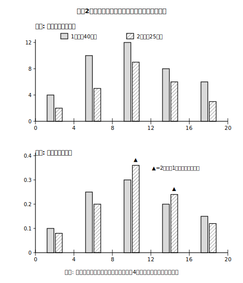

# L06 人数がちがうと比べられない——相対度数

## ねらい

- 大きさ（総度数）の異なる2つの集団は、各階級の度数のままでは比べられないことを体感する。
- **相対度数**（全体に対する各階級の度数の割合）を求められるようになり、割り算の向きを型として固定する。
- 相対度数を使うと、大きさの異なる集団どうしを比べられることを理解する。

## 主概念1：40人の学年と25人の学年、どっちが「けん玉上手」？

生徒会レクの「けん玉30秒チャレンジ」に、1年生から40人、2年生から25人が参加した。成功回数を同じ階級で整理すると、こうなった。

| 成功回数（回） | 1年生の度数（人） | 2年生の度数（人） |
|---|---|---|
| 0以上 4未満 | 4 | 2 |
| 4以上 8未満 | 10 | 5 |
| 8以上12未満 | 12 | 9 |
| 12以上16未満 | 8 | 6 |
| 16以上20未満 | 6 | 3 |
| 合計 | 40 | 25 |

「16回以上の人は、1年生6人・2年生3人。1年生の方が上手な人が多い！」——ちょっと待った。1年生は**40人**、2年生は**25人**も参加している。そもそもの人数が違うのだから、度数（人数）をそのまま比べるのはフェアじゃない。走った距離が違う2人の「歩数」を比べるようなものだ。

**大きさの異なる二つ以上の集団のデータの傾向を比べたいとき、各階級の度数で単純に比べることはできない。**では、どうするか。人数の違いを打ち消すには、**全体に対する割合**に直せばいい。

> 【ことば】**相対度数（そうたいどすう）**……全体（総度数）に対する、各階級の度数の割合。
> **相対度数 = その階級の度数 ÷ 総度数**

たとえば1年生の「16以上20未満」なら 6÷40=**0.15**。2年生なら 3÷25=**0.12**。全部の階級で計算して表に足すと、次のようになる。

| 成功回数（回） | 1年生の度数 | 1年生の相対度数 | 2年生の度数 | 2年生の相対度数 |
|---|---|---|---|---|
| 0以上 4未満 | 4 | 0.10 | 2 | 0.08 |
| 4以上 8未満 | 10 | 0.25 | 5 | 0.20 |
| 8以上12未満 | 12 | 0.30 | 9 | 0.36 |
| 12以上16未満 | 8 | 0.20 | 6 | 0.24 |
| 16以上20未満 | 6 | 0.15 | 3 | 0.12 |
| 合計 | 40 | 1.00 | 25 | 1.00 |

作ったら検算しよう。**相対度数の合計は必ず1.00になる**（全体のうちの全体だから）。割り算の向きに迷ったら、この検算が味方になる。もし「総度数÷その階級の度数」と逆向きに割ってしまうと、合計は1.00にならず、1より大きな変な値がゴロゴロ出てくる。**割合は「部分÷全体」**。この向きを型として覚えよう。

## 主概念2：度数と割合で、結論が入れかわる

相対度数の表で「12以上16未満」の行を見てほしい。

- 度数: 1年生8人 ＞ 2年生6人 → 「1年生の方が多い」
- 相対度数: 1年生0.20 ＜ 2年生0.24 → 「2年生の方が割合が高い」

**人数では1年生が多いのに、割合では2年生が上**——結論が入れかわった。どちらの数字も計算は正しい。違うのは「答えている質問」だ。度数は「何人いるか」に、相対度数は「その集団の中でどれくらいの割合か」に答えている。「どちらの学年がけん玉が得意な傾向か」を知りたいなら、人数の違いを打ち消した相対度数で比べるのが筋がいい。

<!-- figure-spec: 意図=同じ2集団を「度数で見た図」と「相対度数で見た図」で並べ、総度数が違うと度数の図はフェアな比較にならないことの可視化。データ=上段度数（1年生4,10,12,8,6／2年生2,5,9,6,3）、下段相対度数（1年生0.10,0.25,0.30,0.20,0.15／2年生0.08,0.20,0.36,0.24,0.12）。軸=横軸成功回数0〜20回（4回刻み）・縦軸は上段度数(人)／下段相対度数。下段では[8,12)と[12,16)で2年生が上回る逆転が見える（▲印）。生成方法=assets_provenance/generate_figures.py のパラメトリックSVG（相対度数を度数÷総度数で再計算し本文の表と一致・合計1.00・逆転の向きをassert検算。白黒両立のため2集団は塗りと斜線パターンで区別） -->

:::guide
**相対度数はどこまで細かく書く？**

この教材では相対度数を小数第2位まで（0.15のように）書く。割り切れないときは四捨五入して書くことになるが、そのときは合計が1.00からわずかにずれることがある（0.99や1.01になる）。それは計算間違いではなく丸めのせいだ。ずれが出たら「四捨五入の影響かな？」とまず疑い、元の割り算を確かめればいい。検算の道具は、機械的に使うのではなく意味と一緒に使うのが大人の流儀だ。
:::

:::guide
**「そろえて比べる」は割合の考えの総決算**

小学校で学んだ百分率（%）と相対度数は親戚で、相対度数0.30は30%と同じことを言っている。「基準をそろえて比べる」という割合の考え方が、データの分布の世界で再登場したわけだ。ちなみに、相対度数は各階級の**頻度**（起こりやすさの度合い）とみなされる、という見方がある。この見方は、この先の「確率」の学習の基礎になる。今はこの一文の予告だけにとどめておく。
:::

:::zatsudan
「うちの学校の方が合格者が多い」「いや、うちの方が合格**率**が高い」。世の中のニュースや広告にも、度数の主張と割合の主張が入り交じっている。どちらかが嘘というわけじゃない。でも、答えている質問が違う。この見分けがつくようになると、テレビの前での独り言がちょっと鋭くなる？　かもしれない。
:::

## 練習

1. 1年生の「8以上12未満」の相対度数0.30を、割り算の式から確かめよう。
2. ある人が2年生の「4以上8未満」の相対度数を「25÷5=5」と計算した。誤りを2つの観点（割り算の向き・検算）から指摘し、正しい値を求めよう。
3. 「0以上4未満」の階級について、度数の比較と相対度数の比較をそれぞれ行い、分かることを1つずつ文にしよう。
4. 次の文が正しければ○を、正しくなければ×を付けて、理由を言おう。
   (1) 相対度数の合計は、四捨五入の影響を除けば1.00になる。
   (2) 総度数が同じ2つの集団なら、度数の大小と相対度数の大小は一致する。
   (3) 度数で多い方の集団は、相対度数でも必ず高い。

:::stretch
**S1** 1年生40人のうち参加者が倍の80人になり、各階級の度数もすべてちょうど2倍になったとする。相対度数はどうなるか、計算する前に予想し、それから2つの階級で実際に計算して確かめよう。この結果は「相対度数は集団の大きさの違いを打ち消す」という言葉とどうつながるだろうか。（「割合 比較 落とし穴」で調べると、身近な実例が見つかる。）
:::

---

対応解答: answer_key_L05-08.md

<!-- gen_nav:nav:start（自動生成・手編集しない） -->

---

[← 前のレッスン](lesson_05.md)｜[単元の目次](README.md)｜[解答](answer_key_L05-08.md)｜[次のレッスン →](lesson_07.md)

<!-- gen_nav:nav:end -->
