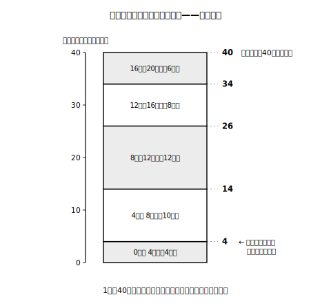

# L07 積み上げてわかる自分の位置——累積度数・累積相対度数

## ねらい

- **累積度数**（最小の階級から各階級までの度数の総和）を、途中を飛ばさずに積み上げて求められるようになる。
- **累積相対度数**を使って、「ある値未満（以上）が全体の何割か」を読み取れるようになる。
- 集団の中での自分の位置を、「少ない方から何%まで」という形で語れるようになる。

## 主概念1：下から積み上げる——累積度数

L06の1年生40人のけん玉チャレンジの表に、新しい列を1本足す。「その階級**まで**の度数を、最小の階級から全部合計した値」だ。

> 【ことば】**累積度数（るいせきどすう）**……最小の階級から、その階級までの度数の総和。

| 成功回数（回） | 度数（人） | 累積度数（人） |
|---|---|---|
| 0以上 4未満 | 4 | 4 |
| 4以上 8未満 | 10 | 14 |
| 8以上12未満 | 12 | 26 |
| 12以上16未満 | 8 | 34 |
| 16以上20未満 | 6 | 40 |

計算は「1つ上の累積度数＋その階級の度数」の繰り返し。4→4+10=14→14+12=26→26+8=34→34+6=40。雪だるまを転がすように、**途中の階級を飛ばさずに**積み上げるのがルールだ。「最初の階級と自分の階級だけ足す」のは典型的な間違いだ。あいだの階級も全部、雪だるまの中に入っている。

検算も型にしよう。**最後の累積度数は、必ず総度数（40人）に一致する**。一致しなかったら、どこかで足し忘れか足し過ぎがある。

<!-- figure-spec: 意図=「下から順に積む」動きの可視化（途中を飛ばす誤りの予防）。データ=度数4,10,12,8,6のブロックを下から積み上げ、各段の右に累積度数4,14,26,34,40を表示。最上段が総度数40に一致することを強調。軸=縦軸人数の積み上がり0〜40人。生成方法=assets_provenance/generate_figures.py のパラメトリックSVG（累積度数を度数列から再計算し本文の表と一致・最終値=総度数をassert検算） -->

この列が答えてくれるのは「**〜未満は何人？**」という質問だ。「12回未満の人は？」——表の「8以上12未満」の行の累積度数を見て、**26人**。いちいち4+10+12と足し直さなくても、表が覚えていてくれる。

:::guide
**累積度数は「範囲」と並ぶ、本単元の〔用語・記号〕指定語**

第1学年のデータの活用の〔用語・記号〕は「範囲」（L02）と「累積度数」の2語。ちなみに「ヒストグラム」や「相対度数」は指導事項の本文に出てくる大事な言葉だが、〔用語・記号〕の指定リストに載っているのはこの2語だけ、という区別がある。どれも使いこなすべき言葉であることに変わりはない。
:::

## 主概念2：割合で積む——累積相対度数と「自分の位置」

累積度数を総度数で割れば、割合の積み上げ版になる。これを**累積相対度数**という（四捨五入していない相対度数なら、最小の階級から積み上げても同じ値になる）。

| 成功回数（回） | 度数（人） | 相対度数 | 累積度数（人） | 累積相対度数 |
|---|---|---|---|---|
| 0以上 4未満 | 4 | 0.10 | 4 | 0.10 |
| 4以上 8未満 | 10 | 0.25 | 14 | 0.35 |
| 8以上12未満 | 12 | 0.30 | 26 | 0.65 |
| 12以上16未満 | 8 | 0.20 | 34 | 0.85 |
| 16以上20未満 | 6 | 0.15 | 40 | 1.00 |

検算は2重にできる。最後の累積相対度数が**1.00**になること。そして各行が「1つ上の累積相対度数＋その行の相対度数」になっていること（0.10→0.35→0.65→0.85→1.00）。この2つの検算がぴったり合うのは、このデータのように相対度数が割り切れているときだ。四捨五入した相対度数を足し上げると、累積度数÷総度数の値とわずかにずれることがある——L06で見た丸めの話と同じ理由である。

累積相対度数が答えるのは「**〜未満は全体の何割？**」という質問だ。そしてこれが、L02からの宿題「集団の中での自分の位置」を解く鍵になる。

あなたの記録が**7回**だったとしよう。7回は「4以上8未満」の階級。この行の累積相対度数は0.35。つまり**8回未満の人は全体の35%**。あなたは、多くても「少ない方から35%」のところまでにいる、と言える。平均値と自分を見比べて「上か下か」しか言えなかったL02のころより、ずっと解像度の高い言い方ができるようになった。**集団の中の位置は、分布の様子に左右される。だから平均値との比較だけで判断せず、累積相対度数で「少ない方から何%まで」と語る**——これが道具のそろった今の答えだ。

逆向きの質問にも使える。「16回以上の人は全体の何割？」なら、1.00−0.85=**0.15**。「〜以上」は、1から「〜未満」を引けばよい。

:::zatsudan
「クラスで真ん中よりちょっと上」と「少ない方から65%まで」。同じような内容でも、後者の方がぐっと具体的に聞こえないだろうか。順位そのものを言わずに位置を伝えられるのも便利なところで、人数が40人でも400人でも「少ない方から35%まで」の意味は変わらない。割合の言葉は、集団の大きさを超えて通じる共通語なんだ。
:::

## 練習

1. 2年生25人の表（L06: 度数 2, 5, 9, 6, 3）について、累積度数と累積相対度数の列を完成させよう。最後の値の検算（総度数25・累積相対度数1.00）も添えること。
2. 1年生の表から次を読み取ろう。
   (1) 成功回数が16回未満の人数。
   (2) 成功回数が12回未満の人の割合。
   (3) 成功回数が8回以上の人の割合。
3. ある人が1年生の「8以上12未満」の累積度数を「4+12=16人」と計算した。この誤りを「積み上げ」という言葉を使って説明し、正しい値を求めよう。
4. 2年生のある生徒の記録は10回だった。この生徒の集団の中での位置を、累積相対度数を使って「少ない方から〜」の形で言おう。

:::stretch
**S1** 1年生と2年生の累積相対度数を同じ表に並べると、大きさの異なる2つの集団の「積み上がり方」を直接比べられる。どちらの学年の方が「少ない回数側に人が集まっている」と言えるか、2つ以上の行を根拠に説明してみよう。（「累積相対度数 グラフ」で調べると、積み上がりを曲線で見る方法が見つかる。）
:::

---

対応解答: answer_key_L05-08.md

<!-- gen_nav:nav:start（自動生成・手編集しない） -->

---

[← 前のレッスン](lesson_06.md)｜[単元の目次](README.md)｜[解答](answer_key_L05-08.md)｜[次のレッスン →](lesson_08.md)

<!-- gen_nav:nav:end -->
