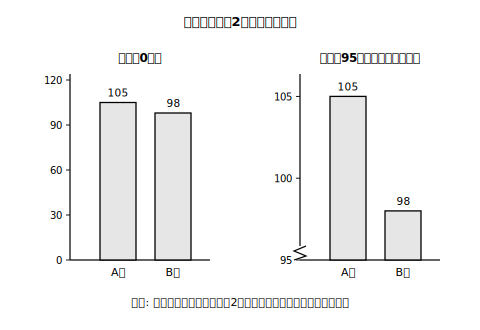

# L08 データを疑い、データで語る——批判的考察

## ねらい

- 「批判的に考察する」とは何か（**単に否定することではない**）を定義から押さえる。
- データにもとづく主張を、観点のリストを使って多面的に検討できるようになる。
- 目盛りを加工したグラフの誇張を見抜けるようになる。
- 統計的な問題解決の一連の流れを、自分のデータで最初から最後まで一人でやり切る。

## 主概念1：「批判的」は「否定的」ではない

この単元の仕上げは、道具の使い方ではなく「データとの付き合い方」だ。まず言葉の定義から。

> 【ことば】**批判的（ひはんてき）に考察する**……物事を単に否定することではなく、**多面的に吟味し、よりよい解決や結論を見いだす**こと。

ケチをつけることではない。「この主張、別の角度から見ても大丈夫かな？」と確かめてから信じる・使う、という前向きな態度だ。検討の観点を6つ、チェックリストにしておこう。

1. **データの収集の仕方**は適切か。（誰が・どうやって集めたデータ？）
2. **どの代表値**が根拠としてふさわしいか。（平均値でいい場面？　中央値・最頻値では？　→L02・L04）
3. **分布の形**に着目しているか。（対称？　裾を引いてる？　山は1つ？　→L04・L05）
4. 傾向を読み取りやすい**グラフ**で表せているか。（階級の幅は検討した？　→L05。人数の違う集団なら相対度数？　→L06）
5. グラフの**目盛りなどを加工して過度に誇張**していないか。（→主概念2）
6. 分析から得られる**結論は妥当**か。（データが語る範囲を超えて言い過ぎていないか）

観点1について1つ補足。「誰がどのように調べた結果か」という**データの信頼性**を気にする姿勢はここで持ってほしいが、データの集め方そのものの理論（かたよりなく選ぶ方法など)は中3の「標本調査」で学ぶ。今は「出どころを確かめる」まででいい。

## 主概念2：目盛りのトリック——誇張グラフを見抜く

文化祭の飲み物販売で、A班は105本、B班は98本売れたとする。この結果を2通りの棒グラフにした。

<!-- figure-spec: 意図=縦軸の始点操作による視覚的誇張の体感。データ=A班105本・B班98本の2本の棒×2枚。左=縦軸0〜120（ほぼ同じ高さに見える）、右=縦軸95〜106（Aの棒がBの2倍以上の高さに見える）。軸=縦軸販売数(本)。右図の縦軸が0から始まっていないことを示す波線マークつき。生成方法=assets_provenance/generate_figures.py のパラメトリックSVG（差7本・柱の高さの比〔左1.1倍未満・右2倍以上〕をassert検算） -->

左の図（縦軸が0から）では、2本の棒はほとんど同じ高さ。実際、差は7本で、105本と98本の違いは7%ほどだ。ところが右の図——縦軸を95本から始めただけで、A班の棒はB班の**2倍以上の高さ**に見える。

データは1つも書き換えていない。**目盛りを切り取っただけ**で、見る人の印象は操作できてしまう。縦軸の途中を省略するのは、限られた紙面で差を見やすくする工夫として使われることもある。だから「途中から始まるグラフ=悪」ではない。見抜くポイントは、**グラフを見たらまず軸の目盛りを確かめる**こと。0から始まっているか、目盛りの間隔は一定か。それだけで、印象に流されず「差は実際どれくらい？」と数値に戻れる。

:::guide
**「グラフにだまされない」から「グラフで誠実に語る」へ**

見抜く力は、裏返せば「自分が作るときの誠実さ」の基準になる。自分のレポートで差を強調したいとき、目盛りの切り取りで盛るのではなく、差そのものを数値で書く（「7本・約7%の差」）方が信頼される。この単元で学んだ道具（代表値の選択・分布の形・相対度数）は全部、「印象ではなく根拠で語る」ための道具だ。使う側に回ったときこそ、観点6点のチェックリストを自分に向けよう。
:::

## 主概念3：一連の活動を、一人でやり切る——ミニレポート

小学校でも経験した統計的な問題解決の流れを、中1の道具でフルにやってみよう。流れは5段階。

**問題を設定する → 計画を立てる → データを集めて分類整理する → グラフや表に表して特徴や傾向をつかむ → 結論をまとめ、さらなる問題を見いだす**

一人で完結する例を1つ通してみせる。テーマは「自分の計算練習は速くなっているか？」。

1. **問題**: 計算ドリル1ページのタイムは、10日間でどう分布しているか。速くなる傾向はあるか。
2. **計画**: 毎日同じ形式の1ページを解き、タイム（秒）を記録する。10日分たまったら整理する。
3. **データ**（自作の記録例・秒）: 95, 88, 90, 82, 85, 80, 78, 81, 76, 75
4. **整理と特徴**: 大きさの順に並べると 75, 76, 78, 80, 81, 82, 85, 88, 90, 95。平均値83秒・中央値81.5秒・範囲20秒。階級の幅5秒で度数分布表にすると、75以上80未満が3日……と分布の形も見える。ただし、並べ替えた表やヒストグラムからは「何日目の記録か」という順序の情報が消える。「速くなっているか」を確かめるために、**記録した日付の順**でも前半5日と後半5日を見比べておく——前半は5日とも82秒以上、後半は5日とも82秒以下だった。
5. **結論**: 「タイムは75〜95秒に散らばり、後半の5日はすべて82秒以下。練習を重ねた時期ほど速い傾向がある。ただし10日分と少ないので、来月も記録を続けて確かめたい。」

結論の最後の一文に注目——**データの限界を自分で言う**のも、批判的考察の一部だ。言い過ぎない結論は、かっこいい。

:::guide
**この流れの呼び名について**

「問題→計画→データ→分析→結論」という統計的な問題解決の流れは、教科書によっては各段階の英語の頭文字から「PPDACサイクル」と呼ばれることがある。これも教科書で使われる慣用的な呼び名で、学習指導要領の用語ではない。名前より大事なのは、最後の「さらなる問題を見いだす」でまた最初に戻る、ぐるぐる回る**サイクル**だという点だ。
:::

:::zatsudan
この単元でデータは、1人1個の生の値→ドットプロット→度数分布表・ヒストグラム→相対度数と、だんだん「縮めて」きた。縮めるほど1個1個の情報は消え、そのかわり全体や集団どうしの比較が見やすくなる。この縮約（しゅくやく）の階段は、実はまだ続きがある。中2では「箱ひげ図」という次の道具に出会う。階段の先も、なかなか面白いよ。
:::

## 練習

1. 「うちのクラスの平均睡眠時間は7時間。だから7時間くらい寝ている人がいちばん多い」という主張を、観点6点のうち**どの観点**で検討すべきか選び、検討の手順を言おう（L04の道具が使える）。
2. 縦軸が300から始まる棒グラフを見つけたとき、印象に流されないために確かめることを2つ挙げよう。
3. 「参加人数の違う2つの講座の人気を、申込者数の棒グラフだけで比べている」記事があった。観点4の立場から、どんなグラフ・数値に直すべきか提案しよう。
4. 【ミニレポート課題】自分の「10日間の記録」を1つ選んで集め（例: 読書のページ数、ランニングの周回数、タイピングの文字数など、一人で記録できるものなら何でもよい）、主概念3の5段階でミニレポートを作ろう。結論には「データの限界」の一文を必ず入れること。

:::stretch
**S1** 身の回り（ニュースサイト・広告・SNS）から「データを使った主張」を1つ見つけ、観点6点のチェックリストで採点してみよう。全部○の主張ばかりとは限らない。どの観点が欠けがちか、3つ集めて傾向を見ると面白い。（「グラフ ミスリード 事例」で調べると、教材になる実例が山ほど見つかる。）
:::

---

対応解答: answer_key_L05-08.md

<!-- gen_nav:nav:start（自動生成・手編集しない） -->

---

[← 前のレッスン](lesson_07.md)｜[単元の目次](README.md)｜[解答](answer_key_L05-08.md)

<!-- gen_nav:nav:end -->
