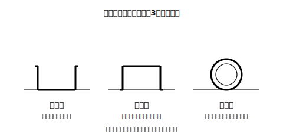
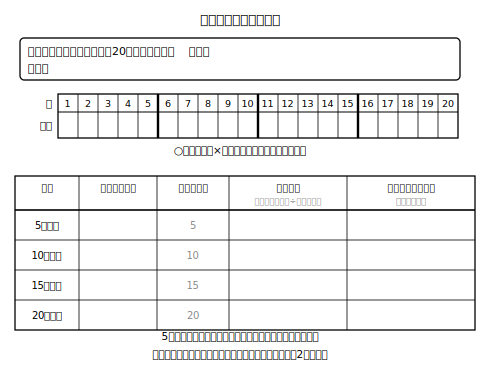

# L01 予言できないことがら——ふたはどっち向きに落ちる？

## ねらい

- 「次に何が起こるか予言（よげん）できないことがら」が身の回りにあることを知り、その**起こりやすさを数で表したい**という必要感をもつ。
- 相対度数の復習を「全体に対する割合」の1点にしぼり、**分母＝何をもとにするか**を言葉で言えるようにする。
- 一人でできる実験（ペットボトルのふた投げ）を実際にやり、**途中経過を記録して「この後どうなる？」を予想**する。

## 準備運動：割合の道具箱を点検しよう

この単元の主役は、新しい計算ではない。もう知っている「割合」だ。4問で点検しておこう。

1. あるゲームを20回やって8回成功した。成功した回数の割合を小数で表そう。
2. ペットボトルのふたを50回投げたら、口が上を向く形（この単元では「上向き」と呼ぶ）が30回出た。上向きが出た回数の相対度数を求めよう。
3. 問2で、割り算の**分母**にした数は何だろう。「投げた回数の合計」「上向きが出た回数」のどちらかで答え、そう選んだ理由を「もとにする量」という言葉を使って言ってみよう。
4. 問2で求めた小数を、分数でも表してみよう。

割合＝**比べる量÷もとにする量**。相対度数は「全体（＝もとにする量）に対する割合」で、あることがらがどれくらいの**頻度（ひんど）**で起こったかを表す数とみなせる。ここまでが復習。この単元では、この数を新しい場面で使っていく。

:::guide
**復習をこの4問だけにしぼった理由**

データの整理の章で学んだ道具（ヒストグラム・代表値など）は、ここでは使わない。この単元で本当に効くのは「相対度数＝全体に対する割合」というたった1点と、「分母に何を置くか」を言葉で言えることだ。特に問3のような「分母の言語化」は、簡単に見えて、割合のつまずきの根っこに直接効く。答え合わせのときは、値だけでなく「何をもとにする量にしたか」まで声に出して確かめるのがおすすめだ。
:::

## 主概念1：予言できないことがら

数学の問題は、ふつう答えが1つに決まる。3＋5は必ず8だし、正三角形の3つの角は必ず等しい。こういう「必ずそうなる」ことがらを、**確定したことがら**と呼ぶことにしよう。

ところが身の回りには、そうでないことがらもたくさんある。ペットボトルのふたを机の上に投げると、落ち方は3つある。

<!-- figure-spec: 意図=中心例の事象を目で確認させる（上向き・下向き・横向きの3通り）。内容=ふたの断面模式図3つを横に並べ、名前ラベルは本文の呼び名と完全一致（上向き=開いた口が上/下向き=口が下、かぶさる形/横向き=転がって横になった形）。装飾なし・白黒。生成方法=assets_provenance/generate_figures.py のパラメトリックSVG（開口の向き・接地をassert検算） -->

次の1回でどれが出るか、投げる前に言い当てられるだろうか？　じつは、誰にもできない。何回やっても、次の1回は**予言できない**。このような、結果が1つに確定しないことがらを**不確定なことがら**と呼ぶことにする。

でも「予言できない」で終わりにしてしまうと、何も判断できなくなる。かさを持っていくかどうか、商品を何個仕入れるか。世の中には、不確定なことがらについて決めなければいけない場面がたくさんある。そこで数学はこう考える。**次の1回は予言できなくても、「起こりやすさの程度」なら数で表せるのではないか**。この単元は、その数を手に入れる旅だ。

:::zatsudan
「なんとなく上向きが出やすい気がする」。この「気がする」を人に伝えるのは、意外と難しい。でも「10回投げたら6回上向きだった」なら伝わるし、さらに「10回中6回だから0.6」と一つの数にすれば、ほかのことがらとも比べられる。感覚を数にする。地味だけど、これがこの単元でいちばんかっこいい技だと先生は思っている。
:::

## 主概念2：やってみないと分からない——一人でできる実験

「上向き・下向き・横向き、どれが出やすいか」を考えたい。ここで大事なことが1つ。ふたの形は上下で違うから、**「3通りあるから、それぞれ同じ起こりやすさ」とは言えない**。形がかたよったものの起こりやすさは、頭の中だけでは決められない——**実験して確かめるしかない**のだ。

では、やってみよう。用意するものはペットボトルのふた1個だけ。机の上に20回投げて、「上向きが出たか」を記録する（この実験は一人で完結する。誰かと一緒にやる必要はない）。

**手順**

1. 投げる前に予想を書く。「上向きは、20回中だいたい何回出そうか」。理由もひとこと添えてみよう。
2. ふたを投げ、上向きなら○、それ以外（下向き・横向き）なら×を記録表に書く。
3. **5回投げるごとに一度手を止めて**、そこまでの上向きの相対度数（上向きの回数÷投げた回数）を計算する。
4. そのたびに「この後、この値はどうなっていくと思うか」を予想欄にメモする。

<!-- figure-spec: 意図=途中経過の記録と予想の書き留めを本文の手順どおりに実行させる作業用紙。内容=実験前の予想欄＋1〜20回の○×マス（5回ごとに太線区切り）＋4時点（5/10/15/20回）の集計欄（相対度数欄に「＝上向きの回数÷投げた回数」の式を薄く印字）＋各時点の予想メモ欄。データなしの白紙書きこみ式。生成方法=assets_provenance/generate_figures.py のパラメトリックSVG（マス数20・太線位置をassert検算） -->

参考までに、20回投げたときの記録の例がこれだ（この単元に出てくる記録は、実験のようすが伝わるように先生が教材用に用意した例だ。結果は人によって、ふたによって変わる。自分の記録が違う値になっても心配いらない）。

| 回 | 1 | 2 | 3 | 4 | 5 | 6 | 7 | 8 | 9 | 10 | 11 | 12 | 13 | 14 | 15 | 16 | 17 | 18 | 19 | 20 |
|---|---|---|---|---|---|---|---|---|---|---|---|---|---|---|---|---|---|---|---|---|
| 結果 | × | × | × | ○ | × | ○ | ○ | ○ | × | ○ | ○ | × | ○ | ○ | × | ○ | ○ | × | ○ | ○ |

（○＝上向き、×＝それ以外）

この記録をながめると、面白いことに気づく。最初は×が3回続いたのに、途中では○が3回続いている。**同じものを同じように投げているのに、結果はかたまって出たり、しばらく出なかったりする**。だからこそ、途中の少ない回数だけを見て「出やすさはこれだ」と決めるのは危ない——次のレッスンで、このことを正面から確かめる。

:::guide
**なぜ「途中で手を止めて予想」をはさむのか**

20回を一気に投げて最後に1回だけ集計しても、実験としては成立する。それでもあえて5回ごとに計算と予想をはさむのは、「相対度数が途中で大きく動く」ことを自分の手で目撃してもらうためだ。あとで多数回のデータを見たとき、「最初からだいたい一定の値だったのでは」という思いこみを、この体験が防いでくれる。予想はあたらなくてよい。むしろ「予想と違った」という記録こそ、次のレッスンで宝物になる。
:::

## 練習

1. 本文の記録の例について、5回時点・10回時点・15回時点・20回時点の上向きの相対度数をそれぞれ求めよう（割り切れないときは四捨五入して小数第2位まで）。
2. 問1で求めた4つの値は、どれくらい動いただろう。いちばん小さい値といちばん大きい値の差を求めよう。
3. 本文の記録の例の「5回時点」だけを見た人が、「上向きの出やすさは0.2だ」と結論づけた。この結論のあやういところを、問1・問2の結果を使って説明してみよう。
4. 自分の実験の記録表について、同じように4つの時点の相対度数を計算し、値の動き方を本文の記録の例と見くらべてみよう（値そのものは違ってよい。「動き方」に注目）。

:::stretch
**S1** 身の回りから「確定したことがら」と「不確定なことがら」を2つずつ探して、仕分けしてみよう。そのうえで、不確定なことがらのうち「くり返し実験や観察ができるもの」はどれかも考えてみよう。くり返せるかどうかが、この先で起こりやすさを数にできるかどうかの分かれ目になる。
:::

---

対応解答: answer_key_L01-03.md

<!-- gen_nav:nav:start（自動生成・手編集しない） -->

---

[単元の目次](README.md)｜[解答](answer_key_L01-03.md)｜[次のレッスン →](lesson_02.md)

<!-- gen_nav:nav:end -->
