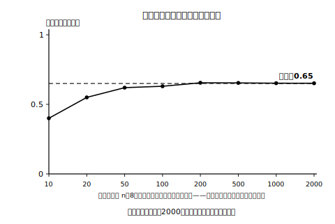

# L02 くり返すと見えてくる——相対度数の安定と「確率」

## ねらい

- ふた投げの回数をうんと増やしたとき、上向きの相対度数が**ある一定の値に近づいていく**ことをデータとグラフで確かめる。
- 相対度数 r/n が近づいていく一定の値を、そのことがらの起こる**確率**ということを知る（この単元の中心）。
- 起こりやすさを分数や小数の**一つの数**で表せるようになる。

## まず予想しよう：回数を増やすと、相対度数はどうなる？

L01では20回投げた。もし200回、2000回と投げ続けたら、上向きの相対度数はどうなっていくだろう。次の4つから、自分の予想を1つ選んでみよう。理由もメモしておこう。

- **ア** 上向きの回数がどんどん増えていくのだから、相対度数も増え続けて1に近づく。
- **イ** 相対度数は最初から決まった値のあたりで一定で、ほとんど動かない。
- **ウ** 相対度数は大きくなったり小さくなったりし続けて、どんな値にも近づかない。
- **エ** 最初はぶれるが、回数を増やすとしだいにある一定の値に近づいていく。

どれもそれなりに筋が通って聞こえるところが、この問題の面白いところだ。答えは頭の中では決められない。データで確かめよう。

## 主概念1：多数回のデータが見せてくれるもの

次は、同じ種類のふたを合計2000回投げたときの記録の例だ（L01の例と同じく、先生が教材用に用意した記録の例で、L01の20回の記録の続きではなく**別の実験の記録**だ。やることはL01と同じ——回数をうんと増やしただけ。自分の実験をこのまま2000回まで続けたら何が見えるか、その先の景色を見にいくつもりで読んでほしい）。

| 投げた回数 n | 上向きの回数 r | 上向きの相対度数 r/n（四捨五入して小数第2位まで） |
|---|---|---|
| 10 | 4 | 0.40 |
| 20 | 11 | 0.55 |
| 50 | 31 | 0.62 |
| 100 | 63 | 0.63 |
| 200 | 131 | 0.66 |
| 500 | 327 | 0.65 |
| 1000 | 652 | 0.65 |
| 2000 | 1303 | 0.65 |

表の見方を1つだけ注意。**上向きの回数 r は増え続けている**（4→11→…→1303）。でも、**相対度数 r/n は増え続けていない**。r と r/n は別の量だ。アを選んだ人は、この2つの列を指でなぞって、動き方の違いを確かめてみよう。

もう1つ、細かいけれど大事な種明かし。500回以降の相対度数はどれも0.65と書いてあるが、これは四捨五入して小数第2位までにそろえたためで、割り算の値そのものは 0.654、0.652、0.6515 と、まだわずかに動いている。ある値でぴったり止まるのではなく、**せまい範囲に落ち着いていく**——「近づいていく」とは、そういう意味だ。

グラフにすると、動きがもっとよく見える。

<!-- figure-spec: 意図=相対度数の安定（前半のぶれと後半の安定の対比）を一目で見せ、3方向の誤った予想（1に近づく/最初から一定/近づかない）を同時に否定する（本単元の中心図版）。データ=本文の2000回の表の8点と完全一致（r/nを生データから四捨五入で再計算しassert検算）。軸=横軸n（10〜2000の8点を等間隔配置＋「間隔は回数に比例していない」注記——実数比例だと前半のぶれが左端に圧縮されるため）・縦軸0〜1（0.5と1の目盛り明示）・0.65の高さに点線＋「およそ0.65」ラベル。生成方法=assets_provenance/generate_figures.py のパラメトリックSVG（answer_key由来の解答値は禁止文字列検査で機械排除） -->

最初の方（10回・20回）では値が大きく動いている。L01で体験したとおりだ。ところが回数を増やしていくと、ぶれはしだいに小さくなり、**およそ0.65というある一定の値に近づいていく**。近づき方は、なめらかな一直線ではない。200回時点の0.66のように、いったん行き過ぎてから戻ることもある。それでも大きな流れとして見れば、値は0.65のあたりに落ち着いていく。正解は**エ**だった。

ここで、L01の記録も思い出そう。○が続いたり、×がしばらく出なかったりしても、うんと長い目で見れば割合はならされていく。**途中のかたまりやぶれは消えないが、全体の割合は落ち着いていく**——これが、多数回くり返したときにだけ見えてくる景色だ。

:::guide
**イ・ウを選んだ人へ（よくある考え方とその修正)**

イ「最初から一定」と考えた人は、きっと最後の安定した姿を先取りしてイメージしている。でも表の最初の5行を見てほしい。0.40から0.66まで、実際にはかなり動いている。少ない回数でのぶれは、実験の失敗ではなく、不確定なことがらの正直な姿だ。
ウ「近づかない」と考えた人は、「次の1回が予言できない以上、割合も定まらないはず」と筋を通したのだと思う。予言できないのはそのとおり。それでも割合だけは落ち着いていく。この「1回は読めないのに、全体はならされる」という二重性こそ、この単元でいちばん不思議で、いちばん大事なところだ。
:::

## 主概念2：近づく先の値に名前をつける——「確率」

この「近づいていく一定の値」に、名前をつけよう。

> 【ことば】**確率（かくりつ）**
> あることがらについて、実験や観察をくり返す回数 n をどんどん大きくしていくとき、そのことがらが起こる相対度数 r/n が**近づいていく一定の値**を、そのことがらの起こる**確率**という。

2000回の記録の例のふたなら、「上向きが出る確率はおよそ0.65」と言える。3つ、だいじな注意がある。

1. **確率は「近づく先」の値**であって、途中のどれか1つの相対度数そのものではない。10回時点の0.40も、2000回時点の0.65も、どちらも相対度数。そのぶれの落ち着く先として考えるのが確率だ。
2. だから、**少ない回数の相対度数だけを見て「確率はこれだ」と決めることはできない**。10回時点の0.40を見て「上向きの確率は0.4」と言ってしまうのは、着地する前に着地点を宣言するようなものだ。
3. この考え方が成り立つのは、**同じことがらを、条件を変えずに何度もくり返せる**ときだ。ふた投げなら、同じふたを同じように投げ続ける、ということ。条件が途中で変わってしまうと、相対度数の近づく先も一つに定まらなくなる。

表記の橋渡しをひとつ。この本では相対度数を r/n と1行で書くが、ノートでは分子 r を上、分母 n を下に置く分数の形で書けばよい。「n分のr」、つまり（上向きの回数）÷（投げた回数）のことだ。

:::guide
**なぜ「およそ0.65」としか言えないのか**

実験から手に入るのは、あくまで有限の回数での相対度数だ。2000回での0.65も「近づく先」を高い精度で教えてくれる目安であって、確率の値そのものを言い当てた保証はない。だから実験にもとづく確率は「およそ」を付けて言うのが誠実な言い方になる。逆に言えば、大きな流れとしては、回数を増やしていくほど目安としてのたよりがいは増していく——ただし、1回増やすごとに必ず前よりよい目安になる、という約束ではない。「もっと回数を増やしたら、この値はどうなるだろう」と問い続ける姿勢そのものが、この単元で身につけたい態度だ。
:::

## 主概念3：起こりやすさを一つの数で

「上向きになりやすい気がする」が、いまや「上向きが出る確率はおよそ0.65」と言える。10回中6回なら 6/10 ＝ 3/5 ＝ 0.6 のように、**割合の知識を使って一つの数に圧縮する**。これで、感覚だったものが、人に伝えられて比べられる数になった。

もう1つ、L01の宿題を回収しよう。「上向きか、それ以外か」は2通りだ。もし「2通りだから、どちらも半分ずつの起こりやすさ」と考えてよいなら、確率は0.5になるはず。でも2000回の記録が示した答えは、およそ0.65だった。**通り数が同じでも、起こりやすさが同じとは限らない**。形のかたよったものの起こりやすさは、くり返し実験してみて初めて分かる。

:::zatsudan
ある教科書には「降水確率60％なら、かさが必要？」というコラムが載っている。天気予報のあの数字も、確率という名前がついた数だ。ニュースで見かけたら、「この数はどうやって出しているんだろう」と一度うたがってみるのも面白い。くわしくは、この単元を学び終えたあとのお楽しみにしよう。
:::

## 練習

1. 画びょう（がびょう）を投げると、針が上を向く形（「上向き」と呼ぶ）と、針が横をさす形がある。次は、画びょうを1000回投げたときの記録の例だ（これも教材用に用意した例だ）。空らん（あ）〜（う）の相対度数を、四捨五入して小数第2位まで求めよう。

   | 投げた回数 n | 上向きの回数 r | 上向きの相対度数 r/n |
   |---|---|---|
   | 10 | 8 | 0.80 |
   | 50 | 30 | （あ） |
   | 100 | 58 | 0.58 |
   | 500 | 284 | （い） |
   | 1000 | 572 | （う） |

2. 問1の実験で、この画びょうの上向きが出る確率として最もふさわしい値を、次から1つ選ぼう。
   **ア** 0.80　**イ** 0.57　**ウ** 0.50　**エ** 1
3. 問1の表について述べた次の文が正しければ○、正しくなければ×を付け、×の場合はどこが違うかを言おう。
   (1) 投げる回数を増やすと上向きの回数は増え続けるから、上向きの相対度数も増え続けて1に近づく。
   (2) 上向きの相対度数は、最初からずっとおよそ0.57で一定である。
   (3) 投げる回数を増やしていくと、上向きの相対度数はある一定の値に近づいていく。
4. 10回投げた時点の記録だけを見た人が、「この画びょうの上向きの確率はおよそ0.8だ」と判断した。この判断のあやういところを、表の続きを根拠にして説明してみよう。
5. あることがらについて実験をくり返したら、40回中26回起こった。この時点での相対度数を、分数と小数の両方で表してみよう。

:::stretch
**S1** ふたの2000回の表で、「上向きの回数」と「上向き以外の回数」の**差**を、n＝100 と n＝2000 について計算してみよう。回数の差は広がっているのに、相対度数は0.65あたりで安定している。「回数の差」と「割合」が別々の動きをすることを、自分の計算で確かめてみよう。なお、コンピュータの乱数（らんすう）機能を使うと、こうした多数回の実験を画面上で手早く再現できる。「乱数 シミュレーション 確率」で調べてみると入り口が見つかる（この本の実験は、紙と実物だけで完結するようにできている）。
:::

---

対応解答: answer_key_L01-03.md

<!-- gen_nav:nav:start（自動生成・手編集しない） -->

---

[← 前のレッスン](lesson_01.md)｜[単元の目次](README.md)｜[解答](answer_key_L01-03.md)｜[次のレッスン →](lesson_03.md)

<!-- gen_nav:nav:end -->
