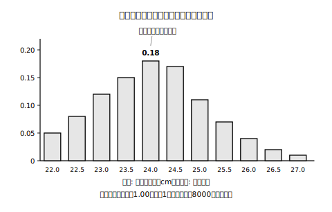

# L03 確率で決める——貸し出し用の靴は何足ずつ？

## ねらい

- 過去のデータの相対度数を確率と**みなして**、これからのことを予測・判断できることを知る（「みなしている」という自覚とセットで）。
- 「◯◯の相対度数が最も大きいから、△△と判断する」という**根拠つきの表現の型**で、自分の判断を書けるようになる。
- 確率が**語れること**（傾向）と**語れないこと**（次の1回・回数の保証）を区別する。

## 主概念1：過去のデータを未来にまわす——「みなす」という技

あるボウリング場が、貸し出し用の靴を100足まとめて買い替えることになった。どのサイズを何足ずつ買えばよいだろう。店には、過去1年間にサイズごとに靴を貸し出した回数の記録がある（貸し出しは合計8000回）。

| サイズ（cm） | 22.0 | 22.5 | 23.0 | 23.5 | 24.0 | 24.5 | 25.0 | 25.5 | 26.0 | 26.5 | 27.0 | 合計 |
|---|---|---|---|---|---|---|---|---|---|---|---|---|
| 貸し出した回数 | 400 | 640 | 960 | 1200 | 1440 | 1360 | 880 | 560 | 320 | 160 | 80 | 8000 |
| 相対度数 | 0.05 | 0.08 | （あ） | 0.15 | 0.18 | 0.17 | 0.11 | 0.07 | 0.04 | 0.02 | 0.01 | 1.00 |

<!-- figure-spec: 意図=どのサイズが借りられやすいかという傾向を一目で読める形にし、相対度数にもとづく意思決定の土台にする。データ=本文の表と完全一致（相対度数を回数÷合計8000から再計算しassert検算・合計1.00を欄外注記）。軸=横軸22.0〜27.0cm(0.5cmきざみ)・縦軸0〜0.20（0.05刻みの主目盛りのみ・補助目盛り/グリッド線なし——棒の高さから（あ）の値を精密に読み取れないようにするため）。数値ラベルは注記対象の24.0cm(0.18)のみで23.0cmには付けない（練習1の空らん（あ）の解答抑止・E裁定）。装飾なし・単色。生成方法=assets_provenance/generate_figures.py のパラメトリックSVG（（あ）の解答値を禁止文字列検査で機械排除） -->

来年どのサイズが何回借りられるかは、不確定なことがらだ。それでも、貸し出しのようすが毎年大きく変わらないなら、こう考えられる。**過去1年の各サイズの相対度数を、来年そのサイズが借りられる確率とみなして**、買う足数の参考にしよう、と。たとえば24.0cmの相対度数は0.18。100足買うなら、24.0cmは 100×0.18＝18足を目安にする。

ここで、正直な注意をひとつ。**過去1年のデータの相対度数は、確率であるとはいえない**。L02の確率は「回数をどんどん大きくしたときに近づいていく先」だったが、この記録は1年分で打ち止めで、しかも来年のようすが今年と同じという保証もない。それでも、傾向を予測するうえで、過去の相対度数は有力なよりどころになる。だから私たちは、相対度数を確率と**みなして**使う。「＝（イコール）」ではなく「みなす」。この一語の慎み深さが、データで判断する人の作法だ。

:::guide
**「みなす」を自覚するとなにが良いのか**

「相対度数＝確率」と思いこんでいる人と、「相対度数を確率とみなしている」と自覚している人は、予測が外れたときの振る舞いが違う。前者は「確率がまちがっていた」と混乱するが、後者は「みなしのもとにしたデータが古かったかもしれない。新しいデータで見直そう」と次の一手が打てる。「みなし」で使っているのは、確率そのもの（近づく先の値）ではなく、**予測のために私たちがデータから引き出した目安の数**だ。この区別を自覚しておくことは、この先データにもとづいて判断する場面で効き続ける。
:::

## 主概念2：判断を「型」で書く

買う足数を決めたら、その理由を人に説明できなければいけない。ここで使うのが、根拠つきの表現の型だ。

> **「（データのどこを見たか）の相対度数が最も大きいから、（判断）と考える。」**

例：「**24.0cmの相対度数0.18が全サイズの中で最も大きいから、24.0cmの靴を最も多く買う**と考える。」

ポイントは2つ。①理由の部分に、感覚ではなく**データの値**を置くこと。②「絶対に正しい」ではなく「と考える」「と判断する」で結ぶこと。不確定なことがらへの判断は、断定ではなく、根拠を示した提案の形で書く。

:::zatsudan
じつはこの貸し出し用の靴の話、先生の思いつきではなくて、学習指導要領の解説（先生たちが授業を作るときに読む国の資料）に載っている活用例をもとにしている。ボウリング場のような身近な商売の裏側でも、データにもとづく判断が動いているんだね。
:::

## 主概念3：確率が語れること・語れないこと

確率は強力な数だが、万能ではない。L02のふた（上向きの確率およそ0.65）で整理しよう。

**語れること**：「上向きは、それ以外より出やすい傾向がある」「回数を重ねれば、全体のうちおよそ0.65の割合が上向きになりそうだ」——**多数回をならしたときの傾向**だ。

**語れないこと**：

1. **次の1回**。確率0.65でも、次の1回が上向きかどうかは、やはり予言できない。
2. **回数の保証**。「確率0.65だから、20回投げれば必ず13回上向きになる」は誤りだ。L01の実験を思い出そう。○が続くことも、しばらく出ないこともあった。確率は「必ず〜回起こる」という約束ではない。

それでも、だ。「必ず〜になる」とは言い切れないことがらについて、**何も言えないのではなく、数を根拠に考えたり判断したりできる**。これが、この単元で手に入れたいちばん大きな力だ。

## 単元の締めくくり——そして、次の問いへ

ふり返ってみよう。①予言できないことがらに出会い、②くり返すと相対度数が安定することを実験とデータで確かめ、③その近づく先を「確率」と名づけ、④過去のデータの相対度数を確率とみなして判断に使った。すべての出発点は「実験・観察をくり返すこと」だった。

最後に、1つ問いを置いておく。ふたや画びょうは、実験しないと確率が分からなかった。では——**さいころのように、どの面も同じように作られたものなら、実験しなくても確率を求められるだろうか？**

この問いの答えは、ここでは言わない。2年生の確率の学習で、正面から取り組むことになる。「同じように作られたものなら」という条件がどれほど強い仮定なのか、ふたと画びょうで学んだ君はもう感じ取れるはずだ。

:::guide
**この単元が残す、いちばん大事な経験**

ふたも画びょうも、「上向きか、それ以外か」の2通りなのに、多数回の相対度数は0.65前後・0.57前後と、半々（0.5）からはっきり離れていた。つまり、**起こりやすさが等しいかどうかは、見た目や通り数だけでは決められず、実験してみないと分からないことがらがある**。この経験を持っているかどうかで、2年生の確率の学習の質が変わる。2年生でさいころの問いに正面から取り組むとき、「どの面も同じように作られている、とほんとうに言ってよいのか」と一度立ち止まれる人は、この単元の実験をくぐった人だ。
:::

## 練習

1. 貸し出し記録の表の空らん（あ）に入る23.0cmの相対度数を求めよう（記録の回数と合計回数から計算し、四捨五入せずに答えられる）。
2. 100足買い替えるとき、各サイズの足数を「100×そのサイズの相対度数」で見積もると、23.5cmと25.0cmはそれぞれ何足になるだろう。また、全サイズの見積もり足数の合計が100足になることを確かめよう。
3. 「22.0cmと27.0cmのどちらを多く買うべきか」について、主概念2の型を使って、根拠つきの1文を書いてみよう。
4. 次の文が正しければ○、正しくなければ×を付け、×の場合は理由を言おう。
   (1) この記録から、来年は24.0cmの靴が必ずいちばん多く借りられるといえる。
   (2) 24.0cmの相対度数が0.18だから、来年貸し出しが100回あれば、そのうちちょうど18回は必ず24.0cmである。
   (3) この記録の相対度数は、来年の傾向を予測するために確率とみなして使うことができる。
5. L02のふた（上向きの確率およそ0.65）について、「次の1回は必ず上向きになる」と言ってよいだろうか。「傾向」という言葉を使って、自分の言葉で答えてみよう。

:::stretch
**S1** 身の回りで「過去のデータをもとに決めていそうなこと」を1つ探し、①何の割合（相対度数）を使っていそうか、②その割合の分母（もとにする量）は何か、③「みなし」が外れるとしたらどんなときか、の3点をノートに書いてみよう。考えるヒントがほしいときは、AIチャットに「過去のデータの割合をもとに数量を決めている身近な例を、中学生向けに3つあげてください」と聞いてみると、題材さがしの参考になる（答えを写すのではなく、③まで自分で考えるのがこの問題の本体だ）。
:::

---

対応解答: answer_key_L01-03.md

<!-- gen_nav:nav:start（自動生成・手編集しない） -->

---

[← 前のレッスン](lesson_02.md)｜[単元の目次](README.md)｜[解答](answer_key_L01-03.md)

<!-- gen_nav:nav:end -->
