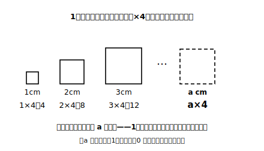

# L01 文字は「どんな数でも」の代理人

## ねらい

- 小学校で使った x や a を思い出し、文字が「どんな数でも入る代理人」であることを確かめる。
- 「同じ文字は同じ数を表す」という文字の基本ルールを知る。
- 文字を使うと何がうれしいのか（短く書ける・どんな場合にも通用する）を実感する。

## 準備運動：小学校の文字を呼び出す

文字の式は、実は初対面ではない。小学校でも「x を使った式」を書いたことがあるはずだ。まずは思い出しから始めてみよう。

1. 1個 x 円のパンを3個買う。代金を x を使った式で表そう。
2. 1の式で、x が 90 のとき、代金はいくらになるか求めてみよう。

答えは 3×x（円）と 270円。ここまでは小学校の続きだ。この章では、この「文字の式」を本格的な道具に育てていく。

## 主概念1：1本の式が、すべての場合を引き受ける

1辺が 1cm、2cm、3cm……の正方形の、まわりの長さを考えてみよう。

- 1辺 1cm → 1×4＝4（cm）
- 1辺 2cm → 2×4＝8（cm）
- 1辺 3cm → 3×4＝12（cm）

1辺の長さが変わるたびに、式を書き直している。でも、変わっているのは「1辺の長さ」の数だけで、**「×4」の部分はいつも同じ**だ。そこで、変わる数の席に文字 a を置いてみよう。

> まわりの長さ ＝ a×4（cm）

a に 1 を入れれば 4、5 を入れれば 20、たとえ 100 でも 1.5 でも、この1本の式が正しい答えを返してくれる。**文字は「どんな数でも入る席」であり、文字の式は「すべての場合をまとめて表した式**」なのだ。ただし「どんな数でも」には注釈がつく。**入れてよい数の範囲は、場面が決める**。いまの a は正方形の1辺の長さだから、0 より大きい数に限られる（−2cm の辺は存在しない）。席は広いが、場面という会場の中での話だ。

> **【ことば】文字の式**……a や x などの文字を使って表した式。文字の席には、いろいろな数を入れることができる。

:::guide
**「a＝りんご」ではない**

文字でつまずくとき、a を「りんごの a」「アメの a」のような**名札**として読んでいることがある。名札と考えると「a が 4 個」のような数えものに見えてしまい、a×4 の意味がとれなくなる。a はあくまで**数の代理人**、つまり「1辺の長さを表す、まだ決まっていない数」だ。「a は数。名前ではない」と最初に一言、自分に宣言しておくと、この先の理解がまるごと安定する。
:::

## 主概念2：文字の文法は「同じ文字は同じ数」

文字の式には、最初に知っておくべき基本ルールがある。

> **【ことば】文字の基本ルール**……1つの式の中で——より正確には、**1つの問題・1つの場面の中で**——**同じ文字は同じ数を表す**。a＋a なら、2つの a には必ず同じ数が入る。同じ場面について書いた別の式に出てくる a も、同じ数を表す。

たとえば a＋a で、片方の a に 3、もう片方に 5 を入れる。これはルール違反だ。a＋a は「同じ数を2回たす」という意味で、a が 3 なら 3＋3＝6。だから a＋a は a の2倍、つまり a×2 と同じはたらきをする。

逆に、**違う文字（a と b など）は、違う数でもよいし、たまたま同じ数でもよい**。a＋b は「a に入れた数と b に入れた数の和」で、a＝3、b＝5 でも、a＝3、b＝3 でもかまわない。

:::guide
**なぜこのルールをわざわざ言うのか**

「同じ文字は同じ数」は、当たり前に見えて、意外と曖昧なまま進みやすいルールだ。ここを曖昧にしたまま進むと、式の値の計算（L06）や一次式の計算（L11）で「a＋a＝a では？」のような混乱が起きる。逆に、ここで一度はっきり言葉にしておけば、あとの全部が「ルール通り」で押し切れる。文字の式は外国語に似ていて、文法を先に知っているほうが早く話せるようになる。
:::

## 文字を使うよさ

文字を使う理由は、かっこよさではない。実用的なうれしさが2つある。

1. **短い**。「1辺の長さを4倍するとまわりの長さになります」と毎回書く代わりに、a×4 の3文字で済む。
2. **どんな場合にも通用する**。1辺が何cmでも、この式1本でよい。個別の計算を無限に書き並べる必要がない。

このよさは、式が複雑になるほど効いてくる。次のレッスンでは、文字の式をもっと短く書くための「約束」を学ぶ。

:::zatsudan
縦 a cm、横 b cm の長方形の面積は a×b。この式、見た目はただの面積の公式だけど、a を「1個の値段」、b を「買う個数」と読み替えれば代金の式になり、a を「速さ」、b を「時間」と読めば道のりの式になる。**1本の式が、まったく別の場面を同時に表せる**——文字の式が「数学の共通語」と呼ばれるゆえんだ。この章が終わるころには、この読み替えが自由にできるようになっている。
:::

## 練習

1. 1本 x 円の鉛筆を6本買う。代金を x を使った式で表そう（×の記号を使ってよい）。
2. 1の式で、x が 80 のとき・120 のときの代金をそれぞれ求めてみよう。
3. 1辺の長さが a cm の正三角形がある。まわりの長さを a を使った式で表そう。
4. 次の説明のうち、文字の基本ルールに**合わない**ものを1つ選ぼう。
   - ア: x＋x で、2つの x にどちらも 7 を入れて 14 とした。
   - イ: x＋y で、x に 2、y に 9 を入れて 11 とした。
   - ウ: x＋x で、左の x に 2、右の x に 9 を入れて 11 とした。
   - エ: x＋y で、x に 6、y に 6 を入れて 12 とした。

:::stretch
**S1** 「1辺 a cm の正方形のまわりの長さ a×4」と「1辺 a cm の正三角形のまわりの長さ a×3」。この2つの式の a に、同じ数を入れなければいけないだろうか？ それとも別の数でもよいだろうか？ 「1つの式の中で」という基本ルールの言葉に注意して、自分の考えを書いてみよう。
:::

---

対応解答: answer_key_L01-04.md

<!-- gen_nav:nav:start（自動生成・手編集しない） -->

---

[単元の目次](README.md)｜[解答](answer_key_L01-04.md)｜[次のレッスン →](lesson_02.md)

<!-- gen_nav:nav:end -->
