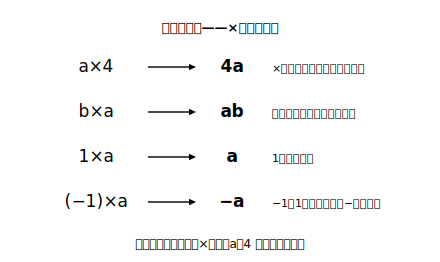
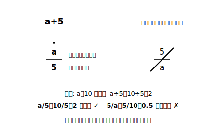

# L02 積と商の表し方——×と÷を省く約束

## ねらい

- かけ算の式から×を省いて書く約束（書き順・1の扱い）を身につける。
- わり算を分数の形で表す約束を身につける。
- この約束が「絶対の規則」ではなく、**普通はこう書くと便利だから**という留保つきの約束であることを知る。

## 主概念1：×を省く（積の表し方）

a×4 のような式は、これから数えきれないほど書くことになる。そこで数学では、**普通は×の記号を省いて書く**という約束がある。ただし、ただ省くだけだと読み間違いが起きるので、セットの約束がいくつかつく。

> **【ことば】積の表し方の約束**
> 1. 文字と数の積では、×をはぶき、**数を文字の前に**書く。 a×4 → **4a**
> 2. 文字どうしの積も×をはぶき、**ふつうアルファベット順**に書く。 b×a → **ab**
> 3. **1×a は a**、(−1)×a は −a と書く（1 は書かない。0.1×a は 0.1a。小数の 1 は残す）。

なぜ省くのか？ 理由は単純で、**短く・見やすくなる**からだ。x×3×y×2 と 6xy を見比べると、後者のほうが「6 が全体の個数、xy が中身」と一目で読める。約束は暗記のためでなく、便利さのためにある。

気をつけたいのは、×を省けるのは**かけ算だけ**ということ。a＋4 の＋は省けない。4a と書いたら、それは必ず 4×a の意味だ。

:::guide
**「必ず省略」ではない、留保つきの約束**

この約束には「**普通は**」という言葉がついている。特に必要な場合には、×を書いてもよい。たとえば具体的な数の計算に戻すとき、4a に a＝3 を入れて 4×3 と書く場面では×が復活する。「×は禁止された」のではなく「省くと便利だから普通は省く」。この温度感で覚えておくと、あとで代入（L06）のときに混乱しない。
:::

## 主概念2：÷は分数の形で（商の表し方）

わり算にも約束がある。

> **【ことば】商の表し方の約束**……わり算は、÷の記号を使わずに、**分数の形**で書くのが普通。 a÷5 → **a/5**（5分の a）

分数の形にすると、「わられる数が上（分子）・わる数が下（分母）」という位置関係で式が読めるようになり、あとで計算するときにも扱いやすい。

ここで大事な注意を1つ。**どちらが分子（上）か**は、元のわり算で決まる。a÷5 は「a を 5 でわる」だから a が上。5÷a なら 5 が上だ。あべこべに書くと、まったく別の量になる。あやしいと感じたら、文字に具体的な数を入れて確かめてみよう。a＝10 なら a÷5＝2。10/5＝2 で一致、5/10＝0.5 は不一致。上下の並びはこれで自分で点検できる。

なお、÷を使って a÷5 と書くことが**誤りになるわけではない**。分数の形は「普通はこう書く」という約束だ。

(a＋3)÷4 のように、式のまとまりをわるときは、まとまりごと分子に載せて (a＋3)/4 と書く。

> **ノートではこう書く**……この教材では紙面の都合で a/5 のように「/」を使った1行の書き方も使うが、ノートでは分数の形（横線の上に a、下に 5）で書こう。教科書やテストの式も分数の形が基本だ。

:::guide
**マイナスつきの商の置き場所**

(−3)×a が −3a になるように、負の数がからむ商も書ける。たとえば x÷(−2) は x/(−2) だが、ふつうは符号を前に出して −x/2 と書く。「符号は式の先頭にまとめる」と見た目が整い、符号の見落としが減る。ここは正負の数（前章）とこの章の合流地点なので、符号の扱いに不安があれば、前章の乗除のページを1枚だけ見返してから進むとよい。
:::

:::zatsudan
「×を省く」なんて、ずいぶん横着な約束に見えるかもしれない。でも、よく使うものほど短くなるのは、言葉の世界でもおなじみだ。「スマートフォン」は「スマホ」になり、よく通る道ほど近道ができる。数学の式ではかけ算の記号を省く約束が広く使われていて、書き方のルール（数を前に・1は書かない）までそろっているから、だれが書いた式でも同じように読める。
:::

## 練習

1. 次の式を、×の記号を省いて表そう。
   (1) x×7　(2) a×b×3　(3) y×(−1)　(4) x×0.1　(5) (a＋b)×5
2. 次の式を、÷の記号を使わずに表そう。
   (1) x÷9　(2) 7÷a　(3) (x−2)÷3
3. 次の式を、×と÷の記号を使った式に戻そう。
   (1) 6ab　(2) x/8　(3) 2(a＋1)
4. 「m÷6 を分数で表すと 6/m である」。この答えが正しいかどうか、m＝12 を入れて確かめ、誤りなら正しく直そう。

:::stretch
**S1** 3×a は 3a と書けるのに、3＋a を「3a」と書いてはいけない。もし＋も省略してよいことにすると、どんな困ったことが起きるだろうか。3a という式が2通りに読めてしまう例（a に具体的な数を入れた例）を挙げて説明してみよう。
:::

---

対応解答: answer_key_L01-04.md

<!-- gen_nav:nav:start（自動生成・手編集しない） -->

---

[← 前のレッスン](lesson_01.md)｜[単元の目次](README.md)｜[解答](answer_key_L01-04.md)｜[次のレッスン →](lesson_03.md)

<!-- gen_nav:nav:end -->
