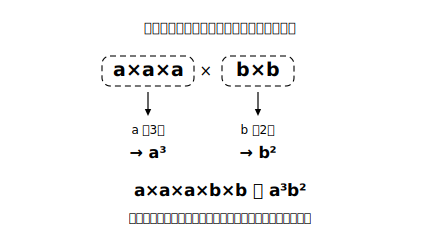

# L03 累乗の表し方と表記の総仕上げ

## ねらい

- 同じ文字の積を、累乗（るいじょう）の指数を使って表せるようになる。
- ×・÷・累乗の3つの約束が混ざった式を、正しく書き替えられるようになる。

## 主概念：同じ文字の積は、指数で数える

a×b は ab と書けた。では a×a はどう書くだろう？ 約束どおりなら aa だが、同じ文字が続くときは、もっとよい書き方がある。前章「正負の数」で使った**累乗**の表し方だ。

> **【ことば】文字の累乗**……同じ文字の積は、指数（しすう）を使って表す。 a×a → **a²**（a の2乗）、a×a×a → **a³**（a の3乗）

指数は「**同じものを何個かけ合わせたか**」の個数を数えている。だから a×a×b なら、a が2個・b が1個で **a²b**。b の指数の1は、L02の「1は書かない」と同じ理屈で省略される。

まぎらわしいペアで確認してみよう。

- **a²＝a×a**（a を2個かける）
- **2a＝a＋a**（a を2個たす。L01の「同じ文字は同じ数」で確かめたとおり）

a＝3 を入れると、a²＝3×3＝9、2a＝3＋3＝6。似た見た目でも、中身はまるで別ものだ。

:::guide
**「2乗」と「2倍」を言葉で区別する**

a² と 2a の取り違えは、この先ずっとつきまとう定番の混同だ。おすすめの予防策は、式を**声に出して読む**こと。a² は「a の2乗」、2a は「a の2倍」。「乗」と読んだらかけ算の重ね、「倍」と読んだら足し算の重ね（＝かけ算1回）。書き分けだけでなく読み分けをセットにすると、目と耳の両方でチェックが働く。
:::

## 表記の総仕上げ：3つの約束を1本の式で

L02とL03の約束を組み合わせると、×÷の混ざった式が短く書ける。

x×x×3−y÷2 → **3x²−y/2**

手順はいつも同じだ。①かけ算のかたまりごとに×を省き、数を前・同じ文字は指数へ ②わり算は分数の形へ ③＋と−はそのまま残す。＋・−は省略できないから、式は「＋・−で区切られたブロックの集まり」に見えてくる。この見え方が、2節（L10）で「項」という名前をもらう伏線になる。

:::guide
**書き替えチェックリスト**

書き替えた式は、次の3点で自己点検できる。①×が残っていないか（残すのは「特に必要な場合」だけ）②数字は文字の前か・1 を書いていないか ③÷が残っていないか（分数の形にしたか）。仕上げに、文字へ具体的な数を1つ入れて、元の式と書き替え後の式が同じ値になるか確かめれば完璧だ。たとえば上の式で x＝2、y＝4 なら、元の式は 2×2×3−4÷2＝12−2＝10、書き替え後は 3×2²−4/2＝12−2＝10 で一致する。
:::

:::zatsudan
x×x×x×x を「xxxx」とは書かず x⁴ と書く。もし指数の書き方がなかったら、「x を10個かけた式」は xxxxxxxxxx。もう何個あるか数える気も起きない。指数は「同じものの繰り返しは、回数だけメモすればいい」という発想の表れで、この発想はあとで大きな数の表し方や、もっと先の数学でも主役級の活躍をする。「繰り返しは数で記録する」——省略の約束の中でも、いちばんの働き者かもしれない。
:::

## 練習

1. 次の式を、×・÷の記号を使わずに表そう。
   (1) x×x　(2) a×a×a×5　(3) b×a×b　(4) x×x−y×7
2. 次の式を、×・÷の記号を使った式に戻そう。
   (1) 4a²　(2) x²y　(3) a²/3
3. x＝5 のとき、x² と 2x の値をそれぞれ求め、どちらが大きいか比べてみよう。
4. 次の書き替えには誤りが1つある。見つけて正しく直そう。
   「a×a×b×3÷c ＝ 3a²b/c」「x×x＋x ＝ x³」

:::stretch
**S1** x² と 2x では、練習3のとおり x＝5 なら x² のほうが大きい。では、**どんな数でも** x² のほうが大きいと言ってよいだろうか？ x に 1、0.5、0、−3 などいろいろな数を入れて調べ、気づいたことを書いてみよう。
:::

---

対応解答: answer_key_L01-04.md

<!-- gen_nav:nav:start（自動生成・手編集しない） -->

---

[← 前のレッスン](lesson_02.md)｜[単元の目次](README.md)｜[解答](answer_key_L01-04.md)｜[次のレッスン →](lesson_04.md)

<!-- gen_nav:nav:end -->
