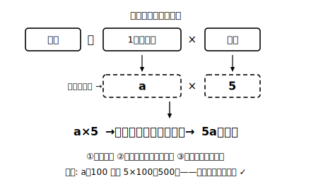

# L04 数量を文字式で表す①——言葉の式を橋にする

## ねらい

- 身のまわりの数量を、「言葉の式」を橋にして文字式で表せるようになる。
- つくった式が正しいかどうかを、**具体的な数を入れて検算する**型を身につける（この章の最重要の型）。
- 単位のつけ方（和の式はかっこでくくる）を知る。

## 主概念1：いきなり文字にせず、言葉の式を橋にする

「1個 a 円のパンを5個買ったときの代金」を文字式にしてみよう。いきなり a と 5 をにらむより、確実な手順がある。小学校でおなじみの**言葉の式**を先に書くことだ。

1. **言葉の式**: 代金 ＝ 1個の値段 × 個数
2. **席に入れる**: 1個の値段の席に a、個数の席に 5 → a×5
3. **約束どおりに書く**: **5a（円）**

言葉の式は、文字が入る前から知っている「数量の関係の骨組み」だ。骨組みに文字を流し込むだけなら、迷いようがない。道のりでも同じ手が使える。

- 道のり ＝ 速さ × 時間 → 時速 4km で x 時間歩いた道のりは **4x（km）**

## 主概念2：つくった式は、具体的な数でテストする

つくった式が合っているか、自分ひとりで確かめる方法がある。**文字に具体的な数を入れて、場面に戻して計算した答えと比べる**のだ。

5a（円）をテストしてみよう。a＝100（1個100円）なら、式からは 5×100＝500円。場面で考えても、100円のパン5個は500円。一致した。式は場面を正しく写している。

もし誤って「a5」ならぬ 5＋a と書いていたら？ a＝100 で 5＋100＝105円。100円のパン5個が105円のはずはないから、その場で誤りに気づける。

> **具体数で検算**……①文字に、計算しやすい具体的な数を入れる ②式の値を計算する ③場面にその数をあてはめ、常識で計算した答えと比べる。ずれていたら式のどこかが誤り。

この検算は、だれかに丸をつけてもらわなくても、**自分の式を自分で点検できる**方法だ。この章のすべての「表す」問題で使っていく。

:::guide
**検算に使う数の選び方**

テストに入れる数は、10 や 100 のような「暗算で場面を再現できる数」がよい。一方で、0 や 1 は避けたほうが安全だ。たとえば誤った式 a＋5 と正しい式 5a に a＝1 を入れると、一方は 6、もう一方は 5 で今回は見分けられるが、2a と a² のような組は 2 を入れるとどちらも 4 になり、誤りを見逃してしまう。**「見分けたい2つの式が、たまたま同じ値になる数」は検査の役に立たない**。1つの数で不安なら、2つ目の数でもう一度テストしてみよう。
:::

## 単位のつけ方：和の式はかっこでくくる

「1個 a 円のパン5個と、1本90円のジュース1本」の代金はどうなるだろう。パンが 5a 円、ジュースが 90 円で、合計は 5a＋90（円）。これを答えとして単位つきで書くときは、

> **(5a＋90)円**……式が和や差のときは、**式全体をかっこでくくって**から単位をつける。

かっこがないと「5a 円＋90」なのか「(5a＋90) 円」なのか読み手に伝わらない。5a のような積だけの式なら、5a 円とそのまま書いてよい。

:::guide
**「＋90 で終わる式」は答えになっている**

5a＋90 を見て「まだ計算が終わっていないのでは？」と感じたら、それはとても自然な感覚だ。小学校まで、答えはいつも1個の数だったから。でも 5a と 90 は種類の違う量（a がいくつ分かで変わる部分と、変わらない部分）で、これ以上まとめられない。**演算記号が残ったままの式が、立派な「答え**」なのだ。この感覚の切り替えはこの章の山場の1つなので、L07でもう一度正面から扱う。いまは「＋が残っていても完成形」とだけ覚えて進もう。
:::

:::zatsudan
奇数を全部あつめて1本の式で書ける、と言われたらどう思うだろう。整数を n とすると、2n＋1。n に 0、1、2、3……を入れると 1、3、5、7……と奇数が次々に出てくる。1 も 101 も 999999999 も、たった4文字 2n＋1 の中に住んでいる。無限にあるものをひとまとめに表せるのは、文字の席に「どんな数でも」入るからこそ。文字式は、無限を圧縮する発明なんだ。
:::

## 練習

1. 次の数量を文字式で表そう（単位もつけよう）。
   (1) 1冊 x 円のノートを4冊買ったときの代金
   (2) 1辺 a cm の正方形のまわりの長さ
   (3) 時速 3km で t 時間歩いたときの道のり
   (4) 1個 a 円のりんご3個と、1個 b 円のなし2個を買ったときの代金
2. 500円玉を1枚出して、1本 y 円の飲み物を2本買った。おつりを文字式で表そう。
3. 2でつくった式を、y＝120 でテストしよう（式の値と、場面で考えた答えが一致するか確かめる）。
4. ある人が「x 人が7人ずつの班に分かれたときの班の数」を 7x と表した。x＝21 を入れてこの式をテストし、誤りなら正しい式に直そう。

:::stretch
**S1** 「1個 a 円の品物を3個」と「1個 3 円の品物を a 個」。代金の式はどちらも 3a 円になる。場面はまったく違うのに式が同じになるのはなぜか、言葉の式（代金＝1個の値段×個数）に立ち返って説明してみよう。
:::

---

対応解答: answer_key_L01-04.md

<!-- gen_nav:nav:start（自動生成・手編集しない） -->

---

[← 前のレッスン](lesson_03.md)｜[単元の目次](README.md)｜[解答](answer_key_L01-04.md)｜[次のレッスン →](lesson_05.md)

<!-- gen_nav:nav:end -->
