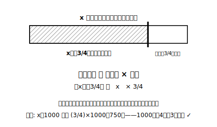
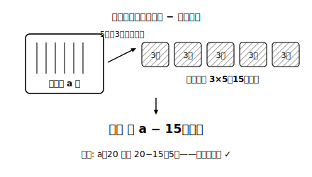

# L05 数量を文字式で表す②——割合・速さ・残り

## ねらい

- 「〜の◯倍」「◯%」「◯割」を、**基準量（もとにする量）を先に特定してから**文字式で表せるようになる。
- 速さ・時間・道のりの関係を、商の形の文字式で表せるようになる。
- 「配って残る」タイプの数量を、構造を分解してから式にできるようになる。

## 主概念1：割合の式は「どちらが基準量？」から

この章の中でも特に間違いが起きやすいのが、割合の式だ。次の2つを見比べてみよう。

- (ア) 「x 円の**4分の3**」
- (イ) 「**x 円が**、ある金額の4分の3にあたる」

(ア)は x が**基準量**（もとにする量）。基準量×割合で、x×3/4 ＝ **(3/4)x（円）**。(イ)は x が比較量で、基準量は別にいる。同じ「x」「4分の3」の組み合わせでも、**どちらが基準量かで式が変わる**。

そこで、割合の問題ではいつもこの手順をとる。

> **割合の式の手順**……①「〜の」の直前にある量＝**基準量**を丸で囲む ②言葉の式「比べる量＝基準量×割合」に流し込む ③具体数でテストする

(ア)をテストしてみよう。x＝1000 なら (3/4)×1000＝750円。1000円の4分の3は750円で、常識と一致する。もし逆に x÷(3/4) と立てていたら 1000÷(3/4) は 1000×(4/3) で約1333円になり、もとの1000円より大きい。「4分の3にしたのに増えるのは変だ」と、検算が教えてくれる。

%や割も、分数・小数に直してから同じ手順に載せる。

- a 人の **30%** → a×0.3 ＝ **0.3a（人）**（30%＝0.3）
- 定価 p 円の **2割引き**の値段 → 2割引き＝定価の8割 → **0.8p（円）**

:::guide
**2割引きの2つの道**

0.8p にはもう1つの道がある。「定価から割引き分を引く」道だ。割引き分は p×0.2＝0.2p 円だから、値段は p−0.2p 円。p＝1000 でテストすると、1000−200＝800円、0.8p も 800円で一致する。p−0.2p と 0.8p が同じ量の別表現だと**計算で**示すのは2節（L11〜L12）の仕事だが、いまの段階でも「どちらの道でも立式できて、検算で同じ値になる」ことは確かめられる。式が人と違っても、あわてず具体数でテストしてみよう。
:::

## 主概念2：速さの式は、上下の並びを検算で守る

速さ・時間・道のりの3兄弟は、どれを文字にしても言葉の式は同じだ。

- 道のり ＝ 速さ × 時間
- 速さ ＝ 道のり ÷ 時間
- 時間 ＝ 道のり ÷ 速さ

「x km の道のりを時速 3km で歩いたときにかかる時間」を表してみよう。時間＝道のり÷速さ、だから x÷3 ＝ **x/3（時間）**。

わり算の式では、L02で見たとおり**上下の並び**が事故ポイントだ。3/x と書きたくなったら、検算の出番。x＝6（6km を時速3km）なら、かかる時間は常識で2時間。x/3＝6/3＝2 で一致、3/x＝3/6＝0.5 は不一致。**分数の式を書いたら、必ず具体数を1回通す**。これだけで上下の事故はほぼ防げる。

:::guide
**「割合・速さは苦手」のままで大丈夫か**

割合と速さは、小学校の内容の中でも特に手ごわい相手で、文字が入るとさらに一段むずかしくなる。ここでつまずくのは恥ずかしいことではまったくない。この教材が「基準量を丸で囲む」「具体数を1回通す」というやや回りくどい手順をわざわざ型にしているのは、**手順が思考の代わりに働いてくれる**からだ。慣れてきたら手順は自然に省略できるようになる。最初から暗算で飛ばそうとしないことが、結局いちばんの近道になる。
:::

## 主概念3：「配って残る」は構造を分解してから式にする

「a 本の鉛筆を、5人に3本ずつ配ったときの残りの本数」を式にしてみよう。一気に書こうとせず、場面を2つの部品に分解する。

1. **配った本数**: 3本ずつ×5人 ＝ 3×5＝15（本）
2. **残り**: はじめの本数 − 配った本数 ＝ **a−15（本）**

a＝20 でテスト。式からは 20−15＝5本。場面でも、20本から15本配れば残り5本で一致だ。

「配る人数のほうが文字」のときも、同じ分解が効く。「30個のあめを、x 人に4個ずつ配ったときの残り」なら、配った個数が 4x 個で、残りは **(30−4x)個**。

:::zatsudan
割合の式、たとえば 0.3a を書いたとき、「aに0.3をかけただけで、ほんとうに『30%』を表せているのかな」と不安になることがある。そんなときこそ a＝100 の出番。100人の30%は30人、0.3×100＝30 で、ぴったり合う。100 という数は、%の検算と最高に相性がいい。30%＝0.3、60%＝0.6 という書き換えも、100 を入れたとたん「100人の30%は30人」と目で見える形になる。困ったら100を入れてみる。割合の式の、たのもしい味方だ。
:::

## 練習

1. 次の数量を文字式で表そう。
   (1) x 円の5分の2　(2) a 人の60%　(3) 定価 y 円の3割引きの値段　(4) b kg の15%
2. 次の数量を文字式で表そう。
   (1) x km の道のりを時速 5km で歩いたときにかかる時間
   (2) a m の道のりを80秒で歩いたときの秒速（1秒あたりに進む長さ）
   (3) 時速 v km で2時間30分走ったときの道のり
3. 次の数量を文字式で表そう。
   (1) a 個のみかんを、7人に2個ずつ配ったときの残りの個数
   (2) 1000円札を1枚出して、1個 x 円のパンを6個買ったときのおつり
4. ある人が「y 円の25%」を y/25 と表した。y＝200 を入れてテストし、誤りを説明して正しい式に直そう。
5. 3の(1)でつくった式を、a＝20 でテストしよう。

:::stretch
**S1** 「定価 p 円の2割引き」を、(ア) 0.8p、(イ) p−0.2p の2通りで表した。p に 500、1000、2500 を入れて、どの場合も2つの式の値が一致することを確かめよう。さらに「どんな p でも一致しそうだ」と思える理由を、割合の言葉（8割＝10割−2割）で説明してみよう。
:::

---

対応解答: answer_key_L05-08.md

<!-- gen_nav:nav:start（自動生成・手編集しない） -->

---

[← 前のレッスン](lesson_04.md)｜[単元の目次](README.md)｜[解答](answer_key_L05-08.md)｜[次のレッスン →](lesson_06.md)

<!-- gen_nav:nav:end -->
