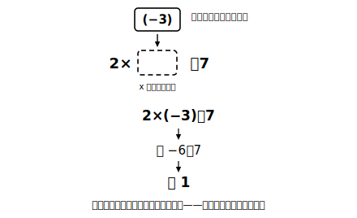

# L06 式の値——文字に数を入れて調べる

## ねらい

- 代入（だいにゅう）と式の値という言葉を知り、文字式の値を正しく求められるようになる。
- **負の数・小数を代入するときはかっこをつける**型を身につけ、符号の事故を防ぐ。
- 式の値を「場面の意味」と結びつけて読めるようになる。

## 主概念1：代入と式の値

これまでの検算で、文字に具体的な数を入れる操作を何度も使ってきた。この操作には正式な名前がある。

> **【ことば】代入（だいにゅう）・式の値**……式の中の文字を数におきかえることを、文字にその数を**代入する**という。代入して計算した結果を、そのときの**式の値**という。

「時速 4km で x 時間歩いた道のり」は 4x km だった（L04）。x に 2 を代入すると、4x＝4×2＝8。x＝2 のときの式の値は 8、つまり「2時間で 8km」だ。

代入のとき、L02で省略した×が復活することに注意しよう。4x は 4×x の省略形だから、x＝2 なら 4×2 であって、「42」ではない。

x の席には小数も入る。x＝1.5 なら 4×1.5＝6 で、「1時間半で 6km」。**文字の席に入れてよい数は、整数だけではない**。場面が許すかぎり、小数も分数も、そして負の数も候補になる。

:::guide
**「数を入れて調べる」は正式な方法**

代入は、検算のためだけの裏ワザではない。「この式はどんなふるまいをするのか」「2つの式は同じか違うか」を調べる、**中1数学の主役級の思考手段**だ。この先、方程式の章では「代入して等式が成り立つかどうか」がそのまま「解であるかどうか」の定義になる。困ったら数を入れて調べる。これは幼稚な方法ではなく、数学者も使う正攻法だと知っておこう。
:::

## 主概念2：負の数は「かっこ付きで席に着く」

x＝−3 のとき、2x＋7 の値を求めてみよう。ここが式の値の代表的な事故ポイントだ。

**正しい手順**: 2x＋7 ＝ 2×(**−3**)＋7 ＝ −6＋7 ＝ **1**

事故が起きるのは、−3 の「−」を置き忘れて 2×3＋7＝13 としてしまうときだ。予防策は1つの型で足りる。

> **負の数は、かっこ付きで席に着く。** x の席に −3 を入れるときは、必ず (−3) と書く。

累乗があるときは、かっこの効果がさらにはっきりする。x＝−3 のとき、

- x² ＝ (−3)² ＝ (−3)×(−3) ＝ **9**
- −x ＝ −(−3) ＝ **3**（−x は「x の符号を反転した数」。x が負なら −x は正になる）

−x＝3 のように、「マイナスのついた式の値が正の数になる」こともある。−x を「必ず負の数」と思い込まないよう、ここで一度体験しておこう。

:::guide
**かっこは「めんどうな保険」ではない**

慣れてくると「かっこを書くのは手間だ」と省きたくなる。だが 2×−3＋7 のような式は読み誤りのもとで、−3 の − が「ひき算の −」と混ざって見えたときに符号の事故が起きる。かっこは、代入した数の符号を**運搬中に落とさないための容器**だ。正の数の代入ならかっこなしでも事故は起きにくいが、負の数・分数のときは必ずかっこ、というように使い分けを決めておくのが実戦的だ。
:::

## 式の値を、場面の言葉で読む

式の値は、計算で出して終わりではなく、場面に戻して読むと意味をもつ。

「標高が 100m 上がるごとに気温が 0.6℃ 下がる山で、ふもとの気温が 15℃ のとき、ふもとから x m 登った地点の気温」は、15−0.006x（℃）と表せる（100m で 0.6℃ ＝ 1m あたり 0.006℃）。

- x＝500 を代入 → 15−0.006×500 ＝ 15−3 ＝ **12**（500m 登ると 12℃）
- x＝2000 を代入 → 15−0.006×2000 ＝ 15−12 ＝ **3**（2000m 登ると 3℃）

同じ1本の式が、代入する数を変えるだけで、いろいろな地点の気温を次々に教えてくれる。**式は「答えの製造機」で、代入はその起動スイッチ**だ。

:::zatsudan
x＋x＋x＋x＝x になる？と聞かれたら「そんなわけない」と思うだろう。ところが、文字の約束がどれくらい身についているかを確かめるために、まさにこの形を問うテスト問題が研究の世界に実在する。ひっかかる理由は「x はどうせ何でもいいんだから、両側とも『何か』で合ってる」という読み方をしてしまうから。L01の文法を思い出そう。1つの式の中の x は全部同じ数。だから左は x の4倍で、x＝0 のような特別な数でないかぎり右とは等しくならない。文字の式は、文法を守ってこそ意味が通じる言語なんだ。
:::

## 練習

1. x＝4 のとき、次の式の値を求めてみよう。
   (1) 3x−5　(2) x/2＋1　(3) x²
2. a＝−2 のとき、次の式の値を求めてみよう（かっこ付きで代入すること）。
   (1) 5a＋13　(2) −a　(3) a²　(4) 3−2a
3. 1個 120円のドーナツを x 個買って、1000円札を1枚出したときのおつりは (1000−120x)円と表せる。
   (1) x＝3 のときの式の値を求め、その値が場面で何を意味するか言葉で書いてみよう。
   (2) x＝8 のときの式の値を求めてみよう。この値は、場面としてどんなことを意味しているだろうか。
4. 「x＝−5 のとき 4−x の値は −1」。この計算が正しいか、かっこ付きの代入で確かめ、誤りなら直そう。
5. x＝1/2 のとき、次の式の値を求めてみよう（分数も、かっこ付きで席に入れるとまちがえにくい）。
   (1) 4x＋3　(2) 2x−3

:::stretch
**S1** 本文の気温の式 15−0.006x に、x＝0、500、1000、1500、2000 を順に代入して、式の値の変化を表にまとめてみよう。x が 500 増えるごとに、値はどう変わっていくだろうか。（発展: 式の値の変化を追いかけるこの見方は、あとの章の「関数」につながる。気になる人は「関数 とは 中学」で調べてみよう。）
:::

---

対応解答: answer_key_L05-08.md

<!-- gen_nav:nav:start（自動生成・手編集しない） -->

---

[← 前のレッスン](lesson_05.md)｜[単元の目次](README.md)｜[解答](answer_key_L05-08.md)｜[次のレッスン →](lesson_07.md)

<!-- gen_nav:nav:end -->
