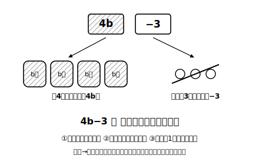
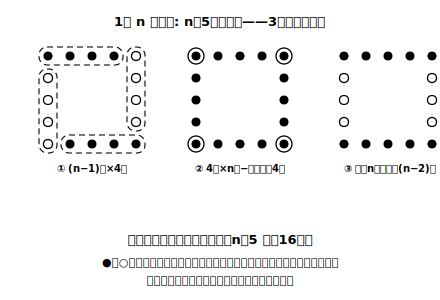

# L07 式を読む——3a＋2はこれで答え

## ねらい

- 「3a＋2」のような**演算記号が残った式を、完成した答えとして受け入れる**。
- 与えられた文字式が「場面の何を表しているか」を読み取れるようになる（書くの逆向き）。
- 同じ数量でも、**数え方が違えば式の形が違う**ことを体験する。

## 主概念1：3a＋2 は「計算の途中」ではない

「1本 a 円の鉛筆3本と、2円の袋を1つ買った代金」を式にすると、3a＋2（円）になる。

この 3a＋2 に、モヤモヤしないだろうか。「＋が残ってる。まだ途中では？」。小学校の計算では、答えはいつも 8 や 120 のような1個の数だった。＋や−が残った式を「答えです」と差し出すのは、たしかに勇気がいる。

でも、考えてみてほしい。a がまだ決まっていない以上、3a＋2 より先へは進めない。3a と 2 は、a の値しだいで変わる部分と変わらない部分、つまり種類の違う量だから、たして「5a」にすることもできない（L01の文法で確かめられる: a＝10 なら 3a＋2＝32 だが 5a＝50）。

> **演算記号が残った式は、それ自体が完成した答え。** 3a＋2 は「a が決まればすぐ計算できるところまで畳んである、答えの完成形」だ。

a が決まった瞬間に、代入（L06）でいつでも1個の数にできる。つまり 3a＋2 は「答えの一歩手前」ではなく、**すべての a に対する答えを1本に束ねたもの**なのだ。

:::guide
**モヤモヤの正体を言葉にしておく**

この違和感の正体は、「数の計算の常識（答え＝1個の数）」で「文字の式」を見ていることにある。違和感をもつこと自体はむしろ、式の意味を真剣に考えている証拠だ。対処は理屈の納得が一番効く。「a が決まっていないのだから、これ以上は決められない」「決まったら代入すればいい」。この2文を自分の言葉で言えたら、この山は越えている。
:::

## 主概念2：式を読む（逆向きの翻訳）

これまでは「場面→式」の翻訳をしてきた。今度は逆向き、「式→場面」だ。

1個 150円のプリンと、1個 a 円のシュークリーム（a は 150 より小さいとする）を売っている店で、**150−a** という式は何を表しているだろう？

150 はプリンの値段、a はシュークリームの値段。その差だから、「**プリンがシュークリームより何円高いか**」を表している。式の各部品を場面の言葉に戻すと、式全体の意味が浮かび上がる。なお「a は 150 より小さい」という条件がここで効いている。もし a が 150 以上なら 150−a は 0 以下になり、「何円高いか」とは読めない。**式を場面の言葉で読むときは、文字の値の範囲もセットで考える**。

もう1問。「1袋 b 個入りのあめを4袋買って、3個食べた」とき、**4b−3** は何を表すか。4b が「買ったあめの総数」、−3 が「食べた分を除く」。残っているあめの個数だ。

:::guide
**読み方の型: 部品→演算→全体**

式を読むときの手順も型にできる。①部品（4b や 3）がそれぞれ場面の何かを確かめる ②部品をつなぐ演算（＋−×÷）が場面のどんな操作かを考える ③全体を1文の日本語にする。逆向きの翻訳は「書く」より難しく感じるかもしれないが、方程式の章からは「式を場面に戻して解釈する」場面が増えていく。ここで1時間かけて練習しておく価値は大きい。
:::

## 数え方が違えば、式も違う

碁石を次の図のように、正方形の形にならべる。1辺に n 個ずつ（n は2以上とする）ならべたとき、いちばん外側の碁石は全部で何個だろうか。

数え方によって、いろいろな式ができる。

- (ア) 角の石を1個ずつずらして4組に分ける → **4(n−1)** 個
- (イ) 4辺を n 個ずつ数えると角の4個を二重に数えるので引く → **4n−4** 個
- (ウ) 上下の2辺は n 個ずつ、左右は角を除いて (n−2) 個ずつ → **2n＋2(n−2)** 個

n＝5 でテストすると、(ア) 4×4＝16、(イ) 20−4＝16、(ウ) 10＋6＝16。**全部同じ16個**だ。同じものを数えているのだから当然だが、式の形はそれぞれ違う。式の形には、**数えた人の「数え方」が写り込む**。逆に言えば、式を読むと「どう数えたのか」まで読み取れる。

:::zatsudan
棒を並べて正方形を横一列に n 個つなげて作るときも、同じことが起きる。1個ずつ「コの字」を足したと数える人、いったん4本×n個と数えてから重なりを引く人。人によって式の形が違うのに、答えはぴったり一致する。式は単なる計算の道具じゃなくて、**考え方の記録**でもあるんだ。同じ結論にたどり着く別々の道筋が、式の形として残る。ちょっとした思考の化石みたいで、おもしろくないだろうか。
:::

## 練習

1. 1個 a 円のおにぎり2個と、1本 140円のお茶1本を買った（a は 140 より小さいとする）。このとき、次の式は何を表しているか、言葉で書いてみよう。
   (1) 2a＋140　(2) 140−a
2. 1辺 x cm の正方形について、次の式は何を表しているか答えよう。
   (1) 4x　(2) x²
3. 上の碁石の図で、(イ)の式 4n−4 の「4n」と「−4」が、それぞれ数え方のどの部分にあたるかを言葉で説明してみよう。
4. 「1枚 b 円の色紙を10枚買ったら、100円引きしてもらえた」。支払った金額を表す式を書き、b＝50 でテストしてみよう。
5. 1000円を持って、1本 80円のジュースを x 本買う。**1000−80x** と **(1000−80)x** は、かっこがあるかないかだけの違いだ。
   (1) x＝5 のとき、2つの式の値をそれぞれ求めてみよう。
   (2) 「買い物のあとの残金」を表しているのはどちらの式か。もう一方の式が場面に合わない理由を、計算の順番（かっこがないときは、かけ算がひき算より先）という言葉を使って説明してみよう。

:::stretch
**S1** 碁石の3つの式 4(n−1)、4n−4、2n＋2(n−2) に、n＝4 と n＝10 を代入して、すべて同じ値になることを確かめよう。「どんな n でも同じ値になる」ことを、代入をくり返さずに示す方法は、この章の2節（一次式の計算）で手に入る。楽しみにしていよう。
:::

---

対応解答: answer_key_L05-08.md

<!-- gen_nav:nav:start（自動生成・手編集しない） -->

---

[← 前のレッスン](lesson_06.md)｜[単元の目次](README.md)｜[解答](answer_key_L05-08.md)｜[次のレッスン →](lesson_08.md)

<!-- gen_nav:nav:end -->
