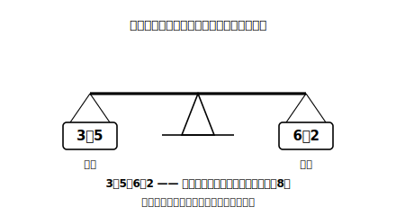

# L08 等式——「等しい」を宣言する記号

## ねらい

- 等号（＝）を「計算の合図」から「**左右が等しいという関係の宣言**」へ読み替える。
- 等式・左辺・右辺という言葉を知り、数量の関係を等式で表せるようになる。

## 主概念1：＝を「答えは」から「等しい」へ読み替える

小学校からずっと、＝は「3＋5＝8」のように使ってきた。このときの＝は、頭の中で「計算すると、答えは」という**合図**として働きがちだ。左に問題、右に答え、という一方通行の読み方だ。

この章からは、＝の読み方をひとつ格上げする。

> **【ことば】等式（とうしき）**……**等号＝の左右が等しい**ことを表した式。＝の左側の式を**左辺（さへん）**、右側の式を**右辺（うへん）**、あわせて**両辺（りょうへん）**という。

＝は「左右は等しい」という**関係の宣言**だ。この読み方だと、3＋5＝8 だけでなく、8＝3＋5 も、3＋5＝6＋2 も、堂々と正しい等式になる。「右側が答えになっていない」ことは、何の問題もない。天びんが左右でつり合っている絵を思いうかべるとよい。

:::guide
**なぜ読み替えが必要なのか**

「計算の合図」の読み方のままだと、次章の方程式で 2x＋1＝7 のような式に出会ったとき、「左辺はまだ計算できないのに＝があるのは変だ」と感じてしまう。方程式は「左右が等しくなるような x を探せ」という**関係についての問い**だから、＝を関係の記号として読めることが前提になる。この読み替えは1時間で終わる小さな話に見えて、次章の理解を左右する大きな分かれ道だ。
:::

## 主概念2：数量の関係を等式で表す

等式は「2つの数量が等しい」という**関係そのもの**を表す道具になる。場面を等式にしてみよう。

**例1**: 1個 x 円のクッキーを6個買ったら、代金は 720円だった。

- 左辺: 代金を式で表すと 6x（円）
- 右辺: その金額は 720（円）
- 等式: **6x＝720**

**例2**: a 枚の色紙を、3人で同じ数ずつ分けたら、1人分は b 枚になった。

- 分けた1人分は a/3（枚）。それが b 枚と等しいから、**a/3＝b**

手順は「表す」（L04〜L05）と同じで、最後に「等しい2つの量を＝で結ぶ」が加わるだけだ。①等しい関係にある2つの数量を見つける ②それぞれを式で表す ③＝で結ぶ。

大切なのは、6x＝720 を見て「x を求めなさいと言われている」と、あわてないこと。この等式は「6個分の代金が720円ですよ」という**関係の記録**であって、まだ何も要求していない。x を求める技術は次章「方程式」の主役だ。いまは、関係を正確に**書き取る**ことに集中しよう。

:::guide
**等式も具体数でテストできる**

つくった等式があやしいときも、検算の型が使える。例1の 6x＝720 なら、x＝120 を想定してみる。左辺は 6×120＝720、右辺は 720 で、両辺が同じ値になった。もし誤って x＝720×6 のつもりの式を書いていたら、この確かめで即座に破たんする。「両辺に同じ状況を入れて、両方の値が一致するか」。等式の検算は、両辺それぞれの値くらべで行う。この感覚は次章で「解の確かめ」という正式な手続きに育つ。
:::

:::zatsudan
8＝3＋5 と書くと、なんだか落ち着かない気分になるかもしれない。「答えを先に書いちゃった」感があるからだ。でも等号の左右は、天びんの左右と同じで**対等**。どちらが「問題」でどちらが「答え」かは、＝自身は一切決めていない。長年つきあってきた記号の意外な素顔、という感じがしないだろうか。
:::

## 練習

1. 次の数量の関係を、等式で表そう。
   (1) 1本 x 円の鉛筆を8本買ったら、代金は 640円だった。
   (2) y 個のいちごを5人で同じ数ずつ分けたら、1人分は7個だった。
   (3) 1辺 a cm の正方形のまわりの長さは、b cm である。
2. 場面をそのまま等式に書き取ったとき、200−4x＝40 になるものを、次から1つ選ぼう（それぞれの場面を「①等しい2つの数量を見つける→②式で表す→③＝で結ぶ」の手順で書き取って比べよう）。
   - ア: 200円持って、1枚4円の折り紙を x 枚買ったら、40円残った。
   - イ: 200円から40円を使ったら、残りは 4x 円になった。
   - ウ: 200円と 4x 円をあわせたら、40円になった。
3. 2で選んだ場面について、x に具体的な数を1つ想定して、左辺と右辺の値が一致することを確かめよう。
4. 「a m のリボンから b m を切り取ったら、残りは 2m だった」。この関係を等式で表そう。

:::stretch
**S1** 等式 x＋3＝10 について、x に 5、6、7、8 を順に代入し、左辺の値が右辺と等しくなるのはどの数のときかを調べてみよう。「等式を成り立たせる数を探す」。実はこれが、次章「方程式」のスタート地点そのものだ。
:::

---

対応解答: answer_key_L05-08.md

<!-- gen_nav:nav:start（自動生成・手編集しない） -->

---

[← 前のレッスン](lesson_07.md)｜[単元の目次](README.md)｜[解答](answer_key_L05-08.md)｜[次のレッスン →](lesson_09.md)

<!-- gen_nav:nav:end -->
