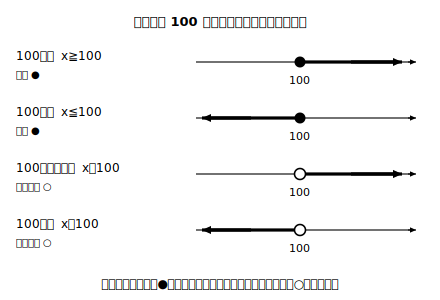

# L09 不等式——大小関係を式にする

## ねらい

- 記号 ≦・≧ を知り、＜・＞との違い（**境界の数を含むかどうか**）を区別できるようになる。
- 「以上・以下・より大きい・未満」の言葉を、正しく不等式に**書ける**ようになる（読めるだけで終わらせない）。
- 境界の数を代入して、自分の不等式を点検する型を身につける。

## 主概念1：≦・≧は境界の数を含む不等号

数の大小を表す ＜・＞ は前章から使ってきた。この章では、仲間が2つ増える。

> **【ことば】不等式（ふとうしき）と記号 ≦・≧**……数量の大小関係を、不等号を使って表した式を**不等式**という。**a≦b** は「a は b **以下**」（a＜b または a＝b）、**a≧b** は「a は b **以上**」を表す。

＜ とのちがいは、**等しい場合を含むかどうか**の一点だけだ。日常の言葉と対応させて整理しよう。

| 言葉 | 記号 | 境界の数（例: 100）を含む？ |
|---|---|---|
| 100 **以上** | x≧100 | 含む（x＝100 はOK） |
| 100 **以下** | x≦100 | 含む（x＝100 はOK） |
| 100 **より大きい** | x＞100 | 含まない |
| 100 **未満**（100より小さい） | x＜100 | 含まない |

「以上・以下」は境界を**含む**、「より・未満」は境界を**含まない**。まぎれたら、境界の数そのものを入れて確かめればよい。「x は 100 以下」に x＝100 は入るか。「以下」は含む側だから入る。だから記号は、等しい場合を許す ≦ が正解になる。

:::guide
**境界代入チェック**

不等式を書いたら、**境界の数を代入して、言葉の意味と合うか**を確かめる習慣をつけよう。「x 人は 30人未満」を x≦30 と書いてしまったとする。境界の 30 を入れると、x≦30 は「30 は OK」と言っているが、「30人未満」に 30人は入らない。不一致、つまり記号の選び違いだ（正しくは x＜30）。等式の検算（L08）が両辺の値くらべだったように、不等式の検算は境界の数の「入る・入らない」くらべ。1秒でできて、確実に効く。
:::

## 主概念2：数量の関係を不等式で「書く」

不等式は、読めても**書く**となると難しさが一段上がる。だからこのレッスンは書く練習を厚くする。手順は等式（L08）とほぼ同じだ。①比べる2つの数量を式で表す ②大小の言葉（以上/以下/より/未満）を確かめる ③向きと種類を選んで不等号で結ぶ。

**例1**: 1個 a 円のパンを4個買うと、代金は 500円**より高く**なった。

- 左: 代金 4a（円）、右: 500（円）。「より高い」＝境界を含まない ＞。 → **4a＞500**

**例2**: 1冊 x 円のノート3冊と 60円の消しゴム1個の代金は、1000円**以下**だった。

- 左: 3x＋60（円）、右: 1000。「以下」＝境界を含む ≦。 → **3x＋60≦1000**

もう1つ、気をつけたい落とし穴がある。「大小の関係なのに、つい＝で結んでしまう」誤りだ。「a は 200 より小さい」を a＝200 と書いては、大小の情報がまるごと消えてしまう。**等しい関係なら等式、大小の関係なら不等式**。式を書き終えたら、「この場面は『等しい』か『大小』か」をもう一度だけ確かめよう。

:::guide
**「不等式は答えが1つに決まらない」に慣れる**

4a＞500 を満たす a は、126 でも 130 でも 1000 でもよく、1つに決まらない。「答えが決まらない式に意味があるの？」と感じるかもしれないが、それこそが不等式の持ち味だ。定員・予算・制限速度など、世の中の条件の多くは「ここまでならOK」という**範囲**で与えられる。範囲をそのまま式にできるのが不等式で、1つに決める等式とは役割分担の関係にある。この対比を意識できると、使い分けの判断が速くなる。
:::

:::zatsudan
エレベーターの「定員10名」、ポスターの「18歳以上」、天気予報の「降水確率30%以下」。よく見ると、身のまわりは境界つきの条件だらけだ。しかも「以上・以下・未満」の使い分けを間違えると、実生活では割と深刻なことになる。「10名以下」と「10名未満」では、乗れる人数が1人違う。数学の記号 ≦ と ＜ の区別は細かい話に見えて、実は社会の約束ごとを正確に読むための道具でもあるんだ。
:::

## 練習

1. 次の関係を、不等式で表そう。
   (1) x 人の参加者は、40人以上だった。
   (2) 1個 a 円のみかん6個の代金は、700円より安かった。
   (3) 1本 y 円のジュース2本と 150円のパン1個の代金は、500円以下だった。
   (4) b kg の荷物は、20kg 未満だった。
2. 次の不等式を、言葉の文に直そう。
   (1) x≦15　(2) 5a＞300
3. 「x 冊は 12冊以下」を x＜12 と書いた人がいる。境界の数 12 を代入して、この式の誤りを説明し、正しく直そう。
4. 次の場面は、等式・不等式のどちらで表すべきかを選び、実際に式で表そう。
   (1) a 円の本を買って 1000円札を出したら、おつりは 280円だった。
   (2) a 円の本の値段は、1000円より高い。

:::stretch
**S1** 「x は 3 以上 8 未満」のように、範囲を両側からはさむ言い方がある。この関係は 3≦x＜8 と、不等号を2つ使って1行に書ける。x＝3、5、8 のそれぞれがこの範囲に入るかどうかを判定してみよう。（発展: 範囲のはさみ方をもっと知りたい人は「不等式 範囲 数直線」で調べてみよう。）
:::

---

対応解答: answer_key_L09-12.md

<!-- gen_nav:nav:start（自動生成・手編集しない） -->

---

[← 前のレッスン](lesson_08.md)｜[単元の目次](README.md)｜[解答](answer_key_L09-12.md)｜[次のレッスン →](lesson_10.md)

<!-- gen_nav:nav:end -->
