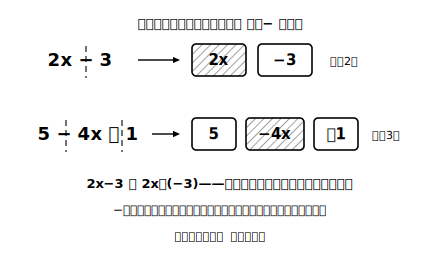

# L10 項と係数——式を部品に分ける

## ねらい

- 式を「＋で結ばれた部品の集まり」として見る目を手に入れ、**項**という言葉で扱えるようになる。
- **係数**という言葉を知り、文字の項・数の項を区別できるようになる。
- 一次式という言葉を知る（2節の主役の紹介）。

## 主概念1：式は「項」という部品でできている

ここから2節では、文字式そのものを「計算する」技術を身につける。最初の一歩は、式を**部品に分解する**ことだ。

2x−3 という式を、前章「正負の数」の目で見直してみよう。ひき算は「負の数をたすこと」と読み替えられたから、

2x−3 ＝ 2x＋(−3)

つまりこの式は、2x と −3 という2つの部品を＋で結んだものだ。

> **【ことば】項（こう）**……式を＋で結ばれた形に直したときの、一つひとつの部品を**項**という。2x−3 の項は **2x と −3**。

部品に分けるときのコツは、**符号ごと切り取る**こと。−3 の − は「ひき算の記号」ではなく「項の一部」として、項にくっつけたまま運ぶ。5−4x＋1 なら、項は 5、−4x、＋1 の3つだ。

## 主概念2：係数は文字の項の「数の部分」

文字の項 2x は、2×x の省略形だった。この「文字にかけられている数の部分」にも名前がある。

> **【ことば】係数（けいすう）**……文字をふくむ項の、数の部分を**係数**という。2x の係数は **2**、−4x の係数は **−4**。

まぎらわしいのは x や −x だ。x＝1×x、−x＝(−1)×x の省略形（L02の「1は書かない」）だから、**x の係数は 1、−x の係数は −1**。「係数が見えない項は、係数 1 か −1 がかくれている」と覚えておこう。

そして、この章の計算の主役に名前をつける。

> **【ことば】一次式（いちじしき）**……2x や −4x のように、**かけられている文字が1個だけ**の項を**一次の項**という（x² は x が2個かけられているから一次の項ではない）。一次の項だけの式や、一次の項と数の項でできている式を**一次式**という。2x−3 も、x/2＋1 も、2x の1項だけでも一次式。

:::guide
**なぜ部品分解から始めるのか**

次のレッスンでやる「一次式の計算」は、実は**項の仕分け作業**にすぎない。文字の項どうし・数の項どうしを集めてまとめるだけ。ただしそれは、式を項に正しく分解できる人にとっては、の話だ。分解の段階で −4x の − を置き忘れると、その先の計算は全部くずれる。料理の下ごしらえと同じで、地味な工程ほど仕上がりを支配する。このレッスンが1時間まるごと「分解」に使われているのは、そういう理由だ。
:::

## 文字の項と数の項は、種類の違う部品

2x−3 の2つの項は、種類が違う。

- **2x（文字の項）**……x の値しだいで変わる部分
- **−3（数の項）**……x が何であっても変わらない部分

x＝1、5、10 を代入すると、2x の部分は 2、10、20 と動くのに、−3 はずっと −3 のままだ。この「動く部品・動かない部品」の区別が、次のレッスンで「まとめてよい項・まとめてはいけない項」の判断に直結する。（なおこれは「x に入れる数を変えたとき」の見方だ。6x＝720 のように、場面によっては x が1つの決まった数を表すこともある——それでも 6x と 720 の項の区別は同じように使える。）

:::guide
**「2x」を1つのかたまりとして見る**

2x を「2 と x の2文字」と見るか、「2x という1つの部品」と見るか。ここに小さな、しかし決定的な視点の差がある。項の目で式を見る人は、2x−3 を「部品2個」と見る。この**かたまり視**ができると、式がぐっと単純に見えてくる。逆に1文字ずつバラバラに見えているうちは、計算の規則が「記号の複雑な操作」に感じられてしまう。「部品いくつ？」と自問するくせをつけると、かたまり視が育っていく。
:::

:::zatsudan
「係数」という言葉、日常では聞かない言葉なのに、この先の数学では何百回と登場する常連になる。方程式でも、関数でも、高校の数学でも、「x についている数」を一言で指せる言葉があると説明が一気に短くなるからだ。専門用語は、よく使う概念への「あだ名」みたいなもの。今日覚えた2つのあだ名「項」と「係数」は、この先ずっと使い続ける、元をとりやすい言葉だ。
:::

## 練習

1. 次の式の項をすべて書き出そう（符号ごと切り取ること）。
   (1) 3x＋5　(2) 7−2x　(3) −x＋4−3x
2. 次の式について、文字の項の係数を答えよう。
   (1) 6x−1　(2) −5a＋8　(3) x＋9　(4) 2−x
3. 式 4a−7 について、次の問いに答えよう。
   (1) 項をすべて書き出そう。
   (2) a＝1、2、3 を代入して式の値を求め、「値が動く部品」と「動かない部品」がどれかを確かめよう。
4. 「−3x＋2 の項は 3x と 2、係数は 3」。この説明には誤りが2か所ある。見つけて直そう。

:::stretch
**S1** x/3 という項の係数は何だろうか。x/3 を「数×文字」の形（×の記号を復活させた形）に書き直して考えてみよう。ヒント: 3でわることは、ある分数をかけることと同じだった（正負の数の章）。
:::

---

対応解答: answer_key_L09-12.md

<!-- gen_nav:nav:start（自動生成・手編集しない） -->

---

[← 前のレッスン](lesson_09.md)｜[単元の目次](README.md)｜[解答](answer_key_L09-12.md)｜[次のレッスン →](lesson_11.md)

<!-- gen_nav:nav:end -->
