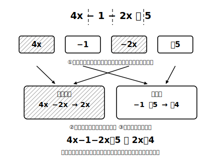

# L11 一次式の加法と減法

## ねらい

- 文字の項どうし・数の項どうしをまとめて、一次式を簡単にできるようになる。
- かっこのついた一次式どうしの加法・減法ができるようになる（−のかっこ外しの符号反転）。
- 計算を「＝を縦に連ねる」書式で書けるようになる。

## 主概念1：まとめられるのは、同じ種類の項どうし

3x＋2x を計算してみよう。3x は x が3個分、2x は x が2個分。あわせて x が5個分で **5x** だ。係数の言葉（L10）で言えば、

3x＋2x ＝ (3＋2)x ＝ 5x

**係数どうしをたして、文字はそのまま**。x の個数を数えているのだから、文字が勝手に x² になったりはしない。

では 3x＋2 はどうか。3x は「x の3個分」、2 はただの数。**種類の違う項はまとめられない**（L07で正面から確かめたとおり、3x＋2 はこれで完成した答えだ）。あやしければ代入でテストできる。x＝10 なら 3x＋2＝32。もし「5x」とまとめてしまうと 50。値が違うから、まとめてはいけなかったと分かる。

> **まとめの規則**……**同じ文字の項どうし**・数の項どうしは、それぞれまとめられる。**文字の項と数の項はまとめられない**。（この章の計算で使う文字は一種類だが、3a と 2b のように文字が違う項も、たしてまとめることはできない——「x が何個分か」を数えられるのは、同じ文字どうしだけだ。）

項が混ざった式では、①項に分解（符号ごと）②文字の項・数の項に仕分け ③それぞれまとめる、の3手順で進める。

4x−1−2x＋5 ＝ (4x−2x)＋(−1＋5) ＝ **2x＋4**

## 主概念2：かっこを外す——−のかっこは全員の符号を反転

一次式どうしの和や差は、かっこつきで書かれる。

**加法**: (2x−3)＋(x＋1)。＋のかっこは、そのまま外してよい。

(2x−3)＋(x＋1) ＝ 2x−3＋x＋1 ＝ **3x−2**

**減法**: (4x＋5)−(2x＋3)。−のかっこを外すときは、**かっこの中の全部の項の符号を反転する**。「2x＋3 をまるごと引く」とは「2x を引き、さらに 3 も引く」ことだからだ。

(4x＋5)−(2x＋3) ＝ 4x＋5−2x−3 ＝ **2x＋2**

事故が起きるのは、先頭の項だけ反転して後ろを忘れるときだ。−(2x＋3) → −2x＋3 としてしまう誤りだ。防ぐには、かっこを外した直後に「中の項の数だけ符号を反転したか」を指さし確認する。検算も効く。x＝10 なら、元の式は 45−23＝22、答えの 2x＋2 も 22 で一致だ。

:::guide
**計算の書式——＝は縦に連ねる**

上の計算例のように、式変形は「＝を行の左端にそろえて縦に連ねる」書き方が数学の標準だ。1行目の右端から2行目へ、**同じ量が形を変えていく**ようすが1本の柱として残る。横に長くつなげて書くと、どこで何をしたか自分でも追えなくなり、見直しがきかない。この書式は次章の方程式でそのまま「解く過程の書き方」になるので、いまのうちにノートで型をつくっておこう。1行につき変形は1つ、が目安だ。
:::

:::guide
**「引き算あとまわし」のもう1つの道**

(4x＋5)−(2x＋3) を、項の仕分け表（図版の箱)で処理する道もある。文字の項: 4x と −2x で 2x。数の項: ＋5 と −3 で ＋2。どちらの道でも答えは 2x＋2 に着地する。計算の道筋は1本ではない。自分の事故が少ない道を選べばよい。ただしどの道でも、−(2x＋3) の「3 の符号も反転」だけは共通の関門だ。ここだけは道を選んでも避けられない。
:::

:::zatsudan
「x が3個と x が2個で、x が5個」。この説明、よく考えるとみかんの数え方と完全に同じだ。みかん3個＋みかん2個＝みかん5個。みかん3個＋りんご2個は、5個の「何か」にはなるが、「みかん5個」にはならない。一次式の計算は、新しい魔法ではなく「同じ種類のものしか一緒に数えない」という、買い物かごの中の常識の式バージョンなんだ。むずかしく見えたら、いつでもみかんに戻ろう。
:::

## 練習

1. 次を計算しよう。
   (1) 5x＋3x　(2) 7a−2a　(3) 4x−x　(4) −2y＋6y
2. 次を計算しよう。
   (1) 2x＋4＋3x　(2) 6a−3−2a＋8　(3) 5−x−7＋4x
3. 次を計算しよう。
   (1) (3x＋2)＋(2x＋4)　(2) (2x−3)＋(x＋1)　(3) (5a＋4)−(3a＋1)　(4) (x−6)−(4x−2)
4. 3の(4)の答えが正しいことを、x＝2 を代入して確かめよう（元の式と答えの式の値くらべ）。
5. 次の計算の誤りを見つけ、正しく直そう。
   「(6x＋1)−(2x−5) ＝ 6x＋1−2x−5 ＝ 4x−4」
6. 【計算方法の説明】「1本 x 円の鉛筆を、先週3本、今週2本買った」という場面を使って、3x＋2x＝5x と計算してよい理由を、言葉で説明してみよう（「x が◯個分」という言い方や、係数の式 (3＋2)x を使ってよい）。

:::stretch
**S1** L07の碁石の式のうち 4n−4 と 2n＋2(n−2) が同じ値になることを、n＝4、10 の代入で確かめた。いまなら計算で示せる一歩手前まで来ている。2n＋2(n−2) のかっこを外すとどうなるか。実は「数×かっこ」の外し方は次のレッスンで学ぶ。予習として、2(n−2) が「(n−2) の2個分＝(n−2)＋(n−2)」であることを使って、かっこを外してみよう。
:::

---

対応解答: answer_key_L09-12.md

<!-- gen_nav:nav:start（自動生成・手編集しない） -->

---

[← 前のレッスン](lesson_10.md)｜[単元の目次](README.md)｜[解答](answer_key_L09-12.md)｜[次のレッスン →](lesson_12.md)

<!-- gen_nav:nav:end -->
