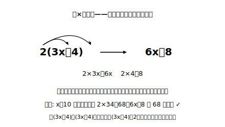

# L12 数×一次式と章のまとめ

## ねらい

- 数×一次式の計算（かっこの中の全項に数を配る）と、(一次式)÷数の計算ができるようになる。
- かっこが2つある式（2(3x＋4)−3(x−5) 程度）までを計算できるようになる。
- 章全体を「表す⇄読む⇄計算」の地図で振り返り、次章「方程式」への接続を確かめる。

## 主概念1：数×一次式は、かっこの中の全員に配る

2(3x＋4) を計算してみよう。これは「(3x＋4) の2個分」、つまり (3x＋4)＋(3x＋4) のことだ。項ごとに数えれば 3x が2つで 6x、4 が2つで 8。

2(3x＋4) ＝ 2×3x＋2×4 ＝ **6x＋8**

> **数×一次式の規則**……かっこの外の数を、**かっこの中のすべての項に**かける。

事故ポイントは、先頭の項にだけかけて 6x＋4 とする「配り忘れ」だ。矢印を実際に書き込み、かっこの中の項の数と矢印の本数が同じかを確かめよう。検算も使える。x＝10 なら元の式は 2×34＝68、6x＋8 は 68 で一致（6x＋4 なら 64 でずれる）。

わり算は、逆数のかけ算に直すか、各項を同じ数でわればよい。

(6x−4)÷2 ＝ 6x/2−4/2 ＝ **3x−2**

## 主概念2：かっこ2つの式（この章の計算の到達点）

分配とかっこ外し（L11）を組み合わせると、この章の計算の到達点に届く。

2(3x＋4)−3(x−5)
＝ 6x＋8−3x＋15
＝ **3x＋23**

途中の −3(x−5) に注目しよう。−3 を x と −5 の**両方**に配る。−3×(−5)＝＋15。負×負＝正（前章）がここで効く。この「負の数の分配」は、符号事故が特に起きやすい場所だ。配ったら、検算を1回。x＝1 なら元の式は 2×7−3×(−4)＝14＋12＝26、答えは 3＋23＝26 で一致だ。

これ以上に複雑な計算（かっこが何重にもなる式など）は、この章では必要ない。**計算の腕は「方程式を解くのに必要な程度」で十分**。それより、式で表す・式を読む力のほうが、この章の主役だったことを思い出そう。

:::guide
**なぜ「−3 を配る」で事故が起きるのか**

−3(x−5) の誤りは2種類に分かれる。①−3 を x にだけ配って −3x−5 とする（配り忘れ）②配ったが −3×(−5) を −15 とする（符号の誤り）。自分の誤りがどちら型かを知ると、対策が変わる。①型なら矢印の書き込み、②型なら「負×負＝正」を声に出す一拍。誤りは才能の問題ではなく型の問題で、型で防げる。answer_keyの解答にはどの問題にも検算がついているので、自分の答えと値が合わないときは、まずこの2種類のどちらかを疑ってみよう。
:::

## 章のまとめ——文字と式の地図

この章で手に入れた道具を、1枚の地図にしておこう。

| 力 | 内容 | レッスン |
|---|---|---|
| 表す | 場面→文字式（言葉の式を橋に・基準量の特定） | L01〜L05 |
| 調べる | 代入・式の値（負の数はかっこ付きで） | L06 |
| 読む | 式→場面（3a＋2はこれで答え・数え方が式に写る） | L07 |
| 関係を表す | 等式・不等式（＝は関係の宣言・境界代入チェック) | L08〜L09 |
| 計算する | 項・係数・一次式の加減・数×一次式 | L10〜L12 |

そして全部の力を下から支えていたのが、**具体数で検算**の型だった。式を書いたら数を1回通す。この習慣は、次章から先もずっと役に立つ。

**次章の予告**。等式 6x＝720（L08）を書いたとき、「x を求めたい」気持ちを一度あずかった。次章「方程式」では、いよいよそれを求める技術を学ぶ。使う道具は、①関係の宣言としての等号（L08）②代入して成り立つかを調べる目（L06）③一次式の計算（L11〜L12）——ぜんぶ、この章でそろえた道具だ。

:::guide
**総点検のすすめ方（独習者向け）**

章末の練習でつまずいたら、上の地図で「どの力の問題か」を特定してから、該当レッスンに戻るのが最短路だ。たとえば練習3で手が止まったなら、それは計算(L11〜L12)ではなく「表す」(L05)の問題かもしれない。全部をやり直す必要はない。地図を持っている人は、迷子になっても戻る場所がわかる。
:::

:::zatsudan
この章の最初（L01）で、a×b という1本の式が面積にも代金にも道のりにもなる、という話をした。章を終えたいま、もう一段だけ言えることがある。式は場面を写すだけじゃなく、計算で形を変えられる。2n＋2(n−2) が 4n−4 に化けたように。**別の数え方どうしが、計算でつながって「同じ」だと証明できる**。表す・読む・計算する、3つの力がそろって初めて、文字式は本当の道具になる。その3つが、いまあなたの手の中にある。
:::

## 練習

1. 次を計算しよう。
   (1) 3(2x＋1)　(2) −2(4x−3)　(3) (8x−6)÷2　(4) (9x＋3)÷(−3)
2. 次を計算しよう。
   (1) 2(x＋3)＋3(2x−1)　(2) 2(3x＋4)−3(x−5)　(3) 4(2x−1)−2(3x−5)
3. 【章のまとめ】1個 a 円のりんごを3個買って、50円の袋を1つつけてもらった。
   (1) 代金を文字式で表そう。
   (2) a＝120 のときの式の値を求めてみよう。
   (3) 代金が 500円より安かった。この関係を不等式で表そう。
4. 【章のまとめ】次の式を計算し、答えが正しいことを x＝2 の代入で確かめよう。
   (2x＋7)＋3(x−4)
5. 【章のまとめ】L07の碁石の式 2n＋2(n−2) を計算して、4n−4 と同じ式になることを確かめよう。代入では「n＝4 と 10 で一致」までしか言えなかったが、計算なら「**どんな n でも同じ**」と言い切れる。その理由も一言で書いてみよう。

:::stretch
**S1** 「連続する3つの整数の和」を、真ん中の整数を n として式に表し、計算して簡単にしてみよう。結果の式から、「連続する3つの整数の和は、必ずある数の倍数になる」ことが読み取れる。何の倍数だろうか。（発展: 式の計算で数の性質を説明するこの方法は、中2でさらに本格的に登場する。気になる人は「文字式 説明 偶数 奇数」で調べてみよう。）
:::

---

対応解答: answer_key_L09-12.md

<!-- gen_nav:nav:start（自動生成・手編集しない） -->

---

[← 前のレッスン](lesson_11.md)｜[単元の目次](README.md)｜[解答](answer_key_L09-12.md)

<!-- gen_nav:nav:end -->
