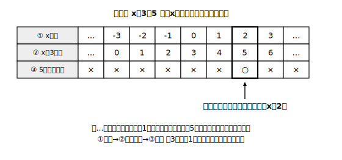

# L01 □からxへ——方程式とその解

## ねらい

- 小学校の「□にあてはまる数を求める」学習と、文字xを使った等式をつなげ、**未知の数を求める対象として等式を扱う**見方を持つ。
- **方程式**と**解**の意味を理解し、「値を代入して、成り立つかどうか確かめる」ができるようになる。

## 主概念1：□の代わりにxと書く

小学校で、こんな問題を解いたことがあるはずだ。

> □＋3＝8　　□にあてはまる数はいくつだろう。

答えは5。「8から3を引けばいい」と逆算で求められる。中学では、この□の代わりに文字xを使う。

> x＋3＝8

見た目は変わったが、やっていることは同じだ。「まだ分かっていない数」に名前を付けて、等式の中に置いている。このように、**まだ値の分かっていない数（未知数（みちすう））を表す文字をふくみ、その文字がどんな値なら成り立つかという条件を表している等式**を、**方程式**という。

> 【ことば】**方程式（ほうていしき）**
> 未知数を表す文字をふくむ等式で、文字の値によって、成り立ったり成り立たなかったりするもの。

「成り立ったり成り立たなかったりする」がポイントだ。x＋3＝8 は、xが5なら成り立つが、xが2なら 2＋3＝5 で、8にはならず成り立たない。

:::guide
**「4＋6＝10」は方程式だろうか**

4＋6＝10 は正しい等式だが、未知数の文字がないので方程式とは呼ばない。また「2x＋1」のような式は、文字はあるが等号がないので等式ですらない。方程式と呼べるのは「文字あり・等号あり・文字の値しだいで成り立つかどうかが決まる」の3拍子がそろったときだ。この区別は、次のレッスンで等式を変形し始めると効いてくる。
:::

## 主概念2：解——条件を満たす値

方程式 x＋3＝5 を考えよう。この式は「xと3の和は5に等しい」という、xが満たすべき**条件**を表している。では、どんな値がこの条件を満たすのか。xの範囲を整数全体として、…、−3、−2、−1、0、1、2、3、… と順に**代入**して（あてはめて）、左辺の値を調べてみよう。

| xの値 | … | −3 | −2 | −1 | 0 | 1 | 2 | 3 | … |
|---|---|---|---|---|---|---|---|---|---|
| x＋3の値 | … | 0 | 1 | 2 | 3 | 4 | 5 | 6 | … |
| 5と等しい？ | × | × | × | × | × | × | **○** | × | × |

x＋3の値は、xを1増やすと1ずつ増えていく。だから表の「…」の部分（−3より小さい整数や3より大きい整数）では、x＋3の値は5からますます離れていくばかりで、5に等しくなることはない。成り立つのは **x＝2 のときだけ**で、2以外の数のときは成り立たない。この2のように、**方程式を成り立たせる値、つまり方程式が表す条件を満たす値**を、その方程式の**解**（かい）という。そして、解を求めることを、方程式を**解く**という。

> 【ことば】**解（かい）・方程式を解く**
> 方程式を成り立たせる文字の値を、その方程式の**解**という。解を求めることを、方程式を**解く**という。

:::guide
**一つずつ代入するなんて面倒？　その通り。でも**

この「全部あてはめて探す」やり方は、たしかに能率がよくない。xの範囲を整数に限らなければ、全部試すことはそもそもできない。それでもこの活動を最初に置くのは、**解とは何か**を体で覚えるためだ。この章の後半でどんなに速い解き方を身につけても、「解＝代入すると成り立つ値」という意味は変わらない。速い解き方で出した答えが本当に解かどうかは、いつでも代入すれば確かめられる——この保険は最後まで使い続ける。
:::

## 型の導入：「代入して確かめる」

「x＝4 は方程式 3x−2＝10 の解といえるか」と聞かれたら、解き方を知らなくても答えられる。**代入して、左辺と右辺が同じ値になるか見ればいい**。

- 左辺: 3×4−2＝10
- 右辺: 10

両辺とも10で等しいから、x＝4 は解である。逆に x＝3 なら左辺は 3×3−2＝7 で右辺の10と等しくないから、解ではない。この「左辺・右辺それぞれに代入して、同じ値になるか確かめる」を、この章では**検算**（けんざん）の型としてずっと使っていこう。

:::zatsudan
小学校の□が、中学ではxに変わった。たったそれだけの変化に見えるけれど、□のころは「あてはまる数を探すクイズ」だったものが、文字にした瞬間「条件を表す式」として扱えるようになる。役者は同じでも、舞台が変わったんだね。この章はその新しい舞台の歩き方を学ぶ章だ。
:::

## 練習

1. 次のうち、方程式はどれだろう。すべて選ぼう。
   ア 3x＋1　　イ 2x＝10　　ウ 4＋6＝10　　エ x−7＝2
2. xに−2, −1, 0, 1, 2 を順に代入して、方程式 2x＋1＝5 の解を見つけよう（表をかいて調べること）。
3. xに−2, −1, 0, 1, 2 を順に代入して、方程式 4−x＝6 の解を見つけよう。
4. x＝3 は方程式 5x−4＝2x＋5 の解といえるだろうか。左辺・右辺それぞれに代入して確かめよう。

:::stretch
**S1** 「解が4になる方程式」を自分で3つ作ってみよう。作ったら、x＝4を代入して本当に成り立つか自分で確かめること。足し算だけ・かけ算だけ・両方混ぜたもの、と作り分けられたら上出来だ。
:::

---

対応解答: answer_key_L01-04.md

<!-- gen_nav:nav:start（自動生成・手編集しない） -->

---

[単元の目次](README.md)｜[解答](answer_key_L01-04.md)｜[次のレッスン →](lesson_02.md)

<!-- gen_nav:nav:end -->
