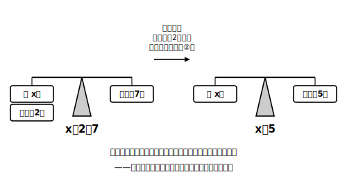

# L02 天びんで考える——等式の性質

## ねらい

- 等号「＝」を「計算の答えを書く合図」ではなく「**左右が等しいことの宣言**」として見直す。
- **等式の性質**4つを、天びんの操作イメージとともに理解し、性質を使って方程式を解けるようになる。使った性質を自分の言葉で宣言できるようになる。

## 主概念1：「＝」の見方をアップデートする

小学校からずっと、「3＋4＝」と書いたら右に答えの7を書いてきた。だから「＝」を「ここから答えを書きますよ」の合図のように感じているかもしれない。でも方程式の世界では、＝の意味をとらえ直す必要がある。

> 【ことば】**等式（とうしき）・左辺・右辺・両辺**
> 等号「＝」を使って、2つの数量が等しいことを表した式を**等式**という。等号の左側の式を**左辺（さへん）**、右側の式を**右辺（うへん）**、あわせて**両辺（りょうへん）**という。

等式 x＋2＝7 は、「左辺 x＋2 と右辺 7 は等しい」という**宣言**だ。左右どちらが偉いわけでもない。この「左右が等しい」という見方が、これから学ぶ変形のすべての土台になる。

## 主概念2：天びんと等式の性質

つり合っている天びんを思いうかべてみよう。左の皿に「中身の個数が分からない袋1つとおもり2個」、右の皿に「おもり7個」がのって、ぴったりつり合っている。袋の中のおもりの個数をx個とすると、このつり合いは等式 x＋2＝7 で表せる。

ここで、**両方の皿からおもりを2個ずつ取り除いたら**どうなるだろうか。左右から同じだけ取るのだから、天びんはつり合ったままだ。左の皿には袋だけ、右の皿にはおもり5個——つまり x＝5 が分かる。

この「両辺に同じことをしても、等しさは崩れない」をまとめたものが、**等式の性質**だ。

> 【ことば】**等式の性質**
> ① a＝b ならば，a＋c＝b＋c　（両辺に同じ数を加えてもよい）
> ② a＝b ならば，a−c＝b−c　（両辺から同じ数を引いてもよい）
> ③ a＝b ならば，ac＝bc　（両辺に同じ数をかけてもよい）
> ④ a＝b **かつ c≠0** ならば，a/c＝b/c　（両辺を**0でない**同じ数でわってもよい）

④にだけ「c≠0」という条件が付いていることに注意しよう。0でわる計算はできないからだ。

:::guide
**4つの性質は、実は「2つ」に見える**

①と②は、引くことを「負の数を加える」と見れば1つにまとめられる（3を引く＝−3を加える）。③と④も、わることを「逆数をかける」と見れば1つにまとめられる（2でわる＝1/2をかける）。正負の数と逆数を学んだ今のきみは、この4つを「加減で1つ・乗除で1つ」と統合して見られる位置にいる。ばらばらに丸暗記するより、この見方のほうがずっと忘れにくい。
:::

## 性質を使って方程式を解く

等式の性質を使うと、代入で探さなくても解が求められる。目標は、式を「**x＝（数）**」の形に変えることだ。使った性質を毎回宣言しながら解いてみよう。

**例1** x−4＝2
両辺に4を加える（性質①）: x−4＋4＝2＋4 → **x＝6**
検算: 左辺 6−4＝2、右辺 2。両辺とも2で成り立つ。

**例2** x＋5＝2
両辺から5を引く（性質②）: x＝2−5 → **x＝−3**
検算: 左辺 −3＋5＝2、右辺 2。成り立つ。

**例3** x/3＝4
両辺に3をかける（性質③）: x＝12
検算: 左辺 12/3＝4、右辺 4。成り立つ。

**例4** 4x＝−20
両辺を4でわる（性質④。4≠0だからわれる）: x＝−5
検算: 左辺 4×(−5)＝−20、右辺 −20。成り立つ。

ここで大事なのは、変形の前後で**解が変わっていない**ことだ。x−4＝2 も x＝6 も、成り立たせる値は6ただ1つ。方程式を解くときの等式の性質による変形は、例1〜例4のように、**同じ解を持つ、より簡単な方程式に段階的に置きかえていく**操作なのだ。ひとつだけ注意——**両辺に0をかけること**はしない。どんな等式も両辺に0をかけると 0＝0 になってしまい、xの情報が消えて、元の方程式に戻れなくなるからだ（性質④に「0でない」と付いているのと同じ理由で、解くための変形では0は特別あつかいになる）。

:::guide
**「使った性質を宣言する」を面倒がらない**

答えだけ出すなら宣言は省けるが、この章では「両辺から5を引いた（性質②）」と毎回言葉にすることを型にする。理由は先回りして言っておくと、次のレッスンで学ぶ「移項」という便利な技は、この性質①②の省略形だからだ。省略形だけ覚えて元の形を言えなくなる——という転び方を防ぐには、いま元の形を口に出しておくのがいちばん効く。
:::

:::zatsudan
天びん、というのがまたいい道具でね。「右の皿だけおもりを取ったらズルだ」というのは、実物を思いうかべれば説明されなくても分かる。数学の規則はときどき天下りに見えるけれど、等式の性質は「つり合いを崩さない操作」という体感にそのまま乗っている。理科室の上皿天びんを見かけたら、ちょっと思い出してみよう。
:::

## 練習

1. 次の方程式を、等式の性質を使って解こう。どの性質を使ったかを（　）に書き、解は代入して検算すること。
   (1) x−7＝−2　　(2) x＋9＝4　　(3) x/5＝−3　　(4) 6x＝42
2. 方程式 2x＋3＝11 を解こう。性質を2回使うことになる。使った順番も書くこと。
3. まちがい探し: ある人が方程式 x/2＝6 を「両辺を2でわって x＝3」と解いた。どこがまちがっているかを説明し、正しく解き直そう。
4. つり合っている天びんがある。左の皿には袋1つとおもり3個、右の皿にはおもり8個。袋の中のおもりの個数をx個として等式で表し、等式の性質を使ってxを求めよう。

:::stretch
**S1** 方程式 5x＝3x＋8 を考える。両辺から「同じ**数**」だけでなく「同じ**文字の項** 3x」を引いてもつり合いは崩れないだろうか。天びんの左右から同じ袋を1つずつ下ろす場面を思いうかべて、両辺から3xを引いて解いてみよう。解けたら代入検算も忘れずに。
:::

---

対応解答: answer_key_L01-04.md

<!-- gen_nav:nav:start（自動生成・手編集しない） -->

---

[← 前のレッスン](lesson_01.md)｜[単元の目次](README.md)｜[解答](answer_key_L01-04.md)｜[次のレッスン →](lesson_03.md)

<!-- gen_nav:nav:end -->
