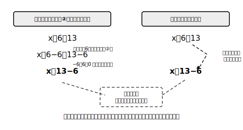

# L03 移項——等式の性質のショートカット

## ねらい

- 等式の性質①②で解いた過程を見比べ、「項が符号を変えて反対側の辺に移る」というショートカット＝**移項**を自分で**導き出す**。
- 移項した式を見て、「この移項の根拠はどの性質か」をいつでも言えるようになる。

## 発見：2つの解き方を並べてみる

前のレッスンの型で、方程式 x＋6＝13 を解いてみよう。

> x＋6＝13
> 両辺から6を引く（性質②）: x＋6−6＝13−6
> x＝13−6
> x＝7

検算: 左辺 7＋6＝13、右辺 13。成り立つ。

ここで、最初の式と3行目だけを抜き出して並べてみよう。

- 変形前: x**＋6**＝13
- 変形後: x＝13**−6**

左辺にあった「＋6」が消えて、右辺に「−6」が現れている。まるで、**＋6という項が、符号を変えて等号の反対側へ引っこししたように見える**。もう1つ、x−4＝9 でも同じことが起きる。両辺に4を加える（性質①）と x＝9＋4、つまり左辺の「−4」が右辺で「＋4」になる。

種明かしをすれば、項が瞬間移動したわけではない。**両辺に同じ数を加えたり引いたりした（性質①②）結果を、途中を省いて書くとそう見える**だけだ。この省略記法に名前が付いている。

> 【ことば】**移項（いこう）**
> 等式の一方の辺にある項を、**符号を変えて**他方の辺に移すこと。等式の性質①②から導かれる変形の省略記法。

## 文字の項も移項できる

移項できるのは数の項だけではない。方程式 4x＝x＋9 を解いてみよう。両辺からxを引く（性質②）と 4x−x＝9、つまり 3x＝9。両辺を3でわって（性質④）**x＝3**。
検算: 左辺 4×3＝12、右辺 3＋9＝12。成り立つ。

これも「右辺の＋xが、符号を変えて左辺に−xとして移った」と読める。文字の項の移項は次のレッスンの主役になるので、ここで感覚をつかんでおこう。

:::guide
**「なぜ符号が変わるの？」に一言で答えられるか**

移項に慣れてくると、手は勝手に動くのに「なぜ符号が変わるのか」と聞かれて詰まる——ということが起こりやすい。答えはいつも同じで、「両辺から同じものを引いた（または加えた）から」。つまり根拠は等式の性質①②だ。この章では、移項を使うたびに心の中で「いま性質①（または②）を省略したぞ」と一言そえる習慣をすすめる——＋の項を移したなら②（引いた）、−の項を移したなら①（加えた）だ。手続きと根拠を一緒に持ち歩ける人は、式変形が複雑になっても道に迷わない。
:::

:::guide
**移項してよいのは「項」だけ**

移項は「項の引っこし」であって、なんでも反対側に動かせるわけではない。たとえば 3x＝12 の「3」は項ではなく係数（けいすう）なので、「−3を右に移して x＝12−3」とはできない。係数を1にするのは性質③④（かける・わる）の仕事だ。「加減の関係にある項→移項」「乗除の関係にある係数→両辺をわる・かける」という道具の使い分けを意識しよう。
:::

:::zatsudan
便利な省略記法って、数学のあちこちにある。移項もその一つで、毎回「両辺から6を引いて…」と書くのは正直まどろっこしいから、みんな短く書くようになった。ただし省略形は、元のフルコースを知っている人が使うから安全なんだ。等式の性質という土台の上に立った移項は、ただの暗記より何倍も強い。
:::

## 練習

1. 次の方程式を、移項を使って解こう。解は必ず代入して検算すること。
   (1) x−5＝9　　(2) x＋8＝3　　(3) 7x＝5x−12
2. 根拠を言おう: 「x−3＝10 を x＝10＋3 と変形した」。この移項の根拠になっている等式の性質は①〜④のどれだろうか。「両辺に（から）〜」の形で説明しよう。
3. まちがい探し: ある人が方程式 x＋9＝2 を「x＝2＋9＝11」と解いた。まちがいを指摘し、正しく解き直そう（検算つき）。
4. 方程式 6x＝4x＋10 を、(ア)等式の性質を宣言するフルコースの書き方、(イ)移項を使った短い書き方、の両方で解いて、同じ解になることを確かめよう。

:::stretch
**S1** 両方の辺に文字の項も数の項もある方程式 3x＋4＝x−6 に挑戦してみよう。文字の項を左辺へ、数の項を右辺へ移項して「（数）x＝（数）」の形にしてから解く。解けたら代入検算まで。これが次のレッスンの本題になる。
:::

---

対応解答: answer_key_L01-04.md

<!-- gen_nav:nav:start（自動生成・手編集しない） -->

---

[← 前のレッスン](lesson_02.md)｜[単元の目次](README.md)｜[解答](answer_key_L01-04.md)｜[次のレッスン →](lesson_04.md)

<!-- gen_nav:nav:end -->
