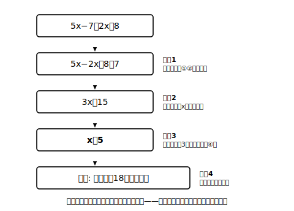

# L04 解き方の基本手順——Ａx＝Ｂへ

## ねらい

- **一元一次方程式**の意味を知り、どんな形でも同じ手順（**文字の項を左辺へ・数の項を右辺へ移項し、Ａx＝Ｂの形にしてから係数でわる**）で解けることを理解する。
- 方程式の変形と「式の計算」との違いを知り、＝を正しく使った答案が書けるようになる。

## 主概念1：一元一次方程式と基本手順

> 【ことば】**一元一次方程式（いちげんいちじほうていしき）**
> 文字（未知数）が1種類で、その文字について1次である方程式。「元（げん）」は文字の種類の数を表す。

x＋3＝5 も 5x−7＝2x＋8 も一元一次方程式だ。後者のように**両方の辺に文字の項と数の項が混ざっている**とき、どう解けばいいだろうか。方針はひとつ。**文字の項を左辺に、数の項を右辺に集める**。

**例1** 5x−7＝2x＋8
2xを左辺へ、−7を右辺へ移項する: 5x−2x＝8＋7
整理する: 3x＝15
両辺を3でわる（性質④）: **x＝5**
検算: 左辺 5×5−7＝18、右辺 2×5＋8＝18。成り立つ。

移項を終えて整理すると、必ず「**Ａx＝Ｂ**」（Ａは0でない数）というシンプルな形に着地する。あとは両辺をＡでわるだけ。つまり解く手順はこうまとめられる。

1. 文字の項を左辺へ、数の項を右辺へ**移項**する
2. 両辺を整理して **Ａx＝Ｂ** の形にする
3. 両辺をxの**係数Ａでわって** x＝（数）にする
4. 解を**代入して検算**する

**例2** 負の係数になる場合: 4x＋9＝6x＋1
6xを左辺へ、＋9を右辺へ: 4x−6x＝1−9
整理: −2x＝−8
両辺を−2でわる: **x＝4**
検算: 左辺 4×4＋9＝25、右辺 6×4＋1＝25。成り立つ。

−2でわるところで符号をまちがえやすい。「負の数でわると符号が変わる」は正負の数の計算そのままだ。不安なら、移項の向きを変えて 1−9＝… ではなく 9−1 側に数を集める（6x−4x＝9−1 → 2x＝8）手もある。どちらの道でも解は同じ4になる。

## 主概念2：方程式の変形は「式の計算」と別の営み

ここで一度立ち止まりたい。文字式の章でやった「式の計算」と、いまやっている「方程式を解く変形」は、見た目が似ているがやっていることが違う。

- **式の計算**: 1つの式を、より簡単な**同じ値の式**に整理していく（例: 5x＋3−(2x−6) を 3x＋9 に）
- **方程式を解く**: 1つの**等式**を、**同じ解を持つ別の等式**に段階的に置きかえていく（例: 5x−7＝2x＋8 を 3x＝15 に、さらに x＝5 に）

だから答案の書き方も変わる。方程式の変形では、**行を変えて等式を書き並べる**。「5x−7＝2x＋8＝3x＝15」のように＝で横につなぐのは、意味の違うものを1本の鎖にしてしまう書き方で、通じない。

:::guide
**答案は「等式のリレー」で書く**

正しい答案は、1行に1つの等式。行が変わるたびに「前の行と同じ解を持つ、より簡単な等式」へバトンが渡っていく——このリレーの終点が x＝5 だ。逆にいえば、途中のどの行に解を代入しても成り立つ。たとえば例1の途中式 3x＝15 に x＝5 を入れると 15＝15 で確かに成り立つ。行と行のあいだの「つなぎ」が等式の性質（と移項）になっているか、書いた答案を一度自分で点検してみよう。
:::

:::guide
**まちがいの典型は「移項の符号」**

移項のミスの典型は、符号を変え忘れる型だ。練習2のようなまちがい探しを自分の答案にも向けてほしい。おすすめの自己点検は2つ。①移項した項に印を付け、符号が変わったか目で確認する。②最後の検算を省かない。検算は「答え合わせ」ではなく解く手順の第4ステップ。ここまでやって「解けた」と言える。
:::

:::zatsudan
「式の計算は1つの式をみがく作業、方程式は等式を乗りかえていく旅」——同じ文字と＝を使うのに、やっていることはこんなに違う。この違いに気づかないまま進むと、答案の＝がぐちゃぐちゃにつながって自分でも読めなくなる。書き方が変わるのは、考えていることが変わったサインなんだね。
:::

## 練習

1. 次の方程式を基本手順で解こう。解はすべて代入して検算すること。
   (1) 3x＋2＝14　　(2) 7x−4＝3x＋16　　(3) 9−2x＝x＋3　　(4) 6x＋5＝8x−7
2. まちがい探し: ある人が方程式 2x＋5＝x−3 を次のように解いた。
   「2x−x＝−3＋5 → x＝2」
   移項のまちがいを指摘し、正しく解き直そう（検算つき）。
3. 根拠を言おう: 方程式 4x−1＝2x＋7 を解く次の各行について、行から行への変形の根拠（移項ならどの性質の省略か、わり算ならどの性質か）を書こう。
   4x−1＝2x＋7 → 4x−2x＝7＋1 → 2x＝8 → x＝4
4. 方程式 10−3x＝4x−4 を解こう（検算つき）。

:::stretch
**S1** x＝3 を解に持つ一元一次方程式を、次の順で「育てて」みよう。①まず x＝3 の両辺に同じ数を加える ②できた等式の両辺に同じ数（0以外）をかける ③さらに両辺に同じ文字の項を加える。できあがった複雑な方程式を、こんどは基本手順で解いて、ちゃんと x＝3 に戻ることを確かめよう。変形の行き帰りができれば、「同じ解を持つ等式に置きかえている」の意味が体感できるはずだ。
:::

---

対応解答: answer_key_L01-04.md

<!-- gen_nav:nav:start（自動生成・手編集しない） -->

---

[← 前のレッスン](lesson_03.md)｜[単元の目次](README.md)｜[解答](answer_key_L01-04.md)｜[次のレッスン →](lesson_05.md)

<!-- gen_nav:nav:end -->
