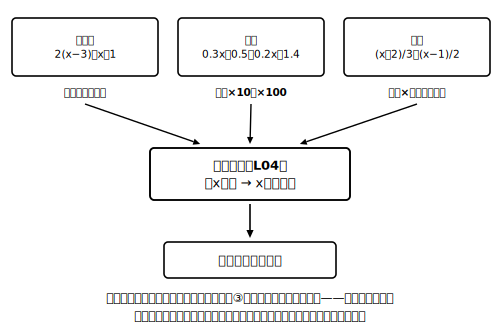

# L05 かっこ・小数・分数の方程式

## ねらい

- かっこ・小数・分数をふくむ方程式を、**前処理**（かっこを外す・両辺を10倍する・両辺に分母の公倍数をかける）で基本形に直してから解けるようになる。
- 両辺に数をかけるときは**すべての項にかける**ことを徹底し、**代入検算を解く手順の最終ステップとして固定**する。

## 前処理1：かっこは分配法則で外す

**例1** 2(x−3)＝x＋1
分配法則でかっこを外す: 2x−6＝x＋1
あとは基本手順どおり: 2x−x＝1＋6 → **x＝7**
検算: 左辺 2×(7−3)＝8、右辺 7＋1＝8。成り立つ。

かっこを外すときの注意は文字式の章と同じで、かっこの**中の全部の項**に分配すること。特に「−3(x−2)」のような負の数の分配では符号に気をつけよう。

## 前処理2：小数は両辺を10倍・100倍する

**例2** 0.3x＋0.5＝0.2x＋1.4
小数のまま解いてもよいが、両辺を10倍すると整数係数になって見通しがよい（性質③）。
両辺に10をかける: 3x＋5＝2x＋14
移項して整理: 3x−2x＝14−5 → **x＝9**
検算: 左辺 0.3×9＋0.5＝3.2、右辺 0.2×9＋1.4＝3.2。成り立つ。

10倍するのは**両辺の全部の項**だ。「0.3x＋0.5＝0.2x＋1.4 → 3x＋0.5＝2x＋1.4」のように、小数の項の一部だけを10倍してしまうと、左右のつり合いが崩れる。天びんの片方の皿の一部だけを10倍したら、もうつり合わない、というイメージで覚えよう。

## 前処理3：分数は両辺に分母の公倍数をかける

**例3** (x＋2)/3＝(x−1)/2
両辺に、分母3と2の最小公倍数6をかける（性質③）:
6×(x＋2)/3＝6×(x−1)/2 → 2(x＋2)＝3(x−1)
かっこを外す: 2x＋4＝3x−3
移項して整理: 2x−3x＝−3−4 → −x＝−7 → **x＝7**
検算: 左辺 (7＋2)/3＝3、右辺 (7−1)/2＝3。成り立つ。

## 転びやすい場所：「全部の項にかける」

分数の前処理で起こりがちなミスの型を、まちがい探しで見ておこう。

**まちがい例** 方程式 x/4＋1＝3 を、ある人がこう解いた。
「両辺に4をかけて x＋1＝12、だから x＝11」

どこがおかしいのだろうか。左辺に4をかけるなら、x/4 にも **＋1にも** かけなければいけない。正しくは:
両辺に4をかける: x＋4＝12 → **x＝8**
検算: 左辺 8/4＋1＝3、右辺 3。成り立つ。

まちがい例の「x＝11」を元の式に代入すると、左辺は 11/4＋1＝3.75 で右辺の3と合わない。**検算をすれば、この型のミスは自分で発見できる**。だからこの章では、ここから先ずっと「解いたら代入検算」までを解く手順の一部にする。検算まで書いて1問完了、だ。

:::guide
**検算は「もう1回解く」より速くて確実**

解き直しは同じミスを同じ場所で繰り返しがちだが、代入検算は解くのとは別ルートの確認なので、ミスをすり抜けにくい。かかる時間も、左辺と右辺に1回ずつ数を入れるだけ。テストの見直し時間にやることとしても、全部を解き直すより「全問の解を代入する」ほうが効率がいい。L01で仕込んだ「解＝代入すると成り立つ値」という意味が、ここで最強の実用品になる。
:::

:::guide
**小数・分数の前処理は等式の性質③の応用**

10倍するのも、分母の公倍数をかけるのも、根拠は同じ「両辺に同じ数をかけてよい」（性質③）。かっこを外す前処理だけは種類がちがって、両辺への操作ではなく、文字式の章で学んだ分配法則で各辺の式を整理する計算だ。つまりこのレッスンに新しい原理は1つもなく、増えたのは「どの数をかけると楽になるか」という作戦だけだ。新しい型に見えるものが実は既習の性質の応用——この構図に気づくと、方程式の学習は「暗記する型がどんどん増える」のではなく「同じ道具の使い方がうまくなる」ものに変わる。
:::

:::zatsudan
方程式の変形って、じつは「形は変わるのに解は変わらない」というふしぎな旅なんだ。(x＋2)/3＝(x−1)/2 と 2x＋4＝3x−3 と x＝7 は、見た目はまるで別人なのに、成り立たせる値はどれも7ただ1つ。だから途中のどの式に代入しても成り立つ。姿を変えながら中身が保たれる——変身ものの物語みたいだね。
:::

## 練習

すべて、解いたら代入検算まで書くこと。

1. 3(x＋2)＝5x
2. 4(2x−1)＝5(x＋4)
3. 0.7x−0.8＝0.5x＋0.6
4. x/2−x/5＝3
5. (2x−1)/3＝(x＋4)/2
6. まちがい探し: ある人が方程式 (x−2)/5＝3 を「両辺に5をかけて x−2＝15。答えは15」と解いた。両辺に5をかけるところまでは正しい。どこで止まってしまったのかを指摘し、正しく解き直そう。さらに、x＝15 を元の式に代入すると検算でどう発覚するかも書こう。

:::stretch
**S1** 両辺を100倍する型に挑戦: 0.05x＋0.2＝0.1x−0.3 を解こう（検算つき）。10倍と100倍のどちらを選ぶと全部の項が一度に整数になるか、かける前に係数を見わたして決めるのがコツだ。
:::

---

対応解答: answer_key_L05-08.md

<!-- gen_nav:nav:start（自動生成・手編集しない） -->

---

[← 前のレッスン](lesson_04.md)｜[単元の目次](README.md)｜[解答](answer_key_L05-08.md)｜[次のレッスン →](lesson_06.md)

<!-- gen_nav:nav:end -->
