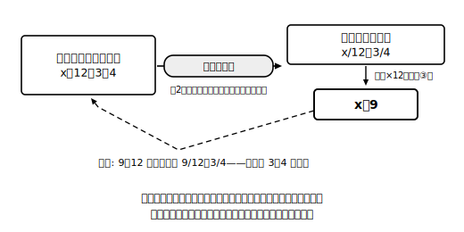

# L06 比例式——比の値で方程式に帰着

## ねらい

- **比例式**を「**比の値**が等しい」という等式に書き直すと、いままで解いてきた一次方程式そのものになることを理解し、解けるようになる。
- 比を使う具体的な場面で、比例式をつくって問題を解決できるようになる。

## 比の復習と比例式

小学校で学んだ比を思い出そう。比 a：b（比の後ろの項bは0でない数とする。0でわることはできないからだ）に対して、a/b（aをbでわった商）をその比の**比の値**という。たとえば 3：4 の比の値は 3/4、6：8 の比の値も 6/8＝3/4。**2つの比が等しいとは、比の値が等しいこと**だった。

> 【ことば】**比例式（ひれいしき）**
> 2つの比が等しいことを表す等式。a：b＝c：d の形で書く（それぞれの比の後ろの項 b、d は0でない数とする）。

比例式の中に未知数xが入ると、「xがいくつなら2つの比が等しくなるか」という問題になる。

**例1** x：12＝3：4 を解いてみよう。
比の値が等しいことから、等式に書き直す: x/12＝3/4
これは**分数をふくむ一次方程式**だ。前のレッスンの前処理どおり、両辺に12をかける（性質③）:
x＝36/4 → **x＝9**
検算: 9：12 の比の値は 9/12＝3/4。右の比 3：4 の比の値と等しいから成り立つ。

新しい解き方は何も出てこなかったことに注目しよう。比例式は、**比の値で書き直せば一次方程式とみることができる**。「比例式を解く」は、この章の道具箱だけで完結する仕事だ。

## 場面で使う：混ぜる・配る

比が活躍するのは、料理や図工のような「混ぜる」場面だ。

**例2** 手作りドレッシングは、酢（す）と油を 2：3 の割合で混ぜて作るとする。油を120mL使うとき、酢は何mL混ぜればよいだろうか。

酢をxmLとすると、酢：油の比が 2：3 に等しいから、比例式は
x：120＝2：3
比の値で書き直す: x/120＝2/3
両辺に120をかける: x＝240/3 → **x＝80**
答え: 酢は**80mL**。
検算: 80：120 の比の値は 80/120＝2/3。成り立つ。答えの80mLは油120mLより少なく、2：3（酢のほうが少ない）という場面の感覚とも合っている。

:::guide
**xの置き場所がどこでも、やることは同じ**

例1はxが先頭、では 9：x＝3：5 のようにxが2番目に来たら？　比の値で書き直すと 9/x＝3/5。両辺にxをかけ（比の後項は0ではないので、xは0でない数として性質③が使える）、9＝(3/5)x。さらに両辺に5/3をかければ x＝15。検算: 9：15 の比の値は 9/15＝3/5 で成り立つ。位置がどこでも「比の値で等式に直して、等式の性質で解く」という一本道は変わらない。
:::

:::guide
**「場面の感覚と照らす」を検算に足す**

例2では、数の検算に加えて「酢は油より少ないはず」という場面の感覚とも照らした。比の問題は、大小の見当が場面からつけやすい。「2：3で混ぜるのに、酢が油より多く出たら何かおかしい」——この感覚チェックは、あとのレッスン（解の吟味）で主役になる考え方の先取りだ。
:::

:::zatsudan
比例式って、見た目は「：」の記号が入った新顔なんだけど、比の値で書き直したとたん、いつもの方程式の顔になる。初対面だと思っていた相手が、よく見たら知り合いの変装だった、というわけ。数学では「新しく見えるものを、知っているものに帰着させる」という手がくり返し登場する。その最初の練習台がこの比例式だ。
:::

## 練習

すべて、解いたら検算（比の値の一致の確認）まで書くこと。

1. x：8＝5：4
2. 9：x＝3：5
3. 絵の具で水色を作るのに、白と青を 5：2 の割合で混ぜる。青を30g使うとき、白は何g必要だろうか。比例式をつくって解こう。
4. 米を炊くとき、米と水を体積の比 5：6 で入れるとする。米を450mL入れるとき、水は何mL入れればよいか。比例式をつくって解こう。

:::stretch
**S1** 例1の x：12＝3：4（解は x＝9）で、「外側どうしの積 x×4」と「内側どうしの積 12×3」をそれぞれ計算してみよう。練習1・2でも同じことを試して、気づいたことを一言で書こう。いつでもそうなる理由を、比の値の等式 x/12＝3/4 の両辺に「12×4」をかけて説明できたらすごい。
:::

---

対応解答: answer_key_L05-08.md

<!-- gen_nav:nav:start（自動生成・手編集しない） -->

---

[← 前のレッスン](lesson_05.md)｜[単元の目次](README.md)｜[解答](answer_key_L05-08.md)｜[次のレッスン →](lesson_07.md)

<!-- gen_nav:nav:end -->
