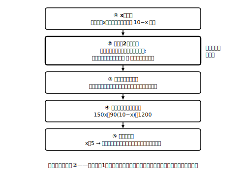

# L07 等しい2つの数量を見つける——個数と代金

## ねらい

- 文章で表された場面から方程式をつくる**立式の型**を身につける。急所は「**等しい2つの数量を見つける**」ステップ。
- つくった方程式について「左辺は何を表すか・右辺は何を表すか」を言葉で言えるようになる。

## 立式の型：5つのステップ

文章題は「解く」より「**式をつくる**」ほうがずっと難しい。だから、式をつくる手順そのものを型にしよう。

1. **求めたい数量を決めて、xで表す**（「〜をx個とする」と宣言する）
2. **等しい2つの数量を見つける**（この問題で、何と何が等しいのか）
3. **左辺・右辺が何を表すかを言葉で言う**（「左辺は◯◯、右辺は△△を表す」）
4. **方程式をつくって解く**
5. **解を場面に戻して答える**（単位を付け、問いに答える形で）

このうち、いちばん立ち止まってほしいのがステップ2だ。等号は「左右が等しい」の宣言だった（L02）。つまり方程式を1本つくるとは、**その場面にひそむ「等しい関係」を1つ見つけ出すこと**にほかならない。

## 段階1：等しい関係が問題文に書いてある場合

**例1** 1個120円のパンをx個と、150円の飲み物を1本買ったところ、**代金の合計は750円だった**。パンは何個買っただろうか。

この問題は親切で、等しい関係が文中にほぼ書いてある。「買った物の代金の合計」と「750円」が等しい。

- 左辺: 買った物の代金の合計 → 120x＋150（円）
- 右辺: 実際の代金 → 750（円）

方程式: 120x＋150＝750
解く: 120x＝600 → x＝5
検算: 左辺 120×5＋150＝750、右辺 750。成り立つ。
答え: パンは**5個**。5個は買い物の場面として自然な個数だ。

## 段階2：等しい数量の式を自分で組み立てる場合

**例2** 1個150円のりんごと1個90円のみかんを、**合わせて10個**買ったら、代金は1200円だった。りんごを何個買っただろうか。

今度も等しい関係そのもの（代金の合計が1200円）は文中にあるが、その左辺を**自分の式で組み立てる**必要がある。文字もりんごとみかんの2つ分ほしくなるが、使えるのはx1つ。ここで「合わせて10個」が効く——りんごをx個とすれば、みかんは（**10−x）個**と表せるのだ。この「もう一方の数量をxで表しきる」ことが、この段階の新しい壁になる。なお、等しい関係が文中に書かれておらず、自分で見いだすところから始める問題は、次のレッスン（過不足・速さ）で本格的に登場する。

等しい2つの数量はどこにあるか。「買い方から計算した代金の合計」と「実際に払った1200円」だ。

- 左辺: 買い方から計算した代金の合計 → 150x＋90(10−x)（円）
- 右辺: 実際の代金 → 1200（円）

方程式: 150x＋90(10−x)＝1200
かっこを外す: 150x＋900−90x＝1200
整理: 60x＝300 → x＝5
検算: 左辺 150×5＋90×5＝750＋450＝1200、右辺 1200。成り立つ。
答え: りんごは**5個**（みかんは10−5＝5個）。個数の合計も 5＋5＝10個 で場面に合う。

:::guide
**「等しい2つの数量」はたいてい「同じものの二通りの表し方」**

例2の左辺と右辺は、どちらも「代金の合計」だ。同じ1つの数量を、「買い方から式で計算する」表し方と「払った金額そのもの」という表し方の**二通り**で表し、等号で結んでいる。文章題で等しい関係が見つからないときは、「この場面で、二通りに表せる数量はどれだろう」と探すと突破口になりやすい。次のレッスンの過不足・速さの問題では、この見方が主役になる。
:::

:::guide
**AI活用枠：立式の壁打ち（独習の行き詰まり用）**

立式は、答えを見てしまうと練習にならないのが悩ましいところだ。一人で行き詰まったら、AIチャットに「答えを言わせない壁打ち相手」を頼むことができる。プロンプト例:
「中1の数学の文章題を練習しています。**答えや式は絶対に言わずに**、私が『等しい2つの数量』を自分で見つけられるように、ヒントの質問を1回に1つだけ出してください。問題: （ここに問題文を写す）　私の今の考え: （ここに自分の考えを書く）」
自分の考えを書き添えるのがコツで、どこで詰まっているかが相手に伝わる。ただし、AIがこの指示を守りきれず、答えや式を見せてしまうこともある。答えが見えてしまったら、その問題は練習台にならなくなるので、別の問題で仕切り直そう。
:::

:::zatsudan
方程式のありがたみは、じつは式を立てた瞬間に半分以上回収されている。いったん 150x＋90(10−x)＝1200 と書けてしまえば、あとはりんごの香りも財布の中身も忘れて、記号の規則だけで機械的に処理できる——場面を離れて形式的に処理できる、これが方程式のよさだ。頭を使う場所を「立式」に集中させて、残りを手続きに任せる分業なんだね。
:::

## 練習

各問とも、立式の型の5ステップ（xの宣言／等しい2つの数量／左辺・右辺の意味／方程式と解／場面に戻した答え）で書こう。検算も忘れずに。

1. 1本80円の鉛筆をx本と、120円のノートを1冊買ったら、代金の合計は600円だった。鉛筆は何本買っただろうか。
2. 現在、Aさんは14歳、Aさんの母は42歳である。母の年齢がAさんの年齢のちょうど2倍になるのは、今から何年後だろうか。
3. 50円切手と80円切手を合わせて12枚買ったら、代金は750円だった。50円切手は何枚買っただろうか。
4. 説明問題: 練習3で自分がつくった方程式について、「左辺は◯◯を表し、右辺は△△を表す。この2つは□□だから等しい」の形で説明を書こう。

:::stretch
**S1** 例2の設定で、りんごとみかんの値段を入れかえてみよう（1個90円のりんごと1個150円のみかん、合わせて10個で1200円）。方程式をつくって解き、元の例2の答えと見比べて、気づいたことを一言で書こう。なぜそうなるのか、合計個数と合計金額に注目して説明できたらすばらしい。
:::

---

対応解答: answer_key_L05-08.md

<!-- gen_nav:nav:start（自動生成・手編集しない） -->

---

[← 前のレッスン](lesson_06.md)｜[単元の目次](README.md)｜[解答](answer_key_L05-08.md)｜[次のレッスン →](lesson_08.md)

<!-- gen_nav:nav:end -->
