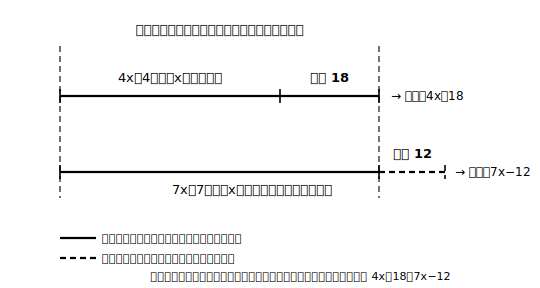

# L08 過不足と速さ——1つの数量を二通りに表す

## ねらい

- 過不足（かふそく）の場面・速さの場面で、**同じ1つの数量を二通りに表して**等号で結ぶ立式ができるようになる。
- 線分図や表を使って、数量の関係を目に見える形に整理してから式をつくる習慣を持つ。

## 型1：過不足の問題（「総数」を二通りに表す）

**例1** あめを何人かの子どもに配る。1人に4個ずつ配ると18個余り、1人に7個ずつ配ると12個足りない。子どもの人数とあめの個数を求めてみよう。

求めたいものが2つあるが、まず**人数**をx人としよう。等しい2つの数量はどこにあるか。配り方が2通り書かれているが、どちらの配り方でも**あめの総数そのものは変わらない**。ここだ。

- 4個ずつで18個余る → あめの総数は 4x＋18（個）
- 7個ずつで12個足りない → あめの総数は 7x−12（個）（12個「足りない」＝配りきるのに必要な7x個より12個少ない）

左辺も右辺も「あめの総数」。同じものの二通りの表し方だから等しい。

方程式: 4x＋18＝7x−12
移項して整理: 18＋12＝7x−4x → 30＝3x → x＝10
検算: 左辺 4×10＋18＝58、右辺 7×10−12＝58。成り立つ。
答え: 子どもは**10人**、あめは**58個**。

「足りない」の符号処理は迷いやすい。**総数を基準に言い直して**、「7個ずつ配るには12個足りない」＝「総数は 7x より12少ない」と考えれば、7x−12 が自然に出てくる。

## 型2：速さの問題（「道のり」を二通りに表す）

速さの言葉の式は小学校で学んだ。**（速さ）×（時間）＝（道のり）**。これを文字で使う。

**例2** 弟が分速60mで家を出発した。その9分後に、兄が自転車に乗って分速240mで同じ道を追いかけた。兄は出発してから何分後に弟に追いつくだろうか。

兄が出発してからx分後に追いつくとする。追いつく瞬間、2人は**同じ地点**にいる。つまり**家からの道のりが等しい**。これが等しい2つの数量だ。表に整理してみよう。

| | 速さ（分速） | 時間（分） | 道のり（m） |
|---|---|---|---|
| 兄 | 240 | x | 240x |
| 弟 | 60 | x＋9 | 60(x＋9) |

弟の時間が x＋9 になるところが急所だ。弟は兄より9分早く出ているから、兄がx分走ったとき、弟は（x＋9）分歩いている。

方程式: 240x＝60(x＋9)
かっこを外す: 240x＝60x＋540
移項して整理: 180x＝540 → x＝3
検算: 左辺 240×3＝720、右辺 60×(3＋9)＝720。成り立つ。
答え: 兄は出発してから**3分後**に追いつく（家から720mの地点）。

:::guide
**図や表は「解けない人の補助輪」ではない**

線分図や表を「かかずに解けるほうが上級者」と思うのは損だ。図や表の役割は、頭の中に散らばった数量を1か所に並べて、**二通りに表されている数量を見つけやすくする**こと。過不足なら「上下の線分の全長が同じ」、速さなら「道のりの列が等しくなる行の組」——等しい関係が図表の上で目に見える。式が立ってしまえば図はもう用済みでいい。立式前の探索道具として使い倒そう。
:::

:::guide
**「単位をそろえてから式にする」の一手**

速さの問題では、分速と時速、mとkmが混ざって出てくることがある。方程式に入れる前に**単位を片方にそろえる**のが安全だ。たとえば時速4.2kmは、4200m÷60分で分速70m。そろえる作業は立式の前にすませて、式の中には同じ単位の数だけが並ぶようにする。単位ミスは検算でも見つけにくい（式の上ではつじつまが合ってしまう）ので、入口で防ぐのがいちばん効く。
:::

:::zatsudan
（速さ）×（時間）＝（道のり）という言葉の式は、小学校からの持ち物だ。あのころは数をあてはめる「計算の公式」だったけれど、文字と組むと 60(x＋9) のように「まだ分からない時間ぶんの道のり」まで一気に表せる式へ育つ。小学校の道具が中学の舞台でパワーアップして再登場——けっこう熱い展開だと思わないかい。
:::

## 練習

各問とも、等しい2つの数量が何かを言葉で書いてから式を立てよう。線分図または表も添えること。検算まで書いて1問完了。

1. ノートを何人かの生徒に配る。1人に5冊ずつ配ると7冊余り、6冊ずつ配ると3冊足りない。生徒の人数とノートの冊数を求めよう。
2. 妹が分速50mで家を出発し、その6分後に姉が分速80mで同じ道を追いかけた。姉は出発してから何分後に妹に追いつくだろうか。
3. 1.8km離れた2地点から、Aさんが分速70m、Bさんが分速50mで、同時に向かい合って歩き出した。2人が出会うのは出発してから何分後だろうか。（ヒント: この問題で等しいのは「2人の道のりの**和**」と何だろう）
4. 説明問題: 練習1で自分がつくった方程式について、「左辺も右辺も◯◯を表している。配り方がちがっても◯◯は変わらないから等しい」の形で説明を書こう。

:::stretch
**S1** 例2で、兄の自転車の速さを分速210mに変えると、追いつくのは兄の出発から何分後になるだろうか。解が整数にならないが、時間の値としてはそれで構わない。「〜分〜秒」に直して答え、道のりの検算までやってみよう。解が整数になるかどうかと、解として意味を持つかどうかは別問題。次のレッスンの入口になる気づきだ。
:::

---

対応解答: answer_key_L05-08.md

<!-- gen_nav:nav:start（自動生成・手編集しない） -->

---

[← 前のレッスン](lesson_07.md)｜[単元の目次](README.md)｜[解答](answer_key_L05-08.md)｜[次のレッスン →](lesson_09.md)

<!-- gen_nav:nav:end -->
