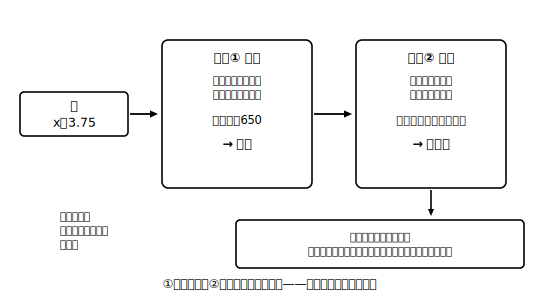

# L09 その解、場面に合ってる？——解の吟味

## ねらい

- 方程式の解が、**計算として正しくても、場面の答えとして使えるとは限らない**ことを、実例で体験する。
- **検算**（方程式に代入する）と**吟味（ぎんみ）**（場面に照らす）の**2段チェック**を、文章題の型の最終ステップとして身につける。

## 事件：正しく解いたのに、答えられない

次の問題を、いつもの型で解いてみよう。

**例1** 1個60円のガムと1個100円のチョコレートを、合わせて8個買って、代金をちょうど650円にしたい。ガムを何個買えばよいだろうか。

ガムをx個とすると、チョコレートは（8−x）個。等しい2つの数量は「買い方から計算した代金」と「650円」。

方程式: 60x＋100(8−x)＝650
かっこを外す: 60x＋800−100x＝650
整理: −40x＝−150 → x＝3.75

検算してみよう。左辺に代入すると 60×3.75＋100×4.25＝225＋425＝650。右辺は650。**方程式としては完璧に成り立っている**。

でも——ガムを3.75個買うことはできない。個数は0以上の整数のはずだからだ。つまりこの問題の答えは「**条件に合う買い方はない**」。方程式は正しく立てて正しく解いた。それでも、解がそのまま答えにならないことがあるのだ。

## なぜこんなことが起きるのか

方程式 60x＋100(8−x)＝650 が表しているのは「代金が650円になる」という条件**だけ**だ。「xは個数だから0以上の整数」という条件は、私たちが頭では分かっていても、**方程式の中には書き込まれていない**。方程式をつくるときに表現しきれなかった条件があるなら、解が出たあとで、その条件に照らして**再検討**する必要がある。これが**解の吟味**だ。

> 【ことば】**検算と吟味の2段チェック**
> ①**検算**: 解を方程式の両辺に代入して、計算が正しいか確かめる。
> ②**吟味（ぎんみ）**: 解を場面に照らして、問題の答えとして意味を持つか確かめる（個数・人数なら0以上の整数か、長さなら正の数か、など）。
> ①が通っても②で止まることがある。両方通ってはじめて「答え」になる。

## 吟味は「はねる」だけでなく「読み直す」ためにも使う

吟味の結果はいつも「不採用」とは限らない。解を**場面に即して読み直す**と、答えが見えてくることもある。

**例2** 現在、Bさんは12歳、Bさんの父は38歳である。2人の年齢の和が44歳になるのは、今から何年後だろうか。

x年後として、方程式: (12＋x)＋(38＋x)＝44
整理: 50＋2x＝44 → 2x＝−6 → x＝−3
検算: (12−3)＋(38−3)＝9＋35＝44。成り立つ。

x＝−3 をどう読むか。問いは「今から**何年後**」だから、問いの文字どおりに答えるなら「**2人の年齢の和が44歳になる年は、未来にはない**」——これがこの問いへの答えだ。そのうえで、x＝−3 を場面に即して読み直すと、「−3年後」は「**3年前**」を意味する。3年前、Bさんは9歳・父は35歳で、和はたしかに44歳。だから「未来にはない。ただし3年前がそうだった」とまで付け加えられると、吟味として満点だ。解を捨てる（不採用にする）のではなく、問いに正確に答えたうえで、解の意味まで読み取っている。

個数の3.75は救えなかったが、年齢の−3は意味まで読み取れた。**解を採用できるかどうかは、その数量が場面で何を意味するかで決まる**。だから吟味は、機械的な手続きではなく「場面に戻って考える」ステップなのだ。

:::guide
**「答えが変な値になったら式がまちがい」とは限らない**

解が分数や負の数になると、反射的に「計算ミスだ」と思いがちだ。実際には3つの可能性がある。①本当に計算ミス（→検算で見つかる）②式は正しく、解も場面で意味を持つ（例2の−3）③式は正しいが、場面の条件に合う解がない（例1の3.75）。検算と吟味を分けて持っておくと、この3つを落ち着いて切り分けられる。「変な値＝まちがい」と早合点して正しい式を消してしまうのが、いちばんもったいない。
:::

:::guide
**吟味で見るポイントの早見表**

場面ごとに、方程式に書き込めていない「暗黙の条件」の定番がある。個数・人数・枚数→0以上の整数。お金→0以上（場面によっては整数）。長さ・重さ・時間の長さ→正の数（整数とは限らない。L08のstretchで確かめた通り）。「何年後」→負なら「〜年前」と読み直せるか場面で判断。文章題を解き終えたら、この早見表を頭の中で1周させてみよう。
:::

:::zatsudan
「方程式をつくるときに表現しきれなかった条件を、解が出たあとで再検討する」——吟味の正体はこれなんだ。式は場面のすべてを写し取っているわけじゃなく、等しい関係を1本だけ切り取った似顔絵みたいなもの。だから最後にもう一度、本物の場面と見比べる。式に任せきりにせず、最後の判断は人間が場面に戻ってする。いい分担だと思うな。
:::

## 練習

各問とも、検算①と吟味②の2段チェックを明記して答えること。

1. 1枚30円の色紙と1枚50円の色紙を、合わせて10枚買う。
   (ア) 代金をちょうど420円にしたい。30円の色紙を何枚買えばよいか。
   (イ) 代金をちょうど435円にしたい。30円の色紙を何枚買えばよいか。
2. あめが92個ある。x人の子どもに7個ずつ配ると6個余るとして方程式をつくり、解いてみよう。解の吟味から、この問題の設定についてどんなことが言えるだろうか。
3. 説明問題: 「検算が成り立てば答えは正しい、とは言い切れない」のはなぜか。例1を使って、自分の言葉で2〜3文で説明しよう。

:::stretch
**S1** 例1の「650円」を、答えが存在するような金額に自分で作り変えてみよう。60x＋100(8−x)＝（金額）の解が0以上8以下の整数になるためには、金額はどんな値なら可能か。x＝0, 1, 2, …, 8 のそれぞれの場合の代金を全部計算して、「可能な金額のリスト」を作ると見通しが立つ。
:::

---

対応解答: answer_key_L09-10.md

<!-- gen_nav:nav:start（自動生成・手編集しない） -->

---

[← 前のレッスン](lesson_08.md)｜[単元の目次](README.md)｜[解答](answer_key_L09-10.md)｜[次のレッスン →](lesson_10.md)

<!-- gen_nav:nav:end -->
