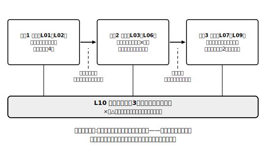

# L10 章末まとめ——「形を変えても解は変わらない」

## ねらい

- この章で学んだことを「**意味**」「**解く**」「**使う**」の3部屋に整理し、自分の弱い部屋を特定する。
- 総合演習で、手続きだけでなく**根拠と吟味まで**そろった答案を仕上げる。

## 3部屋の自己チェック

この章の中身は、大きく3つの部屋に分かれていた。各項目に自分で○△×を付けてみよう。×や△の項目は、かっこ内のレッスンに戻れば復習できる。

**部屋1：意味（方程式とは何か）**
- 方程式・解・「方程式を解く」の意味を説明できる（L01）
- 「x＝2 がこの方程式の解といえるか」を、代入して確かめられる（L01）
- 等式の性質を4つ言える。④の「c≠0」の条件も落とさない（L02）

**部屋2：解く（手続きと根拠）**
- 移項を使って解ける。そして「移項の根拠は等式の性質①②」と言える（L03）
- 文字の項と数の項が両辺に混ざった方程式を、Ａx＝Ｂの形に整理して解ける（L04）
- かっこ・小数・分数の前処理ができる。両辺に数をかけるときは全部の項にかける（L05）
- 比例式を、比の値を使って一次方程式に直して解ける（L06）
- 解いたら代入検算する習慣がついている（L01・L05）

**部屋3：使う（立式と吟味）**
- 「等しい2つの数量」を見つけて方程式をつくれる（L07）
- 左辺・右辺が何を表すかを言葉で言える（L07・L08）
- 過不足・速さの場面で、同じ数量を二通りに表して立式できる（L08）
- 検算と吟味の2段チェックができる（L09）

## 総合演習

1. **意味の部屋から**: −1, 0, 1, 2 のうち、方程式 5x−2＝3x＋2 の解はどれだろうか。4つの値をそれぞれ両辺に代入して確かめよう。
2. **根拠を言う**: 方程式 x−6＝4 を x＝4＋6 と変形した。この変形を、(ア)移項という言葉を使った説明、(イ)等式の性質①〜④のどれを使ったかの説明、の両方で述べよう。
3. **解く**: (3x−2)/4＝(x＋2)/2 を解こう（代入検算まで）。
4. **比例式**: x：6＝5：3 を解こう（比の値の検算まで）。
5. **使う（立式から吟味まで）**: 1個80円のドーナツと1個130円のマフィンを、合わせて9個買ったら、代金は920円だった。ドーナツを何個買っただろうか。立式の型の5ステップと、検算・吟味の2段チェックをすべて書くこと。

:::guide
**「解けたのに説明で詰まる」は伸びしろの合図**

総合演習2のような「根拠を言う」問題は、手が動く人ほど後回しにしがちだ。でも、この章の背骨は「なぜその変形が許されるのか」に等式の性質で答えられること。手続きと根拠の両方を持っているかを最後にもう一度確かめるために、2は口頭でもいいから必ず言葉にしてみてほしい。すらすら言えたら、この章は卒業だ。
:::

:::guide
**この先の風景を一言だけ**

この章で身につけた「解＝条件を満たす値」という意味と、「等式の性質で同値な方程式に変形していく」という解き方は、この先の方程式の学習でもそのまま通用する。方程式の学びはここが土台で、上の階が増えていくイメージだ。だからこそ、この章の3部屋に×を残さず進みたい。
:::

:::zatsudan
中2では連立方程式を、中3では二次方程式を学ぶ。方程式の姿は変わっていくのに、「解は条件を満たす値」という意味も、等式の性質で形を変えて解くという発想も、本質的には変わらない。つまりきみは今、この先ずっと使い回せる道具を手に入れたところなんだ。いい買い物だったと思うよ。
:::

:::stretch
**S1** 総合演習5の答えが出たら、問題の「920円」だけをいろいろな金額に変えて、「答えが存在する金額」と「存在しない金額」の境目を調べてみよう。合わせて9個という条件のもとで、代金として可能な最小の金額と最大の金額はいくらだろうか。
:::

---

対応解答: answer_key_L09-10.md

<!-- gen_nav:nav:start（自動生成・手編集しない） -->

---

[← 前のレッスン](lesson_09.md)｜[単元の目次](README.md)｜[解答](answer_key_L09-10.md)

<!-- gen_nav:nav:end -->
