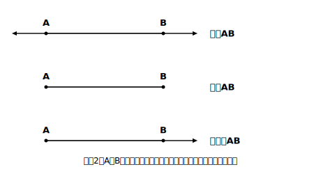
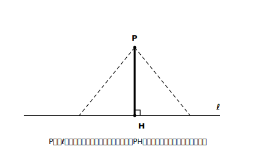
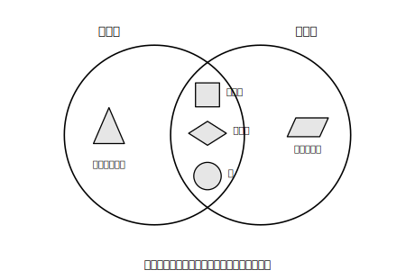

# L01 図形のことばと記号〜対称性の学び直し

## ねらい

- 直線・線分・半直線、記号∠・△・⊥・∥、2点間の距離・点と直線の距離を、**あいまいさなく**使い分けられるようになる。
- 小6で学んだ**線対称・点対称**を思い出し、「1つの図形が両方の対称性をもつことがある」ことまで見抜ける目をつくる。

## 準備運動：小学校の道具箱の点検

紙と鉛筆を出して、次の3つをやってみよう。

1. 二等辺三角形（正三角形でないもの）を1つかいて、**折るとぴったり重なる折り目**を1本かき入れよう。
2. 平行四辺形（長方形・ひし形・正方形でないもの）を1つかこう。この図形は、折ってぴったり重ねることができるだろうか？
3. 「合同」ということばの意味を、自分の言葉で1文で書こう。

3は小5の内容だ。**形も大きさも同じで、ぴったり重ね合わせられる2つの図形を合同という**——この章では、この「ぴったり重なる」を道具にして図形を調べていく。

## 主概念1：図形を「ことば」で正確に指す

これから図形の話をたくさんする。まず、指すものがずれない言い方をそろえよう。

> 【ことば】
> - **直線AB** … 2点A・Bを通って、両方向に限りなくのびたまっすぐな線
> - **線分AB** … 直線ABのうち、AからBまでの部分（両端がある）
> - **半直線AB** … Aを端として、Bの方向に限りなくのびた部分
> - **2点A・B間の距離** … 線分ABの長さ

「直線」「線分」「半直線」は、日常語ではぜんぶ「線」の一言ですませてしまう。でも数学では、**端があるかないか**で区別する。作図の場面で「直線をひく」のか「線分をひく」のかは意味が変わるから、ここでそろえておくわけだ。

<!-- figure-spec: 意図=直線・線分・半直線の3点セットを1枚で対比する定義図。要素=2点A・Bを共通にした3段組。上段=直線AB（両端に矢印）・中段=線分AB（両端が点で止まる）・下段=半直線AB（A側が点・B側が矢印）。各段の右にことばのラベル。alt=同じ2点A・Bに対する直線・線分・半直線のちがい。描かないもの=目盛り・長さの数値。生成方法=パラメトリックSVG（assets_provenance/generate_figures.py・3段のA・B位置の共通性をassert検証）。 -->

角と三角形、垂直と平行にも記号を与えよう。

> 【ことば】
> - **∠AOB** … 頂点Oから出る2つの半直線OA・OBがつくる角（記号∠は「角」と読む）
> - **△ABC** … 3点A・B・Cを頂点とする三角形
> - **AB⊥CD** … 直線ABと直線CDが垂直（記号⊥は「垂直」）
> - **AB∥CD** … 直線ABと直線CDが平行（記号∥は「平行」）
> - **点と直線の距離** … 点から直線にひいた**垂線（すいせん）**の、点から交点までの長さ

点と直線の距離だけ少し説明がいる。点Pから直線ℓへは、いろいろな線分がひける。その中で**いちばん短いのが、ℓに垂直にひいた線分**だ。だから「距離」といえばこの垂線の長さを指す、と約束する。

<!-- figure-spec: 意図=点と直線の距離＝垂線の長さ、を「他の線分より短い」比較で見せる図。要素=直線ℓと直線外の点P。Pからℓへ垂線PH（直角マーク付き・太線）と、斜めの線分2本（細線・破線）。PHがいちばん短いことが見た目でわかる配置。alt=点Pから直線ℓへひいた垂線と斜めの線分の比較。垂線がいちばん短い。描かないもの=具体の長さの数値。生成方法=パラメトリックSVG（PH⊥ℓとPH<斜め線分をassert検証）。 -->

:::guide
**なぜ最初が「ことば」なのか**

この単元の後半では、作図の手順や図形の移動を「言葉で説明する」場面が続く。説明がうまくいかない原因の多くは、考えが足りないことではなく、**指しているものがずれること**（直線のつもりが線分、角のつもりが頂点）にある。だから道具のことばを最初に1回そろえる。ここで完璧に暗記する必要はない。使いながら何度でも戻ってくればよい。
:::

## 主概念2：対称性で図形を見る（線対称と点対称）

小6の学び直しから入ろう。

> 【ことば】
> - **線対称な図形** … 1本の直線を折り目にして折ると、両側がぴったり重なる図形。折り目の直線を**対称の軸（対称軸）**という
> - **点対称な図形** … ある点を中心に**180°回転させる**と、もとの図形にぴったり重なる図形

ここで大事な問いを1つ。**1つの図形が、線対称でもあり点対称でもある、ということはあるだろうか？**

正方形で確かめてみよう。対角線で折っても、辺のまん中を通る直線で折っても重なるから線対称（対称軸は4本）。さらに、対角線の交点を中心に180°回すとやはり重なるから点対称でもある。つまり正方形は**両方をもつ**。

「線対称か点対称か、どちらか一方」と思い込んでいると、こういう図形で片方を見落とす。次の練習で、自分の目を点検してみよう。

<!-- figure-spec: 意図=線対称・点対称の分類マップ（両方をもつ図形の存在を面で見せる）。要素=2つの円が重なるベン図。左の円=線対称・右の円=点対称・重なり=両方。左のみ→二等辺三角形、右のみ→平行四辺形、重なり→正方形・ひし形・円を小さなシルエットで配置。alt=線対称と点対称のベン図。重なりに正方形・ひし形・円がある。描かないもの=対称軸の本数の一覧（練習で自分で数えるため）。生成方法=パラメトリックSVG（各シルエットの対称性と領域配置をassert検証）。 -->

:::guide
**「180°回転」と点対称**

点対称の説明にある「180°回転させる」は、次のL02・L03で学ぶ**回転移動**の特別な場合を先どりした言い方だ。小6では「逆さまにしても同じ形」という感覚で学んでいるが、中学ではこれを「回転」という操作のことばで言い直していく。感覚から操作のことばへ。この言い直しが、この単元の背骨になる。
:::

:::zatsudan
万華鏡（まんげきょう）をのぞいたことはあるかな。あの模様が美しく感じられるのは、鏡の反射で同じ形が折り返されて、対称な模様が生まれているからだ。対称性は「きれい」と感じる形の裏にひそんでいることが多い。この章が終わるころには、模様を見て「どこに対称の軸があるか」を探すくせがついているはずだよ。
:::

## 練習

1. 次の言い方を、記号を使って書き直そう。
   (1) 点Aと点Bを通る直線　(2) 頂点Oから出る半直線OXとOYがつくる角　(3) 直線ℓと直線mは垂直　(4) 辺ABと辺DCは平行
2. 「線分AB」と「半直線AB」と「半直線BA」のちがいを、図をかいて説明しよう（半直線は**どちらが端か**で別物になることに注意）。
3. 次の図形を「線対称のみ／点対称のみ／両方／どちらでもない」に分類しよう。線対称のものは対称軸の本数も書くこと。
   (1) 二等辺三角形（正三角形でないもの）　(2) 正三角形　(3) 平行四辺形（長方形・ひし形でないもの）　(4) ひし形（正方形でないもの）　(5) 円
4. 「ひし形は線対称な図形だから、点対称ではない」。この説明のまちがいを指摘して、正しく直そう。

:::stretch
**S1** 正多角形（正三角形・正方形・正五角形・正六角形…）について、対称軸の本数と「点対称かどうか」を表に整理してみよう。頂点の数が偶数のときと奇数のときで、点対称かどうかに規則はあるだろうか。見つけた規則を「頂点の数が…のとき…」の形で書いてみよう。
:::

---

対応解答: answer_key_L01-04.md

<!-- gen_nav:nav:start（自動生成・手編集しない） -->

---

[単元の目次](README.md)｜[解答](answer_key_L01-04.md)｜[次のレッスン →](lesson_02.md)

<!-- gen_nav:nav:end -->
