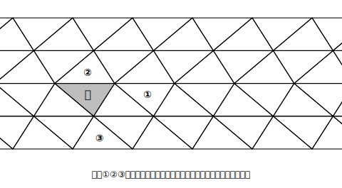
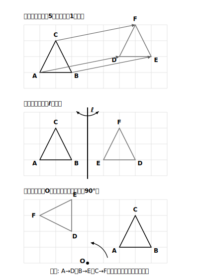
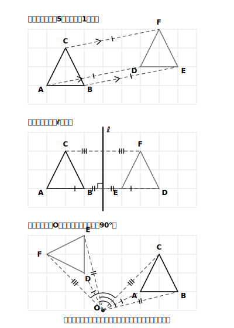

# L02 図形を動かす〜3つの移動

## ねらい

- 図形の**平行移動・対称移動・回転移動**を知り、移動の前後で「どの点がどの点に移ったか」（対応）を正しく読み取れるようになる。
- 移動しても**形と大きさは変わらない**こと、対応する点どうしの間に成り立つ性質を、図で確かめられるようになる。

## 導入：敷き詰め模様をながめる

同じ形の三角形をすき間なく並べた「敷き詰め模様」を見てみよう。

<!-- figure-spec: 意図=合同な三角形の敷き詰め模様の観察素材（この後の設問①〜③で使う本体図）。要素=合同な不等辺三角形（直角なし）を4行×7列敷き詰め（下2行=基準の向きの帯・上2行=それを折り返した鏡映の帯——②の裏返し位置とstretch S1の「裏返さないと重ならない三角形の帯」が実在するための構成）。基準の三角形アに対し、①=アを右へずらした位置、②=アを共有辺で裏返した位置、③=アを1つの頂点のまわりに回した位置、に配置してラベル。alt=合同な三角形を敷き詰めた模様。基準の三角形と、ずらす・裏返す・回すで重なる3つの三角形にラベル。描かないもの=移動を表す矢印（読者が自分で見つけるため）・移動の種類名（練習1の答えのため）。生成方法=パラメトリックSVG（①②③の位置と裏返しの帯の存在を移動の計算で厳密にassert検証）。 -->

模様の中の三角形は、どの2つをとっても形も大きさも同じ——つまり**合同**だ。では、基準の三角形アを①②③のそれぞれにぴったり重ねるには、アをどう動かせばよいだろう？ 小さいころからやってきた「ずらす」「裏返す」「まわす」で言えそうだ。この3つの動かし方に、数学の名前を付けるのが今日の仕事だ。

## 主概念1：3つの移動

図形の位置だけを変えて、**形や大きさを変えない**動かし方を、図形の**移動**という。基本の移動は次の3つだ。

> 【ことば】
> - **平行移動** … 図形を、**一定の方向に、一定の距離だけ**ずらす移動
> - **対称移動** … 図形を、**ある直線を折り目（軸）として**、その反対側のぴったり重なる位置へ移す移動。この直線を**対称の軸**という
> - **回転移動** … 図形を、**ある点を中心として、決めた向きに一定の角度だけ**回す移動。この点を**回転の中心**という

日常語との対応は、ずらす＝平行移動、裏返す＝対称移動、まわす＝回転移動。冒頭の模様なら、①は平行移動、②は対称移動、③は回転移動でアと重なる。

<!-- figure-spec: 意図=3つの移動の定義を1枚で対比する図（△ABCと移動後の△DEFを3段組で）。要素=各段に移動前△ABC（実線）・移動後△DEF（実線・薄め）・移動のようす（平行移動=対応点を結ぶ平行な矢印、対称移動=軸ℓと折り返し、回転移動=中心Oと回転の弧矢印）。対応する頂点A→D・B→E・C→Fを明記。alt=平行移動・対称移動・回転移動それぞれの移動前と移動後の三角形。描かないもの=3段のあいだの優劣・順序を示す装飾。生成方法=パラメトリックSVG（平行移動=右へ5マス・上へ1マス／縦の直線ℓが軸／点O中心に反時計回りに90°。全頂点が方眼の格子点上にあることをassert検証）。 -->

移動前の図形の点Aが、移動後の図形の点Dに移ったとき、AとDは**対応する点**であるという。辺ABと辺DEは**対応する辺**、∠Aと∠Dは**対応する角**だ。移動は形も大きさも変えないから、**対応する辺の長さ・対応する角の大きさはそれぞれ等しい**。

## 主概念2：対応を正しく読み取る

移動の問題でいちばん事故が起きやすいのは、計算ではなく**対応の読み取り**だ。とくに回転移動では、図形の向きが変わるので、「いちばん近くにある点どうし」を対応と思い込みやすい。

対応を読み取る手がかりは、移動の種類ごとにはっきりしている。

- **平行移動** … 対応する点を結ぶ線分（AD・BE・CF）は、**すべて平行で、長さが等しい**
- **対称移動** … 対応する点を結ぶ線分は、**対称の軸と垂直に交わり、その交点で2等分される**
- **回転移動** … 対応する点は、**回転の中心から等しい距離**にあり、対応する点と中心を結んでできる角（∠AOD・∠BOE・∠COF）は**すべて等しい**

<!-- figure-spec: 意図=移動の種類ごとの「対応する点を結ぶ線分の性質」を確かめる検証図。要素=L02図2の3段組に、対応点を結ぶ補助線分（破線）と、等しい長さ・直角・等しい角のマークを重ねる。回転移動の段は中心Oから各対応点への線分と角のマークを明示。alt=3つの移動それぞれで、対応する点を結ぶ線分に成り立つ性質を示した図。描かないもの=本文にない追加の性質・数値。生成方法=パラメトリックSVG（L02図2と同じ設定を再利用。AD・BE・CFの等長平行／軸との垂直・2等分／中心から等距離・等角をassert検証）。 -->

たとえば平行移動で「△ABCが△DEFに移った。AからDまでの長さは？」と問われたら、測るのは**対応する2点**を結ぶ線分ADの長さだ。AとE、BとFのような対応していない2点の間の長さを答えてしまうミスがとても多い。**まず対応を書き出してから**長さや角を読む、を習慣にしよう。

:::guide
**「移動」を学ぶのは何のためか**

小6までは「1つの図形が対称かどうか」を見てきた。中1では見方を一歩すすめて、**2つの図形の関係**を移動のことばで説明する。「②はアを、この辺を軸に対称移動した図形だ」と言えれば、2つの図形が合同であることを、動かし方つきで説明できたことになる。これは中2で学ぶ「図形の合同」の学習にそのままつながっていく。
:::

:::guide
**手を動かす確かめ方（1人でできる）**

うすい紙（トレーシングペーパーやコピー用紙）を図に重ねて基準の図形を写し取り、実際に「ずらす・裏返す・まわす」をやってみよう。とくに回転移動は、写し取った紙を鉛筆の先で中心に押さえて回すと、「中心から対応点までの距離が変わらない」ことが手の感覚でわかる。道具は紙1枚——確かめは自分の手でできる。
:::

:::zatsudan
敷き詰め模様は、日本の伝統文様の中にたくさん生きている。たとえば「麻の葉（あさのは）」と呼ばれる文様は、頂角120°の合同な二等辺三角形を敷き詰めたものと見ることができるんだ。ほかにも「矢絣（やがすり）」「亀甲（きっこう）」「七宝（しっぽう）」といった文様がある。着物や手ぬぐいでこれらの模様を見かけたら、どの三角形がどの移動で重なるか、探してみると面白いよ。
:::

## 練習

1. 冒頭の敷き詰め模様（図版L02-1）で、基準の三角形アを①②③に重ねる移動の種類をそれぞれ答えよう。
2. 方眼紙に△ABCをかき、「右に6マス・上に2マス」の平行移動で移った△DEFをかこう。かき終えたら、線分AD・BE・CFをひいて、**すべて平行で長さが等しい**ことを確かめよう。
3. △ABCと、それを対称移動した△DEFの図がある（軸は示されていない）。対称の軸はどうすれば見つけられるか、L02の性質を使って説明し、実際に軸を作図……したいところだが作図はまだ習っていないので、**方眼を利用して**軸をかき入れよう。
4. △ABCを、点Oを中心に反時計回りに90°回転移動した△DEFをかこう（方眼紙・Oは△ABCの外の格子点にとる）。かき終えたら、OA＝OD・OB＝OE・OC＝OFを、コンパスで長さを写し取って確かめよう。さらに、∠AODに三角定規の直角を当てて90°になっているか、回した向きが反時計回りになっているかも点検しよう（距離が合っているだけでは、角度や向きのまちがいは見つけられない）。

:::stretch
**S1** 図版L02-1の敷き詰め模様で、基準の三角形アと「裏返さないと重ならない三角形」をすべて塗り分けてみよう（図を写し取って作業する）。裏返しが必要な三角形と不要な三角形は、模様の中でどんな並び方をしているだろうか。気づいたことを2文で書いてみよう。
:::

---

対応解答: answer_key_L01-04.md

<!-- gen_nav:nav:start（自動生成・手編集しない） -->

---

[← 前のレッスン](lesson_01.md)｜[単元の目次](README.md)｜[解答](answer_key_L01-04.md)｜[次のレッスン →](lesson_03.md)

<!-- gen_nav:nav:end -->
