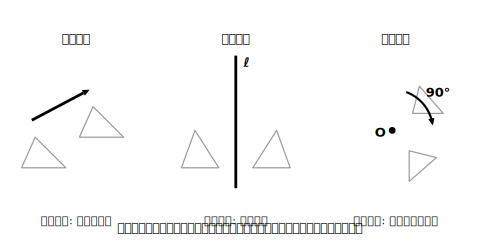

# L03 移動を言葉で決める〜決定要素と説明の型

## ねらい

- それぞれの移動が「何を決めれば1通りに決まるか」（**決定要素**）を言えるようになる。
- 「この図形はどう移動したか」を、決定要素をもらさず**言葉で説明**できるようになる。

## 導入：「回転移動です」だけでは足りない

前のレッスンで、移動の種類を見分けられるようになった。では次の説明はどうだろう。

> 「△DEFは、△ABCを回転移動した図形です。」

種類は合っている。でも、この説明を読んだ人が△ABCから△DEFを**再現できるか**を考えてみよう。どの点を中心に？ どちら向きに？ 何度？ ——何ひとつわからない。移動の説明は、**読んだ人がそのとおりに動かせて初めて完成**だ。

## 主概念1：移動の決定要素

各移動が1通りに決まるために必要な情報を、**決定要素**と呼ぶことにしよう。

| 移動 | 決定要素 | 例 |
|---|---|---|
| 平行移動 | **方向**と**距離** | 「矢印PQの方向に、線分PQの長さだけ」 |
| 対称移動 | **対称の軸の位置** | 「直線ℓを軸として」 |
| 回転移動 | **中心の位置**・**回転角の大きさ**・**回転の向き** | 「点Oを中心に、時計回りに90°」 |

平行移動は2つ、対称移動は1つ、回転移動は**3つ**。回転移動だけ決定要素が多い。だから説明の抜けもれも、回転移動でいちばん起こりやすい。**中心・角・向き——三つそろって一人前**、と覚えよう。

なお、回転移動のうち**回転角が180°**のものは、特別に**点対称移動**ということがある。180°回転では時計回りでも反時計回りでも結果が同じ位置になるから、このときだけ「向き」を言わなくても図形の行き先が決まる。ただし、点対称移動は「第4の移動」ではない。**移動は3種類**で、点対称移動は回転移動の特別な場合だ。L01で学んだ「点対称な図形」は、自分自身への点対称移動でぴったり重なる図形、と言い直せる。

<!-- figure-spec: 意図=3つの移動の決定要素の対比表を図解化（各移動のミニ図で「何を指定しているか」を強調）。要素=上の表の3行に対応する3枚のミニ図。平行移動=方向と距離を表す矢印だけを強調、対称移動=軸だけを強調、回転移動=中心の点・回転の弧矢印（向き）・角度ラベルの3要素を強調（白黒両立のため色でなく濃淡・太さで強調）。alt=平行移動・対称移動・回転移動それぞれの決定要素を強調した対比図。描かないもの=決定要素以外の補助線。生成方法=パラメトリックSVG（回転移動の例は「点O・時計回りに90°」。回転向き・角度をassert検証）。 -->

## 主概念2：説明の型と自己点検チェックリスト

移動の説明は、次の型で書こう。

> **「（図形）を、（決定要素をすべて）、（移動の種類）した図形」**
>
> 例: 「△DEFは、△ABCを、**点Oを中心に、反時計回りに120°**、回転移動した図形である。」

書いたら、自分でこのチェックリストを当てよう。

**決定要素チェックリスト**
- □ 平行移動 → **方向**と**距離**を言ったか
- □ 対称移動 → **対称の軸の位置**を言ったか
- □ 回転移動 → **中心の位置**・**回転角の大きさ**・**回転の向き**の3点を言ったか

もう1つ、隠れた事故ポイントがある。回転角を読むときは、**対応する点どうし**（AとD）と中心を結んだ角∠AODを測ること。対応していない点の組で角を読むと、種類も中心も合っているのに角度だけ違う、という説明ができあがってしまう。説明を書く前に、L02でやったとおり**対応を書き出す**。この一手間が効く。

:::guide
**「通じる説明」の練習相手にAIを使う**

説明が通じるかどうかは、読んだ人が再現できるかで決まる。1人で学んでいても、この「読んだ人」役はAIチャットに頼める。たとえばこう送ってみよう。

> 「方眼紙に三角形ABCがあります。私の説明だけを頼りに、移動後の三角形の位置を言葉で答えてください。あいまいで再現できない場合は、何が足りないか指摘してください。説明:『△ABCを、点Oを中心に90°回転移動する』」

この例文なら「回転の向きが書かれていないので位置が2通りありえます」といった指摘が返ってくるはずだ。**足りない要素を指摘させる**使い方がコツで、答えを作ってもらう使い方ではないことに注意しよう。
:::

:::guide
**なぜ「言葉で決めきる」ことにこだわるのか**

図をかいて動かすだけなら、感覚でもできる。しかし「どんな移動か」を過不足なく言葉にする練習は、この先ずっと効いてくる。中2では図形の性質を**根拠を挙げて説明する**学習（証明）が始まる。そこで求められる「読んだ人が確かめられる説明」の最初の練習台が、この移動の説明だ。決定要素チェックリストは、その第一歩の補助輪だと思ってほしい。
:::

:::zatsudan
「まわして重なる」といえば、L02の雑談で出てきた伝統文様「麻の葉」を思い出そう。頂角120°の合同な二等辺三角形の敷き詰めだったね。120°という角度は360°のちょうど3分の1。実物の麻の葉模様を見かけたら、どの点のまわりに何度回すと模様が模様自身に重なりそうか、探してみてほしい。見つけた回し方は、決定要素のことばで言えば「その点を中心に、○°の回転移動」。文様の美しさが、移動のことばできっちり説明できるわけだ。
:::

## 練習

1. 方眼紙に△ABCと、それを移動した△DEFの図がある（本問は自分で設定を作る再現練習）。まず自分で「右に4マス・下に3マス」の平行移動の図をかき、それを見ていない人に伝えるつもりで、説明の型に当てはめて1文で書こう。書いたらチェックリストで自己点検すること。
2. 次の説明の**足りない決定要素**をすべて指摘し、足りない要素を自分で決めて説明を完成させよう（(1)は練習1でかいた図がそのまま使える。(2)(3)は練習1の図とは別の話として読み、中心Oや対称の軸の位置は自分で設定してよい——決定要素のそろった文になっていれば正解だ）。
   (1) 「△DEFは、△ABCを平行移動した図形である。」
   (2) 「△DEFは、△ABCを、点Oを中心に回転移動した図形である。」
   (3) 「△DEFは、△ABCを対称移動した図形である。」
3. 「点対称移動は4種類目の移動である」。このまちがいを、「移動は3種類」の立場から1〜2文で直そう。
4. 方眼紙に△ABCをかき、点Oを△ABCの外にとって、△ABCを点Oを中心に180°回転移動（点対称移動）した△DEFをかこう。このとき「回転の向き」を言わなくても図形の行き先が1通りに決まる理由を、自分の図で確かめて1文で書こう。

:::stretch
**S1** 同じ△ABCと△DEFの組でも、移動の説明が2通り以上書けることがある。方眼紙に、△ABCと、それを点Oを中心に時計回りに90°回転移動した△DEFをかこう。このとき「反時計回りに270°」という説明でも△DEFに重なることを図で確かめ、「時計回りに90°」と「反時計回りに270°」がどちらも正しい説明になる理由を1〜2文で書いてみよう。回転角と向きの組は、1回転（360°）を挟んでペアになっている。決定要素チェックリストが「答えは1通り」ではなく「もれなく言えたか」の点検であることが見えてくるはずだ。
:::

---

対応解答: answer_key_L01-04.md

<!-- gen_nav:nav:start（自動生成・手編集しない） -->

---

[← 前のレッスン](lesson_02.md)｜[単元の目次](README.md)｜[解答](answer_key_L01-04.md)｜[次のレッスン →](lesson_04.md)

<!-- gen_nav:nav:end -->
