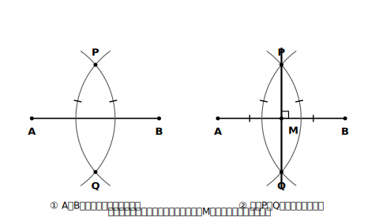
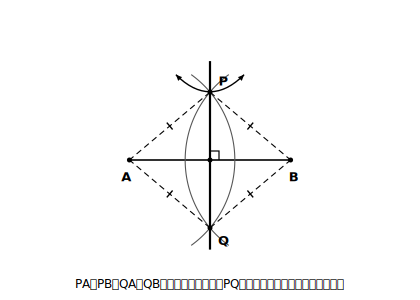

# L04 定規とコンパスの約束〜垂直二等分線

## ねらい

- **作図**とは何か（定規とコンパスだけを使う、という約束）を理解する。
- **線分の垂直二等分線**を作図でき、「なぜその手順でよいか」を対称性と等距離のことばで説明できるようになる。

## 主概念1：作図の道具規約（定規は長さを測らない）

小学校では、物差しで長さを測り、分度器で角度を測って図をかいてきた。中学の**作図**では、道具と使い方を思い切りしぼる。

> 【ことば】
> **作図**とは、**定規とコンパスだけを用いて**、条件に合う図形をかくこと。
> - **定規** … **2点を通る直線をひく**道具として使う（長さを**測らない**）
> - **コンパス** … **円をかく**道具、**長さを写し取る**道具として使う

「定規で測ってはいけないの？」と思うだろう。そう約束するのには理由がある。測った値には必ず読み取りの誤差があり、「だいたい5cm」しか言えない。ところが定規とコンパスの操作だけで図がかけたなら、その図が条件に合うことは、測定ではなく**図形の性質を根拠に**説明できる。作図は「きれいな図をかく技術」ではなく、**測定に頼らずに図形を論理的にかき表す方法**なんだ。

この約束のもとでは、フリーハンドで「だいたいこの辺」と点を打つのも作図ではない。**道具でしてよい操作**は「2点を通る直線をひく」「中心と半径を決めて円（円の一部）をかく」——定規とコンパスの仕事はこの2つだけだ。

:::guide
**「1つの円の一部」もコンパスの1操作**

作図の途中では、円をまるごと1周かかずに、必要なところだけ短い弧をかくことが多い。これは「円の一部をかいた」だけで、操作としては円をかくことと同じ扱いだ。ただし、**中心と半径が決まっていること**が大前提。中心をどこにとったか、半径をどの長さに取ったかを言えないコンパスの線は、根拠の説明ができなくなる。かいた弧には「どこ中心・どの半径か」を自分で言えるようにしておこう。
:::

## 主概念2：線分の垂直二等分線

最初の作図の題材はこれだ。

> 【ことば】
> **線分の垂直二等分線** … 線分の**中点**（まん中の点）を通り、その線分に**垂直**な直線。

作図の手順を先に示す。線分ABの垂直二等分線は、次の2手でかける。

1. A・Bをそれぞれ中心として、**等しい半径**（ABの半分より長くとる）の円をかく。2つの円は2点P・Qで交わる。
2. 直線PQをひく。この直線が、線分ABの垂直二等分線になっている。

<!-- figure-spec: 意図=垂直二等分線の作図手順図（2ステップを左右に並べる）。要素=左=手順①（A中心・B中心の同半径の弧が上下2点P・Qで交わる。半径が等しいことを弧上の印で示す）、右=手順②（直線PQをひき、ABとの交点Mに中点の印と直角マーク）。alt=線分ABの両端から等しい半径の弧をかき、2つの交点を通る直線をひく作図手順。描かないもの=長さの数値・分度器。生成方法=パラメトリックSVG（共通の半径はABの半分より大きくとる条件・交点P・Qの厳密計算・PA=PB=QA=QBの等距離性・PQ⊥AB・中点をassert検証）。 -->

さて、ここからが本番だ。**なぜこの2手で「中点を通る」「垂直」の両方が実現できるのだろう？**

手がかりは2つある。

**手がかり1（等距離）**: PはA中心の円とB中心の円の両方の上にあり、2つの円の半径は等しい。だから **PA＝PB**。同じ理由で **QA＝QB**。つまりPもQも、**2点A・Bから等しい距離にある点**だ。

実は、垂直二等分線は次のように見ることができる。

> 【ことば】
> 線分ABの垂直二等分線は、**2点A・Bから等しい距離にある点の集まり**である。

中点はもちろんA・Bから等距離。中点以外でも、垂直二等分線上の点はどこもA・Bから等距離になっている（対称の軸で折るとAとBが重なることから納得できる）。逆に、A・Bから等距離の点は必ずこの直線上にのる。だから「A・Bから等距離の点を2つ見つけて結ぶ」＝「垂直二等分線をひく」になる。手順1が2つの等距離の点P・Qを作り、手順2がそれを結んでいたわけだ。

**手がかり2（対称性）**: 図全体を直線PQで折ってみると、A中心の円とB中心の円は半径が等しいから、ぴったり重なる。つまりこの図は**直線PQを対称の軸とする線対称な図形**で、折るとAとBが重なる。AとBが重なるように折れる折り目こそ、ABのまん中を垂直に横切る線——垂直二等分線だ。

<!-- figure-spec: 意図=作図の根拠図（2円の線対称と等距離を1枚で見せる・この単元の統合の伏線）。要素=完成図に、PA・PB（等しい印）・QA・QB（等しい印）の4線分を破線で追加し、直線PQを対称の軸として図全体が線対称であることを折り返し矢印で示す。alt=垂直二等分線の作図の完成図に、2点からの等距離と、2円の線対称を示す印を重ねた図。描かないもの=数値・本文にない補助点。生成方法=パラメトリックSVG（L04図1と同じ設定。等距離と「PQで折るとAとBが重なる」線対称をassert検証）。 -->

## 【根拠】一言ルール（今日から全作図で）

ここから先、作図や説明の課題では、「なぜそうなるか」を**【根拠: …】**の形で一言そえることにしよう。根拠に使ってよいのは、**定義**（ことば枠で決めたこと）と、**すでに確かめたこと**だけ。「そう見えるから」「測ったらそうだったから」は根拠にしない。たとえば今日の作図なら、次のように書ける。

> P・QはどちらもA・Bから等距離【根拠: 等しい半径の円の上の点だから】。よって直線PQは線分ABの垂直二等分線【根拠: 垂直二等分線は2点から等距離の点の集まり】。

形式ばった証明はまだ先の話。いまは**根拠を口に出す習慣**だけを身につけよう。

:::guide
**紙折りで手ごたえを持つ（1人でできる確かめ）**

紙に線分ABをかいて、**AとBがぴったり重なるように**折ってみよう。付いた折り目がABと交わる点をものさし（ここでは確かめ用なので使ってよい）で測ると、ちゃんとまん中。折り目とABの角も直角になっている。作図した垂直二等分線とこの折り目が一致することを重ねて確かめると、「垂直二等分線＝AとBを重ねる折り目＝対称の軸」という3つの顔が1本の線に集まっていることが実感できるはずだ。確かめの測定はOK、**作図の途中の測定はしない**。この区別も道具規約のうちだ。
:::

:::zatsudan
「定規で長さを測ってはいけない」なんて、ずいぶん不便な約束に見えるよね。でも、この約束のおかげで「かけた図形が条件に合うことは、測定に頼らずに図形の性質で説明できる」と言い切れるようになる。道具を減らすほど、かけた図の価値が上がる——ちょっと逆説的で面白い約束だと思わないかな。
:::

## 練習

作図課題は「**(1)かく → (2)確かめる → (3)理由を言う**」の3段で取り組もう。

1. 線分AB（長さは自由）をかき、その垂直二等分線を作図しよう。
   (1) 上の手順でかく。
   (2) コンパスでPA・PBの長さを写し取って等しいことを確かめる。さらに紙を折って、折り目と一致することも確かめる。
   (3) 直線PQが垂直二等分線といえる理由を、【根拠: …】を付けて2文以内で書く。
2. 手順1で、A中心の円とB中心の円の**半径が等しくない**とき（ただし、2つの円が2点P・Qで交わる大きさは保つこと）、直線PQは垂直二等分線になるだろうか。実際にかいてみて、ならない理由を「等距離」のことばで説明しよう。
3. 3点A・B・Cが三角形をつくる位置にある。**2点A・Bから等しい距離にあり、さらに2点B・Cからも等しい距離にある点**を作図で見つけよう（ヒント: 条件を1つずつ、点の集まりとして図にする）。
4. 円の形の紙がある（中心の印はない）。折る操作を2回使って中心を見つける方法を考え、その方法でよい理由を1文で書こう（ヒント: 円を半分に折った折り目はどんな線になっているだろう）。

:::stretch
**S1** 練習3の点は、A・B・Cの**3点すべてから等しい距離**にある。この点を中心に、Aを通る円をかいてみよう。B・Cも同じ円の上にのるはずだ。のる理由を【根拠: …】付きで説明しよう。1つの三角形に対してこの点が1つ見つかる。この先の学年で名前付きで再会する図だ（名前を先に知りたい人は「三角形 3つの頂点を通る円」で調べてみよう）。
:::

---

対応解答: answer_key_L01-04.md

<!-- gen_nav:nav:start（自動生成・手編集しない） -->

---

[← 前のレッスン](lesson_03.md)｜[単元の目次](README.md)｜[解答](answer_key_L01-04.md)｜[次のレッスン →](lesson_05.md)

<!-- gen_nav:nav:end -->
