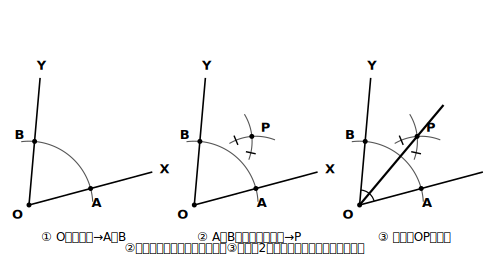
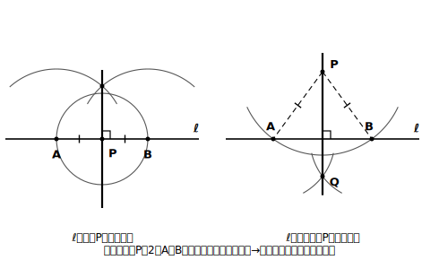

# L05 角の二等分線と垂線

## ねらい

- **角の二等分線**と**垂線**（直線上の点を通る場合・直線外の点を通る場合）を作図できるようになる。
- それぞれの手順が「なぜそれでよいか」を、対称性と等距離のことばで説明できるようになる。
- 折り目・見た目が似ている線（角の二等分線・垂直二等分線・垂線）を**取り違えずに**判別できるようになる。

## 主概念1：角の二等分線

> 【ことば】
> **角の二等分線** … 1つの角を2つの等しい角に分ける半直線。

∠XOYの二等分線は、次の3手でかける。

1. Oを中心に適当な半径の円をかき、半直線OX・OYとの交点をそれぞれA・Bとする。
2. A・Bをそれぞれ中心として、**等しい半径**（ABの半分より長くとる——短いと2つの円が交わらない）の円をかき、角の内側の交点をPとする。
3. 半直線OPをひく。これが∠XOYの二等分線だ。

<!-- figure-spec: 意図=角の二等分線の作図手順図（3ステップ）。要素=3コマ。コマ①=O中心の弧とOX・OY上の交点A・B、コマ②=A中心・B中心の等半径の弧と交点P、コマ③=半直線OPと、2つに分かれた角の等しい印。alt=角の頂点から弧をかいて2点をとり、その2点から等しい弧をかいて交点と頂点を結ぶ作図手順。描かないもの=分度器・角度の数値。生成方法=パラメトリックSVG（∠XOY=70°〔直角・60°に見えない角〕・手順②の半径はABの半分より長い条件・交点Pの厳密計算・OA=OB・PA=PBの等距離性と∠XOP=∠POYの等角性をassert検証）。 -->

なぜこれでよいのだろう。作図をはじめる前に、見通しを1つ。半直線は**2点が決まればひける**。1点目は頂点Oで決まりだ（角を分ける線は必ずOを通る）。だから、**二等分線が通るはずのもう1点**を見つければ勝ち、というのが作図の作戦だ。

手順1と2は、その「もう1点」Pを作っている。根拠を言葉にしよう。

- OA＝OB【根拠: 同じ円の半径】
- PA＝PB【根拠: 等しい半径の円の上の点】
- OA＝OB・PA＝PBだから、OもPも**線分ABの垂直二等分線の上**にある【根拠: 垂直二等分線は2点から等距離の点の集まり（L04）】。つまり直線OPはABの垂直二等分線で、この図は直線OPで折るとAとBが重なる線対称な図形になっている。角の二等分線は、**その角の対称の軸**——2辺OX・OYが重なるように折ったときの折り目だ。だから半直線OPは∠XOYを2等分する。

紙を折って確かめられる。∠XOYをかいた紙を、**辺OXと辺OYがぴったり重なるように**折ってみよう。折り目がちょうどOPに重なるはずだ。

:::guide
**「作図に使わなかった点」を見る目**

手順2でとる点Pは、角の内側なら2つの弧の交点として1つに決まる。ところで、もし誰かの作図に、手順に関係のない点がぽつんと打ってあったら？ 図として結果が正しく見えても、**その点がどの円と どの直線から生まれたのか説明できない**なら、作図の説明としては欠陥になる。「たくさん点をとった方が正確そう」と感じるかもしれないが、作図の正しさは点の数ではなく、**すべての点に根拠があるか**で決まる。自分の作図を見直すとき、「この点はどこから来たか」を全部言えるか点検してみよう。
:::

## 主概念2：垂線（2つの場合）

> 【ことば】
> **垂線（すいせん）** … ある直線に垂直な直線。

「直線ℓに垂線をひく」には2つの場面がある。**ℓ上の点P**を通る場合と、**ℓ上にない点P**を通る場合だ。どちらも、もう習った作図に帰着できる。

**場合1: ℓ上の点Pを通る垂線**

1. Pを中心に円をかき、ℓとの交点をA・Bとする。
2. 線分ABの垂直二等分線を作図する（L04の手順そのまま）。この直線はPを通り、ℓに垂直だ。

理由も一気に言える。PA＝PB【根拠: 同じ円の半径】だから、**PはA・Bから等距離の点**。よってPはABの垂直二等分線の上にある【根拠: 垂直二等分線は2点から等距離の点の集まり】。ABの垂直二等分線はℓ（＝直線AB）に垂直だから、これがPを通る垂線そのものだ。

**場合2: ℓ上にない点Pを通る垂線**

1. Pを中心に、ℓと2点で交わる大きさの円をかき、交点をA・Bとする。
2. 線分ABの垂直二等分線を作図する。この直線はPを通り、ℓに垂直だ。

こちらもPA＝PB【根拠: 同じ円の半径】なので、PはABの垂直二等分線上にある。つまり**どちらの場合も「Pを、2点A・Bから等距離の点にしてしまう」のが作戦**で、あとは垂直二等分線の作図が仕事をしてくれる。

<!-- figure-spec: 意図=垂線の2つの場合を左右対比で示す作図手順図。要素=左=ℓ上の点Pの場合（P中心の弧→A・B→ABの垂直二等分線）、右=ℓ外の点Pの場合（P中心の弧がℓと2点で交わる→A・B→ABの垂直二等分線）。どちらも「PA＝PB」の等しい印を明示し、垂直二等分線部分はL04の図と同じ描き方で統一。alt=直線上の点を通る垂線と、直線外の点を通る垂線の作図。どちらも2点から等距離を作って垂直二等分線に帰着する。描かないもの=「垂線の足」等の慣用語ラベル・数値。生成方法=パラメトリックSVG（場合2の円がℓと2点で交わる条件〔半径>Pとℓの距離〕・交点の厳密計算・PA=PBの等距離性・結果の直線⊥ℓをassert検証）。 -->

:::guide
**3つの作図は「使い回し」でつながっている**

今日の垂線の作図は、2つとも垂直二等分線の作図の使い回しだった。新しい手順を丸暗記したのではなく、「等距離の点を用意して、あとは知っている作図に任せる」という**帰着**の考え方を使った。数学では、新しい問題を知っている問題に作り替える発想がくり返し登場する。次のレッスンでは、角の二等分線・垂直二等分線・垂線の3つが、実は根っこで同じ1つの図だったことを見る。楽しみにしていてほしい。
:::

:::zatsudan
コンパスの弧を数回かくだけで、ぴったりの直角が手に入る——分度器の90°の目盛りに頼らずに、だ。「長さを測らない定規」と「円しかかけないコンパス」という不自由な道具の組み合わせのわりに、この2つは意外なほど多くの仕事をこなす。作図に慣れてきたら、「この図は定規とコンパスだけでかけるかな？」と自分で問題を作ってみるのも面白いよ。
:::

:::guide
**慣用のことばについて**

垂線が直線と交わる点のことを「垂線の足」と呼ぶ言い方を、参考書などで見かけることがある。これは慣用的な言い方で、学習指導要領やその解説には登場しないことばだ。この教材では「垂線と直線ℓとの交点」のように、定義したことばだけで言い表すことにする。見かけたときに驚かないための紹介にとどめよう。
:::

## 練習

作図課題は「(1)かく → (2)確かめる → (3)理由を言う」の3段で。

1. 適当な大きさの∠XOY（直角や60°に見えない角がよい）をかき、その二等分線を作図しよう。(2)の確かめは紙折り（OXとOYを重ねる）で、(3)は【根拠: …】付きで2文以内。
2. 直線ℓと、ℓ上の点P・ℓ上にない点Qをかき、Pを通るℓの垂線と、Qを通るℓの垂線をそれぞれ作図しよう。(3)では、2つの作図に共通する作戦（何をしてから垂直二等分線に任せたか）を1文で書くこと。
3. **折り目判別**: 紙に△ABCをかいて、次の2通りの折り方をする。折り目がそれぞれ「何の線」になっているかを、ことばの定義に照らして答えよう。
   (1) 辺ABと辺ACがぴったり重なるように折ったときの折り目
   (2) 頂点Bと頂点Cがぴったり重なるように折ったときの折り目
4. 次の説明のまちがいを見つけて直そう。
   「(1)の折り目は、頂点Aを通って辺BCと交わる線だから、辺BCの垂直二等分線である。」

:::stretch
**S1** ∠XOYの二等分線上の点Pから、辺OX・OYへそれぞれ垂線を作図してみよう（今日の場合2の作図を2回使う）。Pから2辺までの距離（垂線の長さ）をコンパスで写し取って比べると、等しくなっているはずだ。「角の二等分線は、**角の内部で**、角の2辺から等しい距離にある点の集まり」。角の外側にも2辺から等距離になる点はあるので、「角の内部で」という条件までがセットだ。垂直二等分線の「2点から等距離」と対になる見方だ。紙折り（OXとOYを重ねる折り）でこの2本の垂線が重なることも確かめてみよう。
:::

---

対応解答: answer_key_L05-08.md

<!-- gen_nav:nav:start（自動生成・手編集しない） -->

---

[← 前のレッスン](lesson_04.md)｜[単元の目次](README.md)｜[解答](answer_key_L05-08.md)｜[次のレッスン →](lesson_06.md)

<!-- gen_nav:nav:end -->
