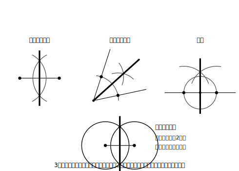

# L06 3つの作図はひとつだった〜統合と活用

## ねらい

- 角の二等分線・垂直二等分線・垂線の3つの作図が、**同じ1つの仕組み**（2つの円がつくる線対称）で動いていることを見抜く。
- 基本の作図を組み合わせて、指定した大きさの角の作図や「条件を満たす点」を見つける問題に**活用**できるようになる。

## 主概念1：統合（どの作図も「2つの円の線対称」だった）

L04・L05でかいた3つの作図の完成図を、並べてながめ直してみよう。

<!-- figure-spec: 意図=3作図（垂直二等分線・角の二等分線・垂線）の完成図を横に並べ、共通の骨組み「等しい半径の2円＋交点を通る対称の軸」をハイライトする統合図（この単元の山場）。要素=3枚とも「2つの円の中心」を同じ太い点、「等しい半径の2円（弧）」を同じグレーの線、「2円の交点を通る直線」を同じ太線で統一（白黒両立のため色でなく濃淡・太さで統一）。下段に骨組みだけを抜き出した抽象図（円2つ・中心を結ぶ線分・交点を通る対称の軸）を1枚置く。alt=3つの基本作図の完成図と、共通する骨組み（等しい半径の2円と、その交点を通る対称の軸）。描かないもの=3作図の手順番号（完成形の比較に集中するため）。生成方法=パラメトリックSVG（3作図とも交点を厳密計算し、軸で折ると2円の中心が入れかわる線対称と等角性をassert検証）。 -->

3つの図には、必ず**等しい半径の2つの円**（またはその一部）と、**2円の交点を通る直線**が現れている。そしてどの図も、その直線を折り目にすると**2つの円がぴったり重なる線対称な図形**だ。

- 垂直二等分線: A中心・B中心の等しい円。対称の軸で折るとAとBが重なる。
- 角の二等分線: A中心・B中心の等しい円（A・BはOから等距離にとった2点）。折ると2辺OX・OYが重なる。
- 垂線: A中心・B中心の等しい円（A・Bは、Pを中心とした円で直線ℓ上に作った2点）。折るとAとBが重なり、ℓが自分自身に重なる。

つまり3つの作図は、「**等しい半径の2円を組にした図形は、2円の交点を結ぶ直線を折り目にすると、2つの円が入れかわってぴったり重なる線対称な図形——だから2円の交点を結ぶ直線は対称の軸になる**」という1つの仕組みの3通りの使い方だったわけだ。折り目で2つの中心が入れかわるのは、交点がどちらの中心からも等距離（等しい半径）にあるからだ【根拠: 2点から等距離の点はその2点を結ぶ線分の垂直二等分線上にある（L04）】。別々に覚えた3つの手順が、1つの原理にまとまる。この「統合してとらえ直す」瞬間が、この単元でいちばん気持ちのよいところだと思う。どうだろう？

対比もしておこう。似た顔の線を混同しないために、次の表を自分のノートに写しておくとよい。

| 線 | 定義 | 点の集まりとしての見方 | 紙折りなら |
|---|---|---|---|
| 線分ABの垂直二等分線 | ABの中点を通りABに垂直な直線 | 2**点**A・Bから等距離の点の集まり | 点Aと点Bが重なる折り目 |
| ∠XOYの二等分線 | 角を2等分する半直線 | **角の内部で**、角の2**辺**から等距離の点の集まり（L05 stretch） | 辺OXと辺OYが重なる折り目 |
| 点Pを通るℓの垂線 | ℓに垂直でPを通る直線 | （特定の点の集まりではなく、Pという1点を通る条件で決まる） | ℓが自分自身に重なり、折り目がPを通る折り |

## 主概念2：活用（基本作図を組み合わせる）

**活用1: 指定した大きさの角をつくる**

分度器なしで**60°がかける**。線分OAをかき、O中心・半径OAの円とA中心・半径OAの円の交点をBとすれば、△OABは3辺がすべて等しい正三角形になり【根拠: すべて等しい半径】、∠AOBは60°【根拠: 正三角形の角はすべて60°（小学校で確かめた性質）】。

60°がかければ、二等分して**30°**。垂線で**90°**、二等分して**45°**。さらに組み合わせれば、たとえば75°は、どう作ればよいだろう？ 75＝60＋15、75＝45＋30、75＝90−15。どの分解でも作れる。答えは1通りではない。

**活用2: 条件を満たす点を見つける**

「2点A・Bから等しい距離にある点」は、1個ではなく**直線1本ぶん**（垂直二等分線）ある。このように、条件に合う点の集まりが線になる、という見方を使うと、複数の条件を満たす点は**線と線の交点**として見つけられる。L04練習3（A・Bから等距離かつB・Cから等距離の点）がまさにこの型だった。

**活用3: 移動の作図（移動と作図の往還）**

L02では方眼を頼りに移動後の図形をかいた。作図を覚えたいまなら、方眼なしでかける。たとえば「△ABCを直線ℓで対称移動した△DEFをかく」は、各頂点からℓへ**垂線**を作図し、ℓの反対側へ**コンパスで同じ距離を写し取る**。これを3頂点分やればよい【根拠: 対称移動では、対応する点を結ぶ線分が対称の軸と垂直に交わり、交点で2等分される（L02）】。移動の性質が、そのまま作図の手順書になっている。

:::guide
**「作図できた」の先にある問い**

活用問題では、かけたかどうかに加えて「**なぜその組み合わせで目的の図になるのか**」を言えるかが勝負どころだ。75°の作図なら、「どの作図で何度を作り、どう足した(引いた)か」を【根拠】付きで書けたら合格。手が動くこと（技能）と、理由が言えること（思考・表現）は別の力で、この教材では練習でも(1)(2)と(3)を分けて出題している。両方そろえていこう。
:::

:::guide
**説明が通じるかをAIで検証する**

活用作図は手順が長くなるので、説明の抜けが起きやすい。L03と同じように、AIチャットを「再現できるか読む人」役にしよう。プロンプト例:

> 「定規とコンパスの作図の説明として読んでください。この手順どおりに作図して75°の角ができるか、手順に抜けやあいまいさがあれば指摘してください。手順: （自分の書いた手順をここに貼る）」

指摘されたあいまいさを直す作業そのものが、説明の力の練習になる。
:::

:::zatsudan
円を1回も「円のため」に使っていないのに気づいただろうか。今日の統合図で、円はぜんぶ「等しい長さを配るための道具」として働いている。コンパスは円をかく道具というより、**同じ長さを何度でも正確に写す道具**——そう見えてきたら、作図の目はかなり育っている。次のレッスンからは、円そのものが主役になるよ。
:::

## 練習

1. 分度器を使わずに、次の大きさの角を作図しよう（(1)かく→(2)分度器で確かめる（確かめは測定OK）→(3)理由を言う、の3段で）。
   (1) 30°　(2) 45°　(3) 75°（どの分解で作ったかを【根拠】に書くこと）
2. 直線ℓと、ℓ上にない2点A・Bがある（線分ABが直線ℓと垂直にならないようにかく）。**ℓ上にあって**、2点A・Bから等しい距離にある点Pを作図で見つけよう。見つけたら、なぜその点でよいかを「点の集まり」のことばで1文で書こう。
3. △ABCと直線ℓ（△ABCと交わらない）をかき、△ABCをℓで対称移動した△DEFを作図しよう。確かめはトレーシングペーパー（または紙の裏写し）で。
4. 対比表を見ずに、「頂点Bと頂点Cが重なる折り目」と「辺BAと辺BCが重なる折り目」がそれぞれ何の線か答えよう（L05練習3の再演。今度は即答できるだろうか？）。

:::stretch
**S1** 15°の角を作図してみよう。作り方は1通りではない。2通り以上の作り方を考えて、それぞれの手順を【根拠】付きで書き、どちらが手数（正三角形・二等分などの基本の作図を何回使うか）が少ないか数えて比べてみよう。「同じ図形への別ルート」を比べる目は、作図を1段深く楽しむ目だ。
:::

---

対応解答: answer_key_L05-08.md

<!-- gen_nav:nav:start（自動生成・手編集しない） -->

---

[← 前のレッスン](lesson_05.md)｜[単元の目次](README.md)｜[解答](answer_key_L05-08.md)｜[次のレッスン →](lesson_07.md)

<!-- gen_nav:nav:end -->
