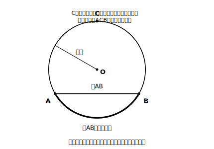
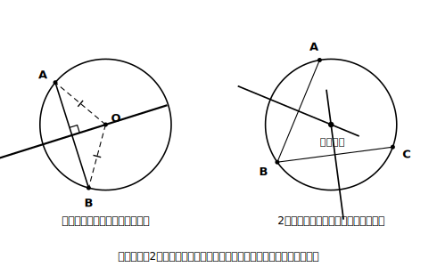

# L07 円のことば〜弧と弦、円の対称性

## ねらい

- 円を「点の集まり」として定義し直し、**弧（こ）**・**弦（げん）**のことばを使えるようになる。
- 円の対称性をとらえ、「弦の垂直二等分線は中心を通る」ことを根拠付きで導けるようになる。

## 主概念1：円を定義し直す

小学校から付き合ってきた円を、この章で学んだ「点の集まり」のことばで定義し直そう。

> 【ことば】
> **円** … 平面上で、**1つの点（中心）から等しい距離にある点の集まり**としてできる曲線。中心Oの円を**円O**と書く。中心と円周上の点を結ぶ線分（とその長さ）が**半径**だ。

コンパスで円がかける理由が、この定義そのものだ。針を刺した点が中心、開いた幅が半径。コンパスは「中心から等距離」という条件を、手の動きで実現する道具だったわけだ。

円周上に2点A・Bをとると、円周はA・Bで2つの部分に分かれる。

> 【ことば】
> - **弧（こ）AB** … 円周のうち、AからBまでの部分。**弧AB**と書く（2つに分かれた部分のどちらを指すかは、図で示すか、間の点を添えて示す）
> - **弦（げん）AB** … 円周上の2点A・Bを結ぶ**線分**

弧は「まがった道」、弦は「まっすぐな近道」とイメージするとよい。なお、弧ABを記号で「AB の上に⌒（つるの形の印）を付けて」書く流儀もある。⌒は慣用的な記号なので、この教材では「弧AB」と文字で書くことにする。

<!-- figure-spec: 意図=弧と弦の定義図。要素=円Oと円周上の2点A・B。弦AB（直線的な線分・ラベル「弦AB」）、2つの弧のうち短い方を太線で「弧AB」ラベル、長い方は通常線＋「こちらも弧（間の点Cを添えて弧ACBのように区別する）」の注記（白黒両立のため色でなく線の太さで区別）。中心Oと半径1本も示す。alt=円周上の2点がつくる弦と2つの弧。描かないもの=⌒記号による表記（本文の方針と合わせて文字表記のみ）。生成方法=パラメトリックSVG（A・B・Cが円周上・Cが長い方の弧の上・弦が直径でないことをassert検証）。 -->

弦の中でいちばん長いものはどれだろう？ **中心を通る弦**、つまり直径だ。中心から離れた弦ほど短くなっていく。この感覚は、次の対称性の話とつながっている。

## 主概念2：円の対称性（弦の垂直二等分線は中心を通る）

円はおどろくほど対称性の高い図形だ。**中心を通る直線（直径を含む直線）は、どれも円の対称の軸**になる。折り目が中心を通りさえすれば、どの向きに折っても円はぴったり重なる。対称の軸が無限にある図形なんて、そうそうない。

この対称性から、作図と直結する性質が1つ導ける。

**性質: 円の弦の垂直二等分線は、その円の中心を通る。**

理由を【根拠】でつなごう。弦ABの両端A・Bは、どちらも円周上の点だから、中心Oから等距離にある【根拠: OA＝OB＝半径】。ところで、2点A・Bから等距離の点は、すべて線分ABの垂直二等分線上にある【根拠: 垂直二等分線は2点から等距離の点の集まり（L04）】。だからOは、弦ABの垂直二等分線の上にある。つまり弦ABの垂直二等分線は、必ず中心Oを通る。

これを逆向きに使うと、実用的な作図が手に入る。**中心のわからない円**（たとえば、お皿のふちを写し取った円）の中心を、作図で復元できるのだ。

1. 円周上に適当に3点A・B・Cをとり、弦ABと弦BCをひく。
2. それぞれの垂直二等分線を作図する。
3. 2本の垂直二等分線の交点が、円の中心だ【根拠: どちらの垂直二等分線も中心を通るから、その交点は中心そのもの】。

<!-- figure-spec: 意図=「弦の垂直二等分線は中心を通る」の性質図と、中心復元の作図を1枚にまとめる。要素=左=円Oと弦AB・その垂直二等分線が中心Oを通るようす（OA・OBに等しい印・弦との交点に直角マーク）。右=中心の印がない円に3点A・B・C、弦AB・BCの垂直二等分線2本の交点として中心が復元されるようす。alt=弦の垂直二等分線が円の中心を通ることと、それを2本使って円の中心を作図で見つける方法。描かないもの=3本目の垂直二等分線（2本で決まることを際立たせる）。生成方法=パラメトリックSVG（垂直二等分線が中心を通ること・2本の交点＝真の中心をassert検証）。 -->

L04の練習4で「円の紙を2回折って中心を見つける」をやった人は、同じことをしていたと気づくだろう。折り目＝弦の垂直二等分線。紙折りが作図に、作図が根拠に、それぞれ言い換えられていく——この往復が、この単元の設計図だ。

:::guide
**「点の集まり」という見方の育ち方**

この単元では「〜から等距離の点の集まり」という見方が3回登場した。垂直二等分線（2点から等距離）・角の二等分線（角の内部で2辺から等距離・L05 stretch）・そして円（1点から等距離）。図形を「条件を満たす点の集まり」と見る目は、高校の数学でさらに大きく育つ見方だ。いまは「円も『集まり』の仲間だったのか」という発見を味わっておけば十分だ。
:::

:::guide
**弧・弦ということばの使いどころ**

弧と弦は、次のレッスン以降で必ず出てくることばだ。とくに「おうぎ形」は**2つの半径と弧で囲まれた図形**として定義されるので、弧のことばがあいまいだと定義ごとあいまいになる。練習1のような「指さし確認」問題を、面倒がらずにやっておこう。ことばの正確さは、後のレッスンの計算の正確さに直結する。
:::

:::zatsudan
同じ2点A・Bから出発しても、まっすぐ結べば弦、円周ぞいにたどれば弧。出発点と行き先が同じなのに、道すじがちがうから別の名前がつく——地図でいう近道と回り道みたいな関係だ。「いま、どっちの道の話をしているのか」を一言で言い分けたくなったとき、それが用語の出番なんだよ。
:::

## 練習

1. 円Oと円周上の3点A・B・C（Cは弧ABの長い方の上）をかき、次のものを図に示そう。
   (1) 弦AB　(2) 弧AB（短い方）　(3) 弦BC　(4) 中心Oと弦ABの距離（ヒント: 点と直線の距離はL01で定義した）
2. 「直径は弦の一種といえるか」を、弦の定義に照らして答え、理由を1文で書こう。
3. 中心の印がない円をかき（コンパスでかいてから中心の印を消す、または丸い物のふちを写す）、作図で中心を復元しよう。復元できたら、コンパスの針をその点に置いて円をなぞれるか確かめよう。
4. 次の説明のまちがいを1か所見つけて直そう。
   「弦ABの垂直二等分線が中心を通るのは、垂直二等分線が円の面積を2等分するからである。」

:::stretch
**S1** 円Oの中で、長さの等しい2本の弦AB・CDをかいてみよう（コンパスで同じ幅を写し取れば正確にかける）。中心Oから2本の弦までの距離をそれぞれ作図（垂線）で示し、コンパスで写し取って比べると、等しくなっているはずだ。「等しい弦は中心から等距離にある」。理由も考えてみよう。ヒント: 円Oを、Oを通る適当な直線で折ると弦どうしを重ねられる配置がある。
:::

---

対応解答: answer_key_L05-08.md

<!-- gen_nav:nav:start（自動生成・手編集しない） -->

---

[← 前のレッスン](lesson_06.md)｜[単元の目次](README.md)｜[解答](answer_key_L05-08.md)｜[次のレッスン →](lesson_08.md)

<!-- gen_nav:nav:end -->
