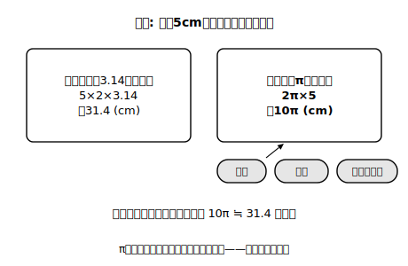

# L08 πで円をはかる

## ねらい

- 円周率を**π（パイ）**という文字で表し、円周と円の面積をπを使った式で表せるようになる。
- 「3.14で計算する」から「πのまま扱う」への流儀の切り替えができるようになる。

## 主概念1：円周率に文字を与える

小学校では、円周率を3.14として計算してきた。でも3.14は円周率の**近似値**（およその値）で、本当の円周率は3.14159…と限りなく続く数だ。どこかで打ち切って計算すれば、答えにはそのぶんのずれが入り込む。

そこで中学からは、円周率を数字で書くのをやめて、文字で書く。

> 【ことば】
> **円周率**を、文字**π（パイ）**で表す。πは3.14159…と続く決まった数を指す、専用の記号だ。

πを使うと、円の計量の式はこう書ける。半径rの円について、

- **円周の長さ ℓ＝2πr**
- **円の面積 S＝πr²**

小学校の「直径×円周率」「半径×半径×円周率」と中身は同じ。直径は半径の2倍だから、円周＝直径×π＝2r×π＝2πr、というわけだ。

文字式の書き方の約束（数→文字の順に書く・×は省く）は、πにも適用される。ただしπは「決まった数」なので、書く位置は**数字のあと、ほかの文字の前**が習わしだ。2πr（2×π×rの意味）、πr²（π×r×rの意味）のように書く。

**「ノートではこう書く」の橋渡し**を1つ。この教材では画面の都合で「πr²」「2πr」と1行で書いているが、ノートに書くときも同じ並びでよい。ただし²（2乗）は、rの右上に小さく書く。また、あとで出てくる「a/360」のような分数は、ノートでは横棒の上下に分けて書こう。1行書きの「/」は画面上の代用表記だ。

## 主概念2：πのまま答える流儀

半径5cmの円の円周を求めてみよう。

ℓ＝2π×5＝**10π (cm)**

「10πって、計算の途中では？」と感じるかもしれない。そうではなくて、これが**完成した答え**だ。πを数値に直さずに残すことで、

1. **正確** … 3.14と打ち切ったときのずれが入らない。10πは円周の長さそのものだ。
2. **速い** … 3.14×5の筆算がいらない。数の計算はπ以外の部分だけで済む。
3. **見通しがよい** … 10πと30πを比べれば「3倍」が一目でわかる。3.14をかけた31.4と94.2では、この関係が見えにくい。

もし「およそ何cmか」を知りたくなったら、そのときはじめて10×3.14＝31.4と概算すればよい。**πのまま進めて、最後に必要なら近似**——これが中学からの流儀だ。

<!-- figure-spec: 意図=「πのまま扱う」流儀の対比図（同じ問題の小学校流・中学流の解答を左右対比）。要素=左右2枚のノート風パネル。右側に「正確・速い・比べやすい」の3つの吹き出し。下部に「およその値が必要なときだけ 10π≒31.4 と直す」の注記。alt=円周の計算を3.14で行う書き方とπのまま書く書き方の対比。描かないもの=πの小数展開の長い桁数。生成方法=パラメトリックSVG（半径5cmの円。左=5×2×3.14＝31.4cm・右=2π×5＝10π cm。計算の一致をassert検証）。 -->

:::guide
**πは「文字」だけれど「変わらない数」**

中1「文字と式」で使ってきたxやaは、いろいろな値をとる文字だった。πも文字だが、役割がちがう。πは**3.14159…というただ1つの決まった値**に付けられた名前だ。だから方程式のように「πを求める」ことはないし、πに好きな値を代入することもない。文字式の計算規則（2π＋3π＝5πなど、同類項の計算)は普通に使える——「値は固定、計算は文字と同じ」と整理しておこう。
:::

:::guide
**なぜこのタイミングでπを導入するのか**

次のレッスンから「おうぎ形」の計量が始まる。おうぎ形の弧の長さや面積は「円全体の何分の何か」で決まるので、円全体の値（2πr・πr²）を土台に、その何分の何、という2段構えの計算になる。もし3.14のままだと、計算のたびに大きな小数のかけ算が発生して、肝心の「何分の何か」に頭を使う余裕がなくなってしまう。πはこの先の学習の**思考の節約装置**でもあるんだ。
:::

:::zatsudan
πのまま答えてよい、と最初に聞いたときの「えっ、それでいいの？」という感覚は、多くの人が通る道だと思う。でも慣れてくると、10πという答えの方が31.4より「円らしさ」が残っていて気持ちよく感じられてくる。πが付いた数を見たら「ああ、どこかに円がいるな」とわかる。πは円の署名みたいなものだよ。
:::

## 練習

答えはすべて**πのまま**表そう（「およそ」を求める指示があるときだけ3.14で概算）。

1. 次の円の円周の長さと面積を求めよう。
   (1) 半径3cmの円　(2) 半径8cmの円　(3) 直径10cmの円（半径に直してから）
2. 円周の長さが14πcmの円がある。この円の半径と面積を求めよう。
3. 半径6cmの円を、中心を通る直線で切ってできる半円について、まわりの長さ（曲線部分と直線部分の合計）を求めよう（ヒント: 直線部分は直径だ。忘れやすい！）。
4. 面積が49πcm²の円の半径を求めよう。また、この円の円周の長さも求めよう。

:::stretch
**S1** 半径rの円と、半径2rの円を比べよう。円周は何倍になるだろうか。面積は何倍だろうか。式で確かめたうえで、「半径を2倍にすると円周は2倍なのに、面積は2倍にならない」ことを、図のイメージ（長さは1方向・面積は2方向に広がる）で自分なりに説明してみよう。半径3倍・半径10倍ならどうなるかも考えると、規則が見えてくる。
:::

---

対応解答: answer_key_L05-08.md

<!-- gen_nav:nav:start（自動生成・手編集しない） -->

---

[← 前のレッスン](lesson_07.md)｜[単元の目次](README.md)｜[解答](answer_key_L05-08.md)｜[次のレッスン →](lesson_09.md)

<!-- gen_nav:nav:end -->
