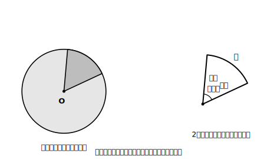
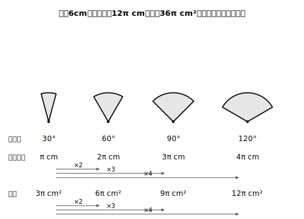

# L09 おうぎ形〜中心角に比例する

## ねらい

- **おうぎ形**と**中心角**の定義を知る。
- 中心角を変えると弧の長さ・面積がどう変わるかを**自分の手で表にして**確かめ、**どちらも中心角に比例する**ことをつかむ。

## 主概念1：おうぎ形とは何か

円をピザのように切り分けたときの1切れ。あの形に、きちんとした定義を与えよう。

> 【ことば】
> - **おうぎ形** … 円の**2つの半径**と**弧**で囲まれた図形
> - **中心角** … おうぎ形で、2つの半径がつくる角

1つだけ約束を足しておく。2本の半径がつくる角には、弧をはさむ側とはさまない側の2つがある。中心角は、**おうぎ形が囲んでいる弧の側**で測った角のことだ。だから、弧が円周の半分より長いおうぎ形では、中心角は180°より大きくなる（この単元の最後には、中心角270°のおうぎ形も登場する）。

<!-- figure-spec: 意図=おうぎ形の定義図（円からの切り出しとして見せる）。要素=左=円O全体（うすい色）の中に、2つの半径と弧で囲まれた部分だけ濃い色。右=切り出したおうぎ形単体に「半径」「半径」「弧」「中心角」の4ラベル。alt=円の2つの半径と弧で囲まれたおうぎ形と、その中心角。描かないもの=弦AB（おうぎ形の境界と混同させないため）・中心角の数値。生成方法=パラメトリックSVG（中心角60°の例。角度はコードでassert検証し図中には数値を載せない）。 -->

紙とはさみで確かめてみよう。コンパスで円をかいて切り抜き、**半分に折る→もう半分に折る→もう1回折る**と3回折ってから開くと、折り目で円が8等分され、**中心角45°のおうぎ形が8つ**現れる。360°÷8＝45°。おうぎ形は「円の一部」であり、中心角がその取り分を表している。この感覚が今日の主役だ。

名前のとおり、おうぎ形は扇（おうぎ）を開いた形。漢字で**扇形**（おうぎがた）とも書く（学習指導要領などの公式文書はこの漢字表記を使っている）。

## 主概念2：弧の長さも面積も中心角に比例する

半径を6cmに固定して、中心角だけをいろいろ変えたおうぎ形を考えよう。円全体（360°）の円周は2π×6＝12π cm、面積はπ×6²＝36π cm²だ（L08）。

中心角が360°の半分（180°）なら、おうぎ形は半円。弧は円周の半分、面積も円の半分になるのは納得できるだろう。では60°なら？ 360°の6分の1だから、弧も面積も6分の1。この調子で表を埋めてみよう。

| 中心角 | 円全体の何分の何か | 弧の長さ | 面積 |
|---|---|---|---|
| 30° | 30/360＝1/12 | 12π×1/12＝**π** | 36π×1/12＝**3π** |
| 60° | 60/360＝1/6 | **2π** | **6π** |
| 90° | 90/360＝1/4 | **3π** | **9π** |
| 120° | 120/360＝1/3 | **4π** | **12π** |
| 180° | 180/360＝1/2 | **6π** | **18π** |
| 360° | 全体 | **12π** | **36π** |

（単位はcm・cm²。空欄を自分で計算してから表と照合するのが、この表のいちばんよい使い方だ）

表を縦にながめてみよう。中心角が30°→60°と**2倍**になると、弧の長さもπ→2πと**2倍**。面積も3π→6πと**2倍**。30°→90°の**3倍**では、弧も面積も**3倍**。どの行の組み合わせで試しても崩れない。

> **同じ円からできるおうぎ形では、弧の長さも面積も、中心角の大きさに比例する。**

「比例」とは、一方が2倍・3倍…になると、もう一方も2倍・3倍…になる関係のことだった。おうぎ形は「円の一部」で、中心角がその**取り分の割合**を決めている。取り分が2倍なら、もらえる弧も面積も2倍。比例するのは、考えてみれば当然のことだったわけだ。

<!-- figure-spec: 意図=「中心角に比例」を視覚化する段階図（同じ半径・中心角30°/60°/90°/120°のおうぎ形を並べる）。要素=同じ半径のおうぎ形4つを扇の要をそろえて並べ、各図の下に「中心角」「弧の長さ」「面積」の3段ラベル。30°を基準に「×2」「×3」「×4」の矢印を弧の長さの行と面積の行の両方に付ける。alt=同じ半径で中心角だけが2倍・3倍・4倍になると、弧の長さと面積も2倍・3倍・4倍になることを示す図。描かないもの=公式（次レッスンで導出するため）。生成方法=パラメトリックSVG（半径6cm・本文の表と同じ中心角と値。弧・面積の値と倍率をコードで再計算しassert照合）。 -->

この「**円全体の何分の何か**」という見方が、おうぎ形のすべての計算の背骨になる。次のレッスンで公式の形にまとめるが、公式を忘れても、この見方さえあればいつでも自力で組み立て直せる。逆に、この見方が抜けたまま公式だけ覚えると、円の面積の公式と混ざって事故が起きる。**式を書く前に「円全体の何分の何か」を分数で言う**——今日から、この習慣で行こう。

:::guide
**なぜ「表」をはさむのか**

「おうぎ形は円の a/360」と一言で済ませずに、表をわざわざ作るのには理由がある。比例という関係は、1つの計算では見えない。**いくつも並べて初めて「2倍なら2倍」が見える**からだ。それに、この表の作業は検算の練習にもなっている。30°の行と60°の行を見比べて「ちゃんと2倍になっているか」を確かめるくせは、次のレッスンの公式計算でそのまま自分の答えのチェックに使える。
:::

:::guide
**「比例」との領域横断**

比例は「関数」の分野のことば、おうぎ形は「図形」の分野の話、と分けて考えがちだが、ここでは図形の性質が比例という関係のことばで表現されている。分野をまたいで道具が働く場面は、数学の実力が いちばん育つ場面だ。「比例と反比例」を先に学んでいる人は、比例定数が何にあたるか考えてみると面白い（弧の長さ＝(12π/360)×中心角、と読めるだろうか？）。まだの人は、「2倍なら2倍」の素朴な意味だけで今日の内容は完結するので安心してほしい。
:::

:::zatsudan
円を3回折ると45°のおうぎ形が8つ。この紙折り、地味に見えてけっこう気持ちがいい。折るたびに中心角が半分になっていくから、360°→180°→90°→45°と、角度の割り算を手が勝手にやってくれているわけだ。もう1回折れば22.5°。分度器では測りにくい角度が、折り紙なら一瞬で現れるのが面白いところだよ。
:::

## 練習

答えはπのまま表そう。

1. 半径9cmの円について、まず円周の長さと面積を求めよう。次に、この円からできる中心角40°のおうぎ形について、「円全体の何分の何か」を分数で言ってから、弧の長さと面積を求めよう。
2. 半径6cmの表（本文）を使って答えよう。
   (1) 中心角150°のおうぎ形の弧の長さと面積を、表のどれかの行から比例の考えで求めよう（150°＝30°×5に注目）。
   (2) 弧の長さが5πcmになるのは中心角何度のときか、表と比例の考えで求めよう。
3. 「同じ円からできる中心角80°のおうぎ形と中心角160°のおうぎ形では、160°の方が弧の長さが2倍になる。面積はどうか」。答えと理由を1〜2文で書こう。
4. 次の説明のまちがいを見つけて直そう。
   「半径6cm・中心角60°のおうぎ形の面積は、半径×半径×πだから36πcm²である。」

:::stretch
**S1** 半径6cm・中心角60°のおうぎ形と、半径3cm・中心角240°のおうぎ形を比べてみよう。中心角は4倍だが、弧の長さはどうなるだろうか。それぞれ計算して比べ、「弧の長さが中心角に比例するのは**同じ円（同じ半径）どうしで比べたときだけ**」であることを確かめよう。比例の主張には「何をそろえて比べているか」という前提が付いている。前提ごと覚えるのが、規則を正しく使うコツだ。
:::

---

対応解答: answer_key_L09-12.md

<!-- gen_nav:nav:start（自動生成・手編集しない） -->

---

[← 前のレッスン](lesson_08.md)｜[単元の目次](README.md)｜[解答](answer_key_L09-12.md)｜[次のレッスン →](lesson_10.md)

<!-- gen_nav:nav:end -->
