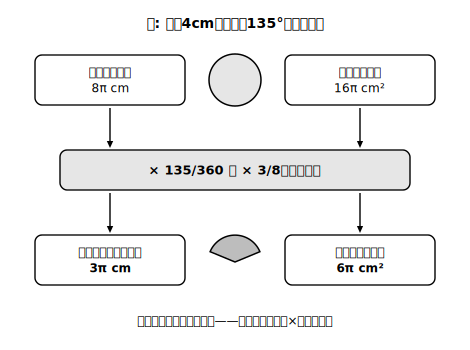

# L10 おうぎ形の弧の長さと面積

## ねらい

- 弧の長さと面積の公式を、**比例の見方から自分で導出**し、使えるようになる。
- 弧の長さや面積から**中心角を逆算する**問題まで扱えるようになる。

## 主概念1：公式は「比例の見方」の清書

L09でつかんだことを式にまとめよう。半径r・中心角a°のおうぎ形は、円全体の**a/360**にあたる。だから、

> **おうぎ形の弧の長さ ℓ＝2πr×(a/360)**
> **おうぎ形の面積 S＝πr²×(a/360)**

構造はどちらも同じ。**「円全体の値」×「何分の何か」**——それだけだ。新しく覚えることはない。円周2πr・円の面積πr²（L08）に、取り分a/360をかけているだけなのだから。

使ってみよう。**半径4cm・中心角135°のおうぎ形**なら、式を書く前にまず取り分を言う。135/360＝**3/8**（分母・分子を45で割って約分した）。円全体の3/8だから、

- 弧の長さ ℓ＝2π×4×3/8＝8π×3/8＝**3π (cm)**
- 面積 S＝π×4²×3/8＝16π×3/8＝**6π (cm²)**

検算のくせも付けよう。3/8は半分（4/8）より少し小さい。半円（180°）なら弧は4π・面積は8πだから、それより少し小さい3π・6πは つじつまが合う。**答えが出たら、半円や4分の1円と比べて大きさの感覚を確かめる**。この10秒の検算が、事故のほとんどを拾ってくれる。

<!-- figure-spec: 意図=公式の構造図（「円全体の値 × a/360」という2段構えを視覚化）。要素=上段=円全体（円周8π・面積16πのラベル）、中段=「×135/360＝×3/8（取り分）」の帯、下段=おうぎ形（弧3π・面積6πのラベル）。弧の長さの系列と面積の系列を左右2列で平行に見せ、構造が同一であることを強調。alt=おうぎ形の弧の長さと面積が、円全体の値に中心角の割合をかけた構造であることを示す図。描かないもの=ℓ・S以外の文字式の変形過程。生成方法=パラメトリックSVG（半径4cm・中心角135°の例〔本文と同じ値〕。8π・16π・3/8・3π・6πをコードでassert検算）。 -->

ありがちな事故を1つ、先に見ておこう。「半径4cmのおうぎ形の面積」と聞いて、π×4²＝16πと答えてしまう。これは**円全体**の面積で、おうぎ形の取り分をかけ忘れている。逆に、弧の長さを求めるのに面積の式πr²を使ってしまう混線も起きやすい。どちらの事故も、**式より先に「円全体の何分の何か」を分数で言う**習慣が防いでくれる。分数を言った時点で「これから円全体の値に取り分をかけるんだ」という構えができるからだ。

## 主概念2：逆向きに使う（中心角を求める）

公式は逆向きにも使える。**半径8cm・弧の長さ6πcm**のおうぎ形の中心角を求めてみよう。

中心角をa°とすると、ℓ＝2πr×(a/360)に値を入れて、

6π＝2π×8×(a/360)
6π＝16π×(a/360)

両辺を16πで割ると、a/360＝6π/16π＝3/8。よってa＝360×3/8＝**135°**。

方程式として解いてもよいが、意味で読むともっと速い。「弧6πは、円周16πの**何分の何か**？」→6π/16π＝3/8→「では中心角は360°の3/8」→135°。**逆問題も、結局は取り分の分数を見つける問題**なのだ。

検算しよう。半径8cm・中心角135°で公式を順向きに使うと、ℓ＝16π×3/8＝6π ✓。逆算の答えは、順向きの計算で必ず検算できる。

面積からの逆算も同じ型で解ける。さらに「弧の長さと面積の両方がわかっていて半径を求める」型もあるが、これは練習とstretchで挑戦しよう。

:::guide
**公式を「忘れる練習」**

おうぎ形の公式は、試験前に思い出せなくなる公式の代表格だ。おすすめは、あえて公式を見ずに「円全体×取り分」から組み立て直す練習をしておくこと。導出が手になじんでいれば、公式は忘れても30秒で再建できる。丸暗記した公式は忘れたら終わりだが、**導出できる公式は忘れても壊れない**。この安心感は、この先のすべての公式との付き合い方の見本になる。
:::

:::guide
**単位の点検も検算のうち**

弧の長さはcm（長さ）、面積はcm²（面積）。答えに単位を書くとき、「いま求めたのは長さか面積か」をもう一度確認することになる。円の面積とおうぎ形の弧を混線させる事故は、単位の点検でも引っかけられる。数値・取り分・単位の3点セットで答える習慣にしよう。
:::

:::zatsudan
「公式ℓ＝2πr×(a/360)を忘れたらどうしよう」という不安には、こう答えたい。L09で君が自分の手で作ったあの表が、公式の中身のすべてだ。表が作れた人は、公式を作れた人。忘れたら、頭の中で半径6cmの円をかいて60°の行をひとつ計算してみればいい。2πが出てきたら、そこからいつでも復元できるよ。
:::

## 練習

答えはπのまま。**式を書く前に「円全体の何分の何か」の分数を必ず書く**こと。

1. 次のおうぎ形の弧の長さと面積を求めよう。
   (1) 半径3cm・中心角240°　(2) 半径10cm・中心角54°　(3) 半径12cm・中心角150°
2. 半径5cm・弧の長さ4πcmのおうぎ形の中心角を求めよう。求めたら、順向きの計算で検算すること。
3. 半径12cm・面積60πcm²のおうぎ形の中心角を求め、さらにこのおうぎ形の弧の長さも求めよう。
4. 次の答案のまちがいを見つけて、正しく直そう。
   「半径6cm・中心角120°のおうぎ形の面積: S＝π×6²＝36π。その120/360だから…あ、これでよかったのかな。S＝36π×(120/360)＝12π cm²。検算: 円全体36πの3分の1で12π ✓」
   実はこの答案、途中で自分のまちがいに気づいて直している。**最初にどんなまちがいをしかけたのか**を説明し、それを防ぐ習慣を1つ挙げよう。

:::stretch
**S1** おうぎ形の面積Sと弧の長さℓのあいだには、半径rを使って **S＝(1/2)ℓr** という関係が成り立つ。2つの公式（ℓ＝2πr×(a/360)・S＝πr²×(a/360)）から、この関係を式変形で導いてみよう。導けたら、練習1(1)の値（ℓ＝4π・r＝3）で S＝(1/2)×4π×3＝6π となることを、取り分方式の答えと照合してみよう。三角形の面積(1/2)×底辺×高さと形がそっくりなのはなぜか、おうぎ形を細かく切って並べるイメージで考えてみるのも面白い。
:::

---

対応解答: answer_key_L09-12.md

<!-- gen_nav:nav:start（自動生成・手編集しない） -->

---

[← 前のレッスン](lesson_09.md)｜[単元の目次](README.md)｜[解答](answer_key_L09-12.md)｜[次のレッスン →](lesson_11.md)

<!-- gen_nav:nav:end -->
