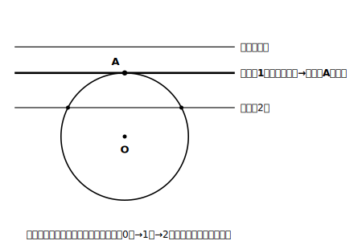
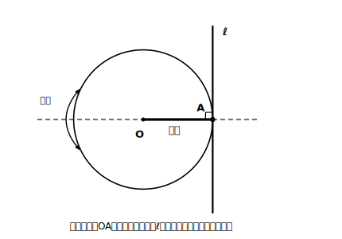

# L11 円の接線

## ねらい

- **接線（せっせん）**・**接点（せってん）**の定義を知り、**円の接線は接点を通る半径に垂直**であることを、円の対称性からとらえる。
- **円周上の点における接線**を作図できるようになる。

## 主概念1：接線とは（1点だけで触れる直線）

円と直線の位置関係を思いうかべよう。直線を円から遠いところからだんだん近づけていくと、はじめは**交わらない**。近づくとやがて**2点で交わる**。そのちょうど境目に、**1点だけを共有する**瞬間がある。

> 【ことば】
> - **接線** … 円と**1点だけ**を共有する直線。円と直線は「**接する**」という
> - **接点** … 接線と円が共有するその1点

<!-- figure-spec: 意図=円と直線の位置関係3態（交わらない・接する・2点で交わる）の遷移図。要素=同じ円Oに対し、平行な3本の直線を段階的に配置。上=共有点なし、中=接する（接点Aを強調・「共有点1つ」）、下=2点で交わる（「共有点2つ」）。中の1本だけ太線（白黒両立のため色でなく太さで強調）。alt=直線が円に近づくにつれ、共有点が0個・1個・2個と変わるようす。共有点1個のときが接線。描かないもの=距離の数値・接線の性質（次の図で扱う）。生成方法=パラメトリックSVG（中心と各直線の距離と半径の大小から共有点数0/1/2をassert判定）。 -->

接線には、きわだった性質がある。

> **円の接線は、その接点を通る半径に垂直である。**

なぜだろう。ここでもL07の**円の対称性**が効く。接点をAとし、直線OA（中心と接点を通る直線）で図全体を折ってみよう。円は、中心を通る直線を対称の軸とするから自分自身にぴったり重なる（L07）。実際に図をかいて直線OAで折ってみると、接線もこの折り目で自分自身にぴったり重なる。直線が折り目で自分自身に重なるのは、**折り目と垂直に交わる**ときだ。だから接線⊥半径OA、と見ることができる。

接線が必ずこの折り目で自分自身に重なることの、きちんとした証明は先の学年に譲る。ここでは「中心と接点を結ぶ直線で折ると、図全体が対称になる」という見方を、図をかいて折って確かめ、納得しておけば十分だ。

<!-- figure-spec: 意図=「接線は接点を通る半径に垂直」の性質図（対称性による説明つき）。要素=円Oと接点A・接線ℓ。半径OAを太線、OAとℓの交点に直角マーク。直線OAを対称の軸（破線で延長）として図全体が線対称であることを折り返し矢印で示す。alt=円の接線が接点を通る半径と垂直に交わっている図。描かないもの=円の外の点からの接線（本単元の範囲外のため描かない）・角度の数値。生成方法=パラメトリックSVG（接線⊥半径・中心とℓの距離＝半径〔共有点1個〕・OAで折るとℓが自分自身に重なる対称性をassert検証）。 -->

## 主概念2：円周上の点における接線の作図

性質がわかれば、作図はもうできたも同然だ。「**円周上の点Aを通る接線**をかけ」と言われたら、こう考える。

接線はAを通り、半径OAに垂直【根拠: 接線は接点を通る半径に垂直】。つまりかくべきものは、「**直線OA上の点Aを通る、OAの垂線**」。これはL05の場合1（直線上の点を通る垂線）そのものだ。

1. 半直線OAをひき、Aの向こう側へのばしておく。
2. Aを中心に円をかき、直線OAとの交点をP・Qとする。
3. 線分PQの垂直二等分線を作図する。この直線がAを通る接線だ【根拠: PA＝QAだからAはPQの垂直二等分線上にあり、この垂線はOAに垂直】。

新しい手順は1つもない。**性質（接線⊥半径）が、作図の設計図になっている**。L06でやった「移動の性質が作図の手順書になる」のと同じ構図だ。

1つ、範囲の注意をしておこう。今日かいたのは「円周上の点における接線」だ。**円の外の1点から円へ接線をひく**作図は、ここでは扱わない。この作図には、第3学年で学ぶ円の性質が必要になる。「円の外から接線がひけそうだけど、どうやるんだろう？」という疑問は正しい疑問なので、中3までの楽しみにとっておこう。

:::guide
**「境目の1点」という見方**

接線を「1点だけ共有する直線」と定義したが、導入でやった「直線を近づけていく」イメージも大切にしてほしい。共有点が2個→1個→0個と変わる、その**境目**が接線だ。境目に注目する見方は、中心から直線までの**距離**とも結びつく。距離が半径より小さければ2点で交わり、半径より大きければ交わらず、**ちょうど半径に等しいとき**に接する。「接線⊥半径」の垂直も、この「中心からの距離＝半径」を実現する垂線として現れている——距離の定義（L01・垂線の長さ）がここで再登場しているのだ。
:::

:::guide
**自転車の車輪で思いうかべる**

まっすぐな道の上を転がる車輪は、地面と1点で接している。車輪の中心（車軸）は、その接点の真上。つまり「中心と接点を結ぶ半径」が地面と垂直になっている。接線の性質を思い出すときの頭の中の絵として、この場面は使いやすい。図形の性質を身近な絵と結びつけておくと、記憶の持ちがぐっとよくなる。
:::

:::zatsudan
接線は、この単元で出会う最後の新しい用語だ。ふり返れば、垂線・弧・弦・おうぎ形——新しいことばが増えるたび、「図のどこを見ればよいか」を短いことばで指させるようになってきた。新しい分野に進んでも、新しい用語に出会ったら、まず自分の図の上で指さして確かめる。このくせは持っていって損がないよ。
:::

## 練習

1. 円Oをかき、円周上に点Aをとって、Aにおける円Oの接線を作図しよう。(1)かく→(2)確かめる（三角定規の直角を当てて、OAと接線が垂直に見えるか点検（確かめは道具OK））→(3)【根拠】付きで理由を2文以内で書く、の3段で。
2. 円Oと、円周上の2点A・B（直径の両端ではない位置）をとり、Aにおける接線とBにおける接線をそれぞれ作図しよう。2本の接線が交わったら、その交点をPとして、PA・PBの長さをコンパスで写し取って比べてみよう。何に気づくだろうか（気づいたことを1文で。理由づけは中3の楽しみに残してよい）。
3. 「円の接線は、円のどの半径とも垂直である」。このまちがいを直して、正しい文にしよう。
4. 半径3cmの円Oの周上の点Aで接する直線ℓがある。中心Oと直線ℓの距離を答え、その理由を【根拠】付きで1文で書こう。

:::stretch
**S1** 円Oの周上に、たがいに大きく離した3点A・B・C（円周をほぼ3等分する位置にとると確実だ）をとり、それぞれの点における接線を3本作図してみよう。3本の接線が**円Oを囲む三角形**をつくれば、円Oはその三角形の3辺すべてに内側から接している（3点をかたよった位置にとると、接線どうしのつくる三角形が円の外側にできてしまう——そのときは3点を離してやり直そう）。この配置を自分の作図で実現できたら、「三角形 すべての辺に接する円」という調べ方で、この円が先の学年でどんな名前で呼ばれるか調べてみよう（作図の手はもう持っている。名前と理屈が後から追いついてくる、というわけだ）。
:::

---

対応解答: answer_key_L09-12.md

<!-- gen_nav:nav:start（自動生成・手編集しない） -->

---

[← 前のレッスン](lesson_10.md)｜[単元の目次](README.md)｜[解答](answer_key_L09-12.md)｜[次のレッスン →](lesson_12.md)

<!-- gen_nav:nav:end -->
