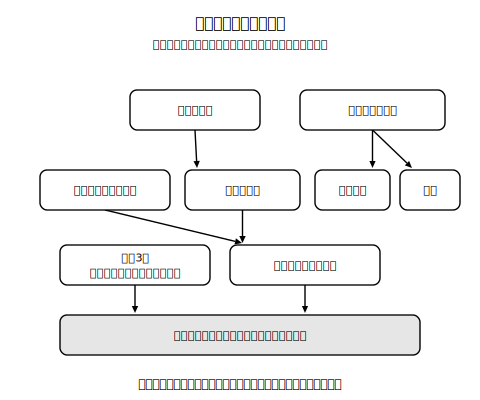

# L12 単元まとめ〜作図と円の総合

## ねらい

- この単元で手に入れた道具（移動3種・作図3種・円の計量・接線）を**一覧に棚卸し**し、どの道具をいつ使うか自分で選べる状態にする。
- 複数の道具を組み合わせる総合問題に取り組む。

## 道具箱の棚卸し

この単元で増えた道具を、種類ごとに並べてみよう。**それぞれについて「使える」だけでなく「根拠が言える」か**を、右の列で自己点検してほしい。

| 道具 | できること | 根拠・決め手（言えるか自己点検） |
|---|---|---|
| 平行移動 | 図形をずらす・説明する | 決定要素=方向と距離／対応点を結ぶ線分は平行で等しい |
| 対称移動 | 図形を裏返す・説明する | 決定要素=軸の位置／対応点を結ぶ線分は軸と垂直・軸で2等分 |
| 回転移動 | 図形をまわす・説明する | 決定要素=中心・角・向き（三つそろって一人前）／対応点は中心から等距離 |
| 垂直二等分線の作図 | 2点から等距離の点の線がひける | 等半径の2円→交点2つ→結ぶ。2円の線対称が根拠 |
| 角の二等分線の作図 | 角を2等分できる | 角の対称の軸を、等距離の点として復元する |
| 垂線の作図 | 直角が作れる（2つの場合） | 2点から等距離の点にして、垂直二等分線に帰着 |
| 円の計量 | 円周2πr・面積πr² | πのまま扱う流儀（L08） |
| おうぎ形の計量 | 弧ℓ＝2πr×(a/360)・面積S＝πr²×(a/360) | 「円全体の何分の何か」を先に言う。中心角に比例が土台 |
| 接線の作図 | 円周上の点における接線がひける | 接線⊥半径→垂線の作図に帰着 |

<!-- figure-spec: 意図=単元全体の道具マップ（依存関係図。どの道具がどの道具の上に建っているか）。要素=最下段=「対称性・等距離・ぴったり重なる（合同）」の土台ブロック。その上に「移動3種」「垂直二等分線」、さらに上に「角の二等分線」「垂線」（および「円の計量」「比例」）、最上段に「接線の作図」「おうぎ形の計量」（おうぎ形は「円の計量」と「比例」の2本柱の上に）。矢印で「帰着」の向きを示す。alt=単元の学習内容の積み上がりを示すブロック図。すべての作図が対称性と等距離の土台の上に建っている。描かないもの=レッスン番号（内容どうしの関係に集中する）。生成方法=パラメトリックSVG（矢印がすべて下向き・ブロックの重なりなし・おうぎ形の2本柱をassert検証）。 -->

表を上から下までながめると、気づくことがある。**新しい道具は、ほとんどが前の道具への「帰着」で作られてきた**。垂線は垂直二等分線に、接線は垂線に、おうぎ形は円の計量と比例に。まったく新品の道具は、実は最初の数個しかない。数学の学びは、道具を増やすことというより、**少ない道具の使い回しがうまくなること**なのかもしれない。

## 総合演習

1. **（作図＋条件を満たす点）** 2点A・Bと直線ℓ（A・Bはℓの同じ側。線分ABがℓと垂直にならない位置にかく）がある。次の条件を**両方**満たす点Pを作図で求めよう。
   条件1: PはA・Bから等しい距離にある　条件2: Pは直線ℓ上にある
   さらに、条件1を満たす点の集まりが何だったかを1文で述べ、【根拠】付きで手順を説明しよう。
2. **（移動＋作図）** △ABCと点Oがある。△ABCを、点Oを中心に180°回転移動（点対称移動）した△DEFを、**方眼なしで**作図しよう（ヒント: 対応点は、Oから等距離で、Oをはさんで反対側にある。半直線とコンパスで作れる）。かき終えたら、決定要素チェックリストの型で移動の説明も1文書くこと。
3. **（おうぎ形の総合）** 半径6cmの円から、中心角90°のおうぎ形を切り取った。残った図形（中心角270°のおうぎ形）について、弧の長さ・面積を求めよう。さらに「まわりの長さ」（弧と2つの半径の合計）も求めよう。
4. **（接線＋おうぎ形）** 半径4cmの円Oの周上に、中心角が90°になるように2点A・Bをとった（∠AOB＝90°）。
   (1) おうぎ形OABの弧の長さと面積を求めよう。
   (2) 点Aにおける接線を作図しよう。この接線と半直線OBは、やがて交わるだろうか？ 図をかいて予想し、理由を考えてみよう（接線上に、Aとは別の点Pをとってみよう。∠OAP＝90°・∠AOB＝90°という2つの直角に注目。きちんとした証明は中2の「平行線」の学習で手に入る。ここでは図からの観察と予想でよい）。

## 次の学びへ（この単元はどこへつながるか）

最後に、この単元で身につけた力の行き先を3つ紹介して締めくくろう。

1. **中2「図形の合同と証明」へ**: この単元でやってきた【根拠: …】の一言は、中2で学ぶ「証明」の卵だ。移動で「ぴったり重なる」ことを言葉で説明した経験が、合同を記号と条件で正確に扱う学習に育っていく（合同を表す専用の記号も中2で登場する)。
2. **中1「空間図形」へ**: おうぎ形は、立体の世界ですぐ再登場する。円錐（アイスのコーンの形)の側面を切り開くと、おうぎ形が現れるのだ。「中心角に比例」の見方が、そのまま立体の表面積の計算道具になる。
3. **中3「円」へ**: 円の外の1点からの接線、円周上の点がつくる角の性質など、円の話には続きがある。L11で残した「円の外からの接線はどうひく？」の答えも、そこで手に入る。

作図の力・根拠を言う力・比例で見る力。3つとも、ここで終わりではなく、ここから始まる力だ。よくここまで来た。次の単元で会おう。

:::guide
**総合問題との付き合い方**

総合問題が難しく感じられるのは、「どの道具を使うか」が問題文に書いていないからだ。手が止まったら、棚卸しの表に戻って「この問題の条件に関係ありそうな道具はどれか」を指でなぞって探すとよい。道具選びも実力のうち。というより、道具選びこそが実力だ。それでも詰まったら、AIチャットに「答えは言わずに、どの作図を使うかのヒントだけください」と頼む手もある。問題文とここまでの自分の考えを添えて送るのがコツだ。
:::

:::guide
**自分の弱点の見つけ方（単元の締めの自己診断）**

棚卸しの表の右列「根拠・決め手」を、表を隠して自分の言葉で言えるか試してみよう。すらすら言えた行はもう大丈夫。言葉に詰まった行が、戻るべきレッスンの案内板だ。とくに「かけるけれど根拠が言えない」作図があったら、そのレッスンの練習(3)（理由を言う段）だけをやり直すのが効率がよい。かく力と根拠を言う力は別の力。最後の点検も、別々にやるのが筋だ。
:::

:::zatsudan
道具マップの最下段に「対称性」と書いた。思えばこの単元、最初の1時間（L01の線対称・点対称）からずっと対称性の話をしていた。折る・重ねる・写す——手の操作が、いつのまにか根拠を言う言葉に変わっていった単元だったわけだ。着物の文様・万華鏡・折り紙。身のまわりで対称なものを見かけたら、この単元を思い出してもらえたらうれしいな。
:::

---

対応解答: answer_key_L09-12.md

<!-- gen_nav:nav:start（自動生成・手編集しない） -->

---

[← 前のレッスン](lesson_11.md)｜[単元の目次](README.md)｜[解答](answer_key_L09-12.md)

<!-- gen_nav:nav:end -->
